# Java 集合框架

Java 最初的版本只为最常用的数据结构提供了很少的一组类：Vector、Stack、Hashtable、BitSet 与 Enumeration 接口，其中的 Enumeration 接口提供了一种用于访问任意容器中各个元素的抽象机制。

随着 JavaSE1.2 的问世，设计人员感到是推出一组功能完善的数据结构的时机了。面对一大堆相互矛盾的设计策略，他们希望让类库规模小且易于学习，而不希望像 C++的“标准模板库”（即 STL）那样复杂，但却又希望能够得到 STL 率先推出的“泛型算法”所具有的优点。本节将介绍 Java 集合框架的基本设计，展示使用它们的方法，并解释一些颇具争议的特性背后的考虑。

## 将集合的接口与实现分离

与现代的数据结构类库的常见情况一样，Java 集合类库也将接口（interface）与实现（implementation）分离。首先，看一下人们熟悉的数据结构——队列（queue）是如何分离的。

队列接口指出可以在队列的尾部添加元素，在队列的头部删除元素，并且可以查找队列中元素的个数。当需要收集对象，并按照“先进先出”的规则检索对象时就应该使用队列。

队列接口的最简形式可能类似下面这样：

```java
public interface Queue<E> { // a simplified form of the interface in the standard library
    void add(E element);
    E remove();
    int size();
}
```

这个接口并没有说明队列是如何实现的。队列通常有两种实现方式：

- 一种是使用循环数组
- 另一种是使用链表

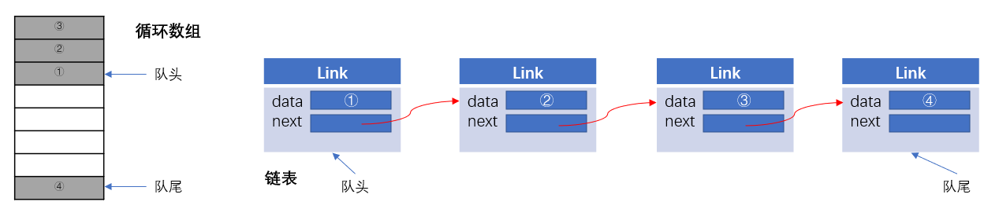

每一个实现都可以通过一个实现了 Queue 接口的类表示

```java
public class CircularArrayQueue <E> implements Queue<E> {
    @Override
    public int size() {        return 0;    }

    @Override
    public boolean isEmpty() {        return false;    }

    @Override
    public boolean contains(Object o) {        return false;    }

    @Override
    public Iterator<E> iterator() {        return null;    }
    
    ......
}
```

```java
public class LinkedListQueue<E> implements Queue<E> {
    @Override
    public int size() {        return 0;    }

    @Override
    public boolean isEmpty() {        return false;    }

    @Override
    public boolean contains(Object o) {        return false;    }

    @Override
    public Iterator<E> iterator() {        return null;    }
}
```

> 注释：实际上，Java 类库没有名为 CircularArrayQueue 和 LinkedListQueue 的类。这里只是以这些类作为示例，解释一下集合接口与实现在概念上的不同。如果需要一个循环数组队列，就可以使用 ArrayDeque 类。如果需要一个链表队列，就直接使用 LinkedList 类，这个类实现了 Queue 接口。

当在程序中使用队列时，一旦构建了集合就不需要知道究竟使用了哪种实现。因此，只有在构建集合对象时，使用具体的类才有意义。也就是在调用构造器的地方，指明你需要使用的接口实现类。具体做法就是在创建一个集合对象时，我们一般静态创建一个接口，在调用构造器 new 这个对象时，再指明具体的接口实现类。

```java
Queue<Customer> expressLane = null;
expressLane = new CircularArrayQueue();
// 也就等价于
Queue<Customer> expressLane = new CircularArrayQueue();
// 这种创建集合对象的做法也是我们在实际开发中通常所用的方法
```

在研究 API 文档时，会发现另外一组名字以 Abstract 开头的类，例如，AbstractQueue。这些类是为类库设计者而设计的。如果想要实现自己的队列类（也许不太可能），会发现扩展 AbstractQueue 类要比实现 Queue 接口中的所有方法轻松得多。

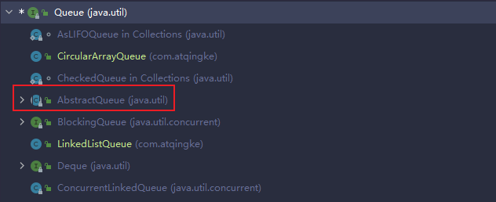

## Collection 接口

在 Java 类库中，集合类的基本接口是 Collection 接口。这个接口有两个基本方法 add 和 iterator()。

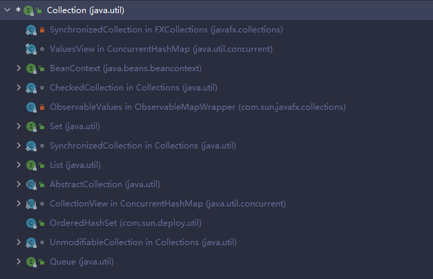

add 用于向集合中添加元素。如果添加成功就返回 true，否则返回 false。例如，如果你试图向集合中添加一个已经存在的对象，会返回 false。因为集合中不允许存在重复的对象。

iterator 用于返回一个实现了 Iterator 接口的对象。可以使用这个迭代器对象依次访问集合中的元素。

## 迭代器

Iterator 接口包含 4 个方法

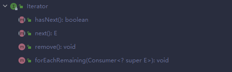

通过反复调用 next 方法，可以逐个访问集合中的每个元素。但是，如果到了集合的末尾，next 方法将抛出一个 NoSuchElementException。因此，需要在调用 next 之前调用 hasNext 方法来判断是否下一个元素是否为 null。

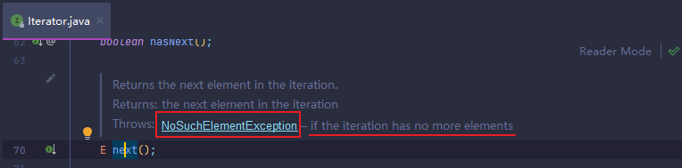

如果想要查看集合中的所有元素，就请求一个迭代器，并在 hasNext 返回 true 时反复地调用 next 方法。例如：

```java
Collection<String> c = ......;
Iterator<String> iter = c.iterator();
while(iter.hasNext()) {
    String element = iter.next();
    do something with element
}
```

用“foreach”循环可以更加简练地表示同样的操作：

```java
for(String element : c) {
 	do something with element   
}
```

编译器简单地将“foreach”循环翻译为带有迭代器的循环。

“foreach”循环可以与任何实现了 Iterable 接口的对象一起工作，这个接口包含三个抽象方法(Java SE 8 之后)：

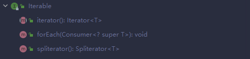

Collection 接口扩展了 Iterable 接口。因此，对于标准类库中的任何集合都可以使用“foreach”循环。

在 Java 集合类库中，应该将迭代器认为是位于两个元素之间。**当调用 next 时，迭代器就越过下一个元素，并返回刚刚越过的那个元素的引用**。

> 注释：这里还有一个有用的推论。可以将 Iterator.next 与 InputStream.read 看作为等效的。从数据流中读取一个字节，就会自动地“消耗掉”这个字节。下一次调用 read 将会消耗并返回输入的下一个字节。用同样的方式，反复地调用 next 就可以读取集合中所有元素。

Iterator 接口的 remove 方法将会删除上次调用 next 方法时返回的元素。在大多数情况下，在决定删除某个元素之前应该先看一下这个元素是很具有实际意义的。然而，**如果先要删除指定位置上的元素，仍然需要越过这个元素**。更为重要的是，对 next 方法和 remove 方法的调用具有互相依赖性。<u> **如果调用 remove 之前没有调用 next 将是不合法的。如果这样做，将会抛出 IllegalStateException 异常**。</u>

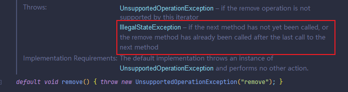

如果想删除两个相邻的元素，不能直接地调用：

```java
it.remove();
it.remove(); // Error!!!
```

相反，必须先调用 next 越过将要删除的元素：

```java
it.remove();
it.next();
it.remove(); // OK!
```

## 泛型实用方法

由于 Collection 与 Iterator 都是泛型接口，可以编写操作任何集合类型的实用方法。例如，下面是一个检测任意结合是否包含指定元素的泛型方法：

```java
public static <E> boolean contains(Collection<E> c, Object obj) {
    for(E element : c) 
        if(element.equals(obj))
            return true;
    return false;
} 
```

Java 类库设计者认为：这些实用方法中的某些方法非常有用，应该将它们提供给用户使用。这样，类库的使用者就不必自己重新构建这些方法了。contains 就是这样一个实用方法。

事实上，Collection 接口声明了很多有用的方法，所有的实现类都必须提供这些方法。在这些方法中，有很多方法的功能非常明确，不需要过多的解释。

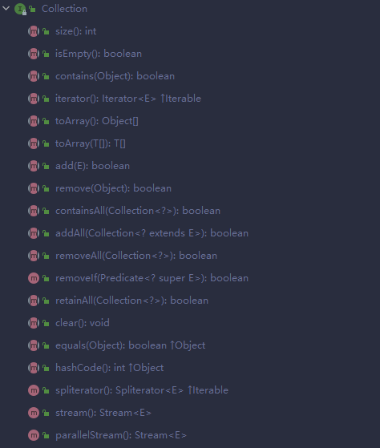

当然，如果实现 Collection 接口的每一个类都要提供如此多的例行方法将是一件很烦人的事情。为了能够让实现者更容易地实现这个接口，Java 类库提供了一个类 AbstractCollection，它将基础方法 size 和 iterator 抽象化了，但是在此提供了例行方法。例如：

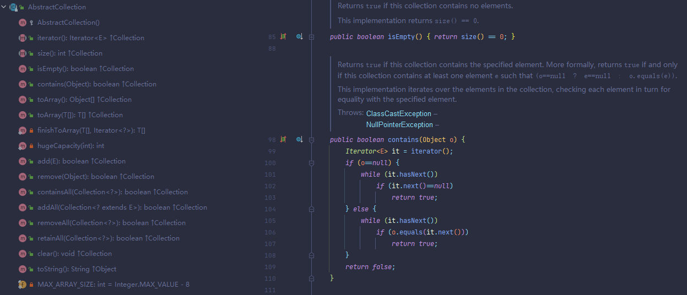

## 集合框架中的接口

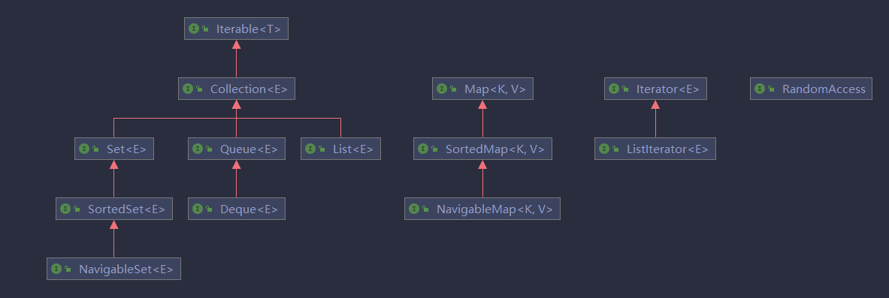

## Collections 工具类

> - Collections 是一个操作 Set、List 和 Map 等集合的工具类。
> - Collections 中提供了一系列静态的方法对集合元素进行排序、查询和修改等操作，还提供了对集合对象设置不可变、对集合对象实现同步控制等方法

- 排序操作（均为 static 方法）
  - reverse(List); 反转 List 中元素的顺序
  - shuffle(List); 对 List 集合元素进行随机排序
  - sort(List); 根据元素的自然顺序对指定 List 集合元素按升序排序
  - sort(List, Comparator); 
  - swap(List, int, int); 将指定 list 集合中的 i 出元素和 j 出元素进行交换
- 查找、替换
  - Object max(Collection); 自然排序后，返回给定集合中最大元素
  - Object max(Collection，Comparator);
  - Object min(Collection);
  - Object min(Collection，Comparator);
  - int frequency(Collection，Object); 返回指定集合中指定元素的出现次数
  - void copy(List dest, List src);
  - boolean replaceAll(List list，Object oldVal，Object newVal); 使用新值替换 List 对象的所有旧值

- 同步机制

  Collections 类中提供了多个 synchronizedXxx 方法，该方法可以将指定集合包装成线程同步的集合，从而可以解决多线程并发访问集合时的线程安全问题。

  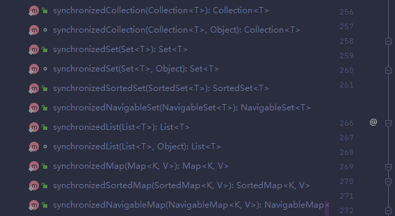