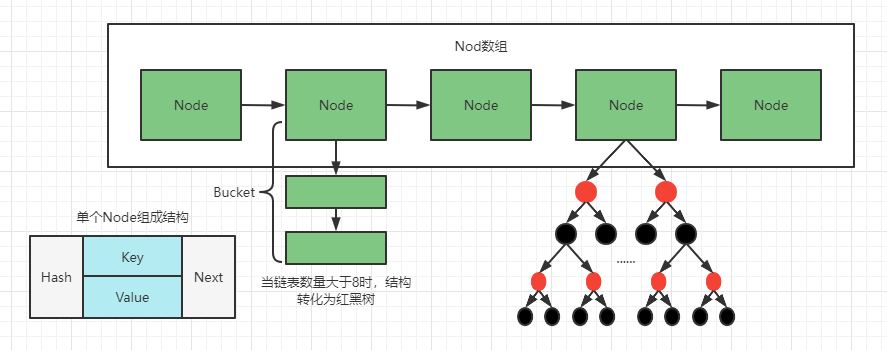

# 深入Java集合系列之——HashMap

## 传统 HashMap 的缺点

HashMap 是基于哈希表的 Map 接口的非同步实现。此实现提供所有可选的映射操作，并允许使用 null 值和 null 键。此类不保证映射的顺序，特别是它不保证该顺序恒久不变。

1. JDK1.8 以前 HashMap 的实现是 数组 + 链表，即使哈希函数取得再好，也很难达到元素百分百均与分布。

2. 当 HashMap 中有大量的元素都存放到同一个桶中时，这个桶下由一条长长的链表，这个时候 HashMap 就相当于一个单链表，加入单链表有 n 个元素，遍历的时间复杂度就是 O(n)，完全失去了它的优势。

3. 针对这种情况，JDK1.8 中引入了红黑树(查找时间复杂度为 O(logn))来优化这个问题。


## JDK1.8 中 HashMap 的数据结构

### HashMap 是数组 + 链表 + 红黑树实现的



新增红黑树：

```java
/**
     * Entry for Tree bins. Extends LinkedHashMap.Entry (which in turn
     * extends Node) so can be used as extension of either regular or
     * linked node.
     */
static final class TreeNode<K,V> extends LinkedHashMap.Entry<K,V> {
    TreeNode<K,V> parent;  // red-black tree links
    TreeNode<K,V> left;
    TreeNode<K,V> right;
    TreeNode<K,V> prev;    // needed to unlink next upon deletion
    boolean red;
    ...
}
```

### HashMap 中关于红黑树的三个关键参数

```java
/**
     * The bin count threshold for using a tree rather than list for a
     * bin.  Bins are converted to trees when adding an element to a
     * bin with at least this many nodes. The value must be greater
     * than 2 and should be at least 8 to mesh with assumptions in
     * tree removal about conversion back to plain bins upon
     * shrinkage.
     */
static final int TREEIFY_THRESHOLD = 8;

/**
     * The bin count threshold for untreeifying a (split) bin during a
     * resize operation. Should be less than TREEIFY_THRESHOLD, and at
     * most 6 to mesh with shrinkage detection under removal.
     */
static final int UNTREEIFY_THRESHOLD = 6;

/**
     * The smallest table capacity for which bins may be treeified.
     * (Otherwise the table is resized if too many nodes in a bin.)
     * Should be at least 4 * TREEIFY_THRESHOLD to avoid conflicts
     * between resizing and treeification thresholds.
     */
static final int MIN_TREEIFY_CAPACITY = 64;
```

1. **TREEIFY_THRESHOLD	     一个桶的树化阈值**

   当桶中元素个数超过这个值时，需要使用红黑树节点替换链表节点。

2. **UNTREEIFY_THRESHOLD   一个树的链表还原阈值**

   当扩容时，桶中元素个数小于这个值时，就会把树形的桶元素还原（切分）为链表结构。

3. **MIN_TREEIFY_CAPACITY     哈希表的最小树形化容量**

   当哈希表中的容量大于这个值时，表中的桶才能进行树形化，否则桶内元素太多时会扩容，而不是树形化。为了避免进行扩容、树形化选择的冲突，这个值不能小于 4 * TREEIFY_THRESHOLD。

### HashMap 在 JDK1.8 中新增的操作：桶的树形化 treeifyBin()

在 Java8 中，如果一个桶中的元素个数超过 TREEIFY_THRESHOLD（默认是 8），就使用红黑树来替换链表，从而提高速度。这个替换的方法叫 treeifyBin()，即树形化。

```java
/**
     * Replaces all linked nodes in bin at index for given hash unless
     * table is too small, in which case resizes instead.
     */
// 将桶内所有的链表节点替换成红黑树节点
final void treeifyBin(Node<K,V>[] tab, int hash) {
    int n, index; Node<K,V> e;
    // 如果当前哈希表为空，或者哈希表中元素的个数小于进行树形化的阈值（默认 64），就去新建/扩容
    if (tab == null || (n = tab.length) < MIN_TREEIFY_CAPACITY)
        resize();
    // 如果哈希表中的元素个数超过了树形化阈值，进行树形化
    // e 是哈希表中指定位置桶里的链表节点，从第一个开始
    else if ((e = tab[index = (n - 1) & hash]) != null) {
        TreeNode<K,V> hd = null, tl = null;
        do {
            // 新建一个树形节点，内容和当前链表节点 e 一致
            TreeNode<K,V> p = replacementTreeNode(e, null);
            if (tl == null) // 确定树的头节点
                hd = p;
            else {
                p.prev = tl;
                tl.next = p;
            }
            tl = p;
        } while ((e = e.next) != null);
        // 让桶的第一个元素指向新建的红黑树头节点，以后这个桶里的元素就是红黑树而不是链表了
        if ((tab[index] = hd) != null)
            hd.treeify(tab);
    }
}

// For treeifyBin
TreeNode<K,V> replacementTreeNode(Node<K,V> p, Node<K,V> next) {
    return new TreeNode<>(p.hash, p.key, p.value, next);
}
```

通过分析源码我们可以看到，treeifyBin 方法主要做了三件事：

1. 根据哈希表中元素个数确定是扩容还是树形化。
2. 如果是树形化遍历桶中的元素，创建相同个数的树形节点，复制内容，建立起联系。
3. 然后让桶第一个元素指向新建的树头节点，替换桶的链表内容为树形内容。

## hash 方法

在 get 方法和 put 方法中都需要先计算 key 映射到哪个桶上，然后才进行之后的操作，计算的主要代码如下：

```java
(n - 1) & hash
```

上面的代码中，n 指的是哈希表的大小，hash 指的是 key 的哈希值，hash 值是通过下面这段源码算出来的，采用了二次哈希的方式，其中 key 的 hashCode 方法是一个 native 方法：

```java
static final int hash(Object key) {
    int h;
    return (key == null) ? 0 : (h = key.hashCode()) ^ (h >>> 16);
}
```

这个 hash 方法先通过 key 的 hashCode 方法获取一个哈希值，再拿这个哈希值与它的高 16 位的哈希值做一个异或操作来得到最后的哈希值，计算过程可以参考下图：


为什么这样做？

```java
/**
     * Computes key.hashCode() and spreads (XORs) higher bits of hash
     * to lower.  Because the table uses power-of-two masking, sets of
     * hashes that vary only in bits above the current mask will
     * always collide. (Among known examples are sets of Float keys
     * holding consecutive whole numbers in small tables.)  So we
     * apply a transform that spreads the impact of higher bits
     * downward. There is a tradeoff between speed, utility, and
     * quality of bit-spreading. Because many common sets of hashes
     * are already reasonably distributed (so don't benefit from
     * spreading), and because we use trees to handle large sets of
     * collisions in bins, we just XOR some shifted bits in the
     * cheapest possible way to reduce systematic lossage, as well as
     * to incorporate impact of the highest bits that would otherwise
     * never be used in index calculations because of table bounds.
     */
```

这是 hash 方法上的注释，大致意思就是通过这种最便捷的方式对一些移位位进行异或，这样可以减少系统损失，以及合并最高位的影响，否则，由于 table bounds，最高位将用于不会用于索引计算。我们可以假设这样一种场景，如果 n 很小，假设为 64，那么 n - 1 就是 63(0x111111)，这样的值跟 hashCode 直接做与操作，实际上只使用了哈希值的后六位。当哈希值的高位变化很大，低位变化很小，这样就很容易造成冲突了，所以这里把高低位都利用起来，从而解决了这个问题。

也正是因为与的这个操作，决定了 HashMap 的大小只能是 2 的幂次方。如果不是 2 的幂次方，会发生什么？


即使你在创建 HashMap 的时候指定了初始大小，HashMap 在创建的时候也会调用下面这个方法来调整大小：

```java
/**
     * Returns a power of two size for the given target capacity.
     */
static final int tableSizeFor(int cap) {
    int n = cap - 1;
    n |= n >>> 1;
    n |= n >>> 2;
    n |= n >>> 4;
    n |= n >>> 8;
    n |= n >>> 16;
    return (n < 0) ? 1 : (n >= MAXIMUM_CAPACITY) ? MAXIMUM_CAPACITY : n + 1;
}
```

这个方法的作用看起来不是很直观，它的实际作用就是把 cap 变成第一个大于等于 2 的幂次方的数。例如：16 还是 16，13 就会调整为 16，17 就会调整为 32。

##  resize 方法（rehash）

当 HashMap 中的元素越来越多的时候，hash 冲突的几率也越来越高，因为数组长度是固定的。所以为了提高查询的效率，就要对 HashMap 的数组进行扩容，数组扩容这个操作也会出现在 ArrayList 中，这是一个常用的操作，而在 HashMap 数组扩容之后，最消耗性能的点就出现了：原数组中的数据必须重新计算其在新数组中的位置，并放进去，这就是 resize。

HashMap 在进行扩容时，使用的 rehash 方式非常巧妙，因为每次扩容都是翻倍，与原来计算(n - 1) & hash 的结果相比，只是多了一个 bit 位，所以节点要么就在原来的位置，要么倍分配到”原位置 + 旧容量“这个位置。也正是因为这样巧妙的 rehash 方式，保证了 rehash 之后每个桶上的节点数必定小于等于原来桶上的节点数，即保证了 rehash 之后不会出现更严重的冲突。

```java
/**
     * Initializes or doubles table size.  If null, allocates in
     * accord with initial capacity target held in field threshold.
     * Otherwise, because we are using power-of-two expansion, the
     * elements from each bin must either stay at same index, or move
     * with a power of two offset in the new table.
     *
     * @return the table
     */
final Node<K,V>[] resize() {
    Node<K,V>[] oldTab = table;
    int oldCap = (oldTab == null) ? 0 : oldTab.length;
    int oldThr = threshold;
    int newCap, newThr = 0;
    // 计算扩容后的大小
    if (oldCap > 0) {
        // 如果当前容量超过最大容量，则无法进行扩容
        if (oldCap >= MAXIMUM_CAPACITY) {
            threshold = Integer.MAX_VALUE;
            return oldTab;
        }
        // 没超过，扩为两倍
        else if ((newCap = oldCap << 1) < MAXIMUM_CAPACITY &&
                 oldCap >= DEFAULT_INITIAL_CAPACITY)
            newThr = oldThr << 1; // double threshold
    }
    else if (oldThr > 0) // initial capacity was placed in threshold
        newCap = oldThr;
    else {               // zero initial threshold signifies using defaults
        newCap = DEFAULT_INITIAL_CAPACITY;
        newThr = (int)(DEFAULT_LOAD_FACTOR * DEFAULT_INITIAL_CAPACITY);
    }
    if (newThr == 0) {
        float ft = (float)newCap * loadFactor;
        newThr = (newCap < MAXIMUM_CAPACITY && ft < (float)MAXIMUM_CAPACITY ?
                  (int)ft : Integer.MAX_VALUE);
    }
    // 新的 resize 阈值
    threshold = newThr;
    // 创建新的哈希表
    @SuppressWarnings({"rawtypes","unchecked"})
    Node<K,V>[] newTab = (Node<K,V>[])new Node[newCap];
    table = newTab;
    if (oldTab != null) {
        // 遍历旧哈希表的每个桶，重新计算桶里元素的新位置
        for (int j = 0; j < oldCap; ++j) {
            Node<K,V> e;
            if ((e = oldTab[j]) != null) {
                oldTab[j] = null;
                // 如果桶上只有一个键值对，直接插入即可
                if (e.next == null)
                    newTab[e.hash & (newCap - 1)] = e;
                // 红黑树处理冲突
                else if (e instanceof TreeNode)
                    ((TreeNode<K,V>)e).split(this, newTab, j, oldCap);
                // 链式处理冲突
                else { // preserve order
                    Node<K,V> loHead = null, loTail = null;
                    Node<K,V> hiHead = null, hiTail = null;
                    Node<K,V> next;
                    // 计算节点新位置
                    do {
                        next = e.next;
                        if ((e.hash & oldCap) == 0) {
                            if (loTail == null)
                                loHead = e;
                            else
                                loTail.next = e;
                            loTail = e;
                        }
                        else {
                            if (hiTail == null)
                                hiHead = e;
                            else
                                hiTail.next = e;
                            hiTail = e;
                        }
                    } while ((e = next) != null);
                    if (loTail != null) {
                        loTail.next = null;
                        newTab[j] = loHead;
                    }
                    if (hiTail != null) {
                        hiTail.next = null;
                        newTab[j + oldCap] = hiHead;
                    }
                }
            }
        }
    }
    return newTab;
}
```

这里有一个需要注意的地方，有些文章指出当哈希表的 **<u> 桶占用 </u>** 超过阈值时就进行扩容，这是不对的；实际上是当哈希表中的 **<u> 键值对个数 </u>** 超过阈值时，才进行扩容的。

## 分析 HashMap 的 put 方法

### HashMap 的 put 方法执行过程

看图说话：


源码分析：

::: code-group

```java [JDK8]
/**
     * Associates the specified value with the specified key in this map.
     * If the map previously contained a mapping for the key, the old
     * value is replaced.
     *
     * @param key key with which the specified value is to be associated
     * @param value value to be associated with the specified key
     * @return the previous value associated with <tt> key </tt>, or
     *         <tt> null </tt> if there was no mapping for <tt> key </tt>.
     *         (A <tt> null </tt> return can also indicate that the map
     *         previously associated <tt> null </tt> with <tt> key </tt>.)
     */
public V put(K key, V value) {
    // hash(key)：对 key 的 hashCode()做 hash
    return putVal(hash(key), key, value, false, true);
}

/**
     * Implements Map.put and related methods.
     *
     * @param hash hash for key
     * @param key the key
     * @param value the value to put
     * @param onlyIfAbsent if true, don't change existing value
     * @param evict if false, the table is in creation mode.
     * @return previous value, or null if none
     */
final V putVal(int hash, K key, V value, boolean onlyIfAbsent,
               boolean evict) {
    Node<K,V>[] tab; Node<K,V> p; int n, i;
    // 步骤 ① tab 为空则创建
    if ((tab = table) == null || (n = tab.length) == 0)
        n = (tab = resize()).length;
    // 步骤 ② 计算 index，并对 null 做处理
    if ((p = tab[i = (n - 1) & hash]) == null)
        tab[i] = newNode(hash, key, value, null);
    else {
        Node<K,V> e; K k;
        // 步骤 ③ 节点 key 存在，直接覆盖 value
        if (p.hash == hash &&
            ((k = p.key) == key || (key != null && key.equals(k))))
            e = p;
        // 步骤 ④ 判断该链为红黑树
        else if (p instanceof TreeNode)
            e = ((TreeNode<K,V>)p).putTreeVal(this, tab, hash, key, value);
        // 步骤 ⑤ 该链为链表
        else {
            for (int binCount = 0; ; ++binCount) {
                if ((e = p.next) == null) {
                    p.next = newNode(hash, key, value, null);
                    // 链表长度大于 8，转换成红黑树处理
                    if (binCount >= TREEIFY_THRESHOLD - 1) // -1 for 1st
                        treeifyBin(tab, hash);
                    break;
                }
                // key 已经存在直接覆盖 value
                if (e.hash == hash &&
                    ((k = e.key) == key || (key != null && key.equals(k))))
                    break;
                p = e;
            }
        }
        if (e != null) { // existing mapping for key
            V oldValue = e.value;
            if (!onlyIfAbsent || oldValue == null)
                e.value = value;
            afterNodeAccess(e);
            return oldValue;
        }
    }
    ++modCount;
    // 步骤 ⑥ 超过最大容量，扩容
    if (++size > threshold)
        resize();
    afterNodeInsertion(evict);
    return null;
}
```

```java [JDK7]
/**
     * Associates the specified value with the specified key in this map.
     * If the map previously contained a mapping for the key, the old
     * value is replaced.
     *
     * @param key key with which the specified value is to be associated
     * @param value value to be associated with the specified key
     * @return the previous value associated with <tt> key </tt>, or
     *         <tt> null </tt> if there was no mapping for <tt> key </tt>.
     *         (A <tt> null </tt> return can also indicate that the map
     *         previously associated <tt> null </tt> with <tt> key </tt>.)
     */
public V put(K key, V value) {
    if (key == null)
        return putForNullKey(value);
    // 计算出 hash 值
    int hash = hash(key);
    // 根据 hash 值计算插入位置
    int i = indexFor(hash, table.length);
    // 遍历当前索引的冲突链，判断是否存在对应 key
    for (Entry<K,V> e = table[i]; e != null; e = e.next) {
        Object k;
        // 先判断 hash 值是否相同，再进行 equals 判断，存在对应 key，则替换 oldValue 并返回 oldValue
        if (e.hash == hash && ((k = e.key) == key || key.equals(k))) {
            V oldValue = e.value;
            e.value = value;
            e.recordAccess(this);
            return oldValue;
        }
    }

    // 哈希值不同并且 equals 判断返回 false，将新添加的 entry 指向原有的 entry
    modCount++;
    addEntry(hash, key, value, i);
    return null;
}
```

:::

步骤小总结（JDK1.8）：

> 1. 判断键值对数组 table [i] 是否为空或为 null，否则执行 resize 进行扩容。
> 2. 根据键值 key 计算 hash 值得到插入的数组索引 i，如果 table [i] == null，直接新建节点添加，转向第六步；如果 table [i] 不为空，继续下一步。
> 3. 判断 table [i] 的首个元素是否和 key 一样，如果相同直接覆盖 value，转向第六步；否则继续下一步。（这里的相同指的是 hashCode 以及 equals）
> 4. 判断 table [i] 是否为 treeNode，即 table [i] 是否为红黑树，如果是，直接在树中插入键值对，转向第六步；否则继续下一步。
> 5. 遍历 table [i]，判断链表长度是否大于 8，大于 8 的话把链表转换成红黑树，在红黑树中执行插入操作，否则进行链表插入操作；遍历过程中若发现 key 已经存在直接覆盖 value 即可。
> 6. 插入成功后，判断实际存在的键值对数量 size 是否超过了最大容量 threshold。如果超过，进行扩容。

### HashMap 在 JDK1.8 中新增的操作：红黑树中查找元素 getNode()

底层源码：

```java
/**
     * Implements Map.get and related methods.
     *
     * @param hash hash for key
     * @param key the key
     * @return the node, or null if none
     */
final Node<K,V> getNode(int hash, Object key) {
    Node<K,V>[] tab; Node<K,V> first, e; int n; K k;
    if ((tab = table) != null && (n = tab.length) > 0 &&
        (first = tab[(n - 1) & hash]) != null) {
        if (first.hash == hash && // always check first node
            ((k = first.key) == key || (key != null && key.equals(k))))
            return first;
        if ((e = first.next) != null) {
            if (first instanceof TreeNode)
                return ((TreeNode<K,V>)first).getTreeNode(hash, key);
            do {
                if (e.hash == hash &&
                    ((k = e.key) == key || (key != null && key.equals(k))))
                    return e;
            } while ((e = e.next) != null);
        }
    }
    return null;
}
```

HashMap 的查找方法是 get，它通过计算指定 key 的哈希值后，调用内部方法 getNode。而这个 getNode 方法就是根据哈希表元素个数与哈希值求模（使用(n - 1) & hash）得到 key 所在的桶的头节点，如果头节点恰好是红黑树节点，就调用红黑树节点的 getTreeNode 方法，否则就遍历链表节点。

getTreeNode 方法是通过调用树形节点的 find 方法进行查找：

```java
/**
         * Calls find for root node.
         */
final TreeNode<K,V> getTreeNode(int h, Object k) {
    return ((parent != null) ? root() : this).find(h, k, null);
}
```

继续查看 find 方法可以发现，因为添加时已经保证这个树是有序的，所以使用的是折半查找，效率很高。

和插入时一样的是，如果对比节点的哈希值和要查找的哈希值相等，就会判断 key 是否相等，相等就直接返回；不想等就从子树中递归查找。

### JDK1.8 VS JDK1.7 扩容机制

举个例子说明一下扩容过程。假设我们的 hash 算法就是简单的用“key mod table.size”。其中的哈希桶数组的 table 的 size = 2。现在我们执行下面三条语句：

```java
map.put(3, "A");
map.put(7, "B");
map.put(5, "C");
```

key = 3、7、5 在 mod 2 以后都冲突在 table [1] 这里了。这里假设负载因子 loadFactor = 1，即当键值对的实际大小 size 大于 table 的实际大小时进行扩容。接下来的三个步骤是哈希桶数组 resize 成 4，然后所有的 Node 重新 rehash 的过程。


下面我们看一下 JDK1.8 做了哪些优化。经过观测可以发现，我们使用的是 2 次幂的扩展，所以，元素的位置要么是在原来的位置，要么是在原位置再移动 2 次幂的位置。看下面这张图，n 为 table 的长度，图(a)表示扩容前的 key1 和 key2 两种 key 确定索引位置的示例，图(b)表示扩容后 key1 和 key2 两种 key 确定索引位置的示例，其中 hash1 是 key1 对应的哈希与高位运算结果。


元素在重新计算 hash 之后，因为 n 变为 2 倍，那么 n-1 的 mask 范围在高位多 1bit（红色），因此新的 index 就会发生这样的变化：


因此，我们在扩充 HashMap 的时候，不需要像 JDK1.7 的实现那样重新计算 hash，只需要看看原来的 hash 值新增的那个 bit 是 0 还是 1 就好了，是 0 的话索引没变，是 1 的话索引变成“原索引 + oldCap”，下图为 16 扩充为 32 的 resize 示意图：


这个设计确实非常巧妙，既省去了重新计算 hash 值的时间，同时由于新增的 1bit 是 0 还是 1 可以认为是随机的，因此 resize 的过程，均匀的把之前的冲突的节点分散到新的 bucket 了。这一块就是 JDK1.8 新增的优化点。

## Fail-Fast 机制

我们知道 java.util.HashMap 不是线程安全的，因此如果在使用迭代器的过程中有其它线程修改了 map，那么将抛出 ConcurrentModificationException，这就是所谓的 fail-fast 策略。


这一策略在源码中的实现是通过 modCount 域，modCount 顾名思义就是修改次数，对 HashMap 内容的修改都将增加这个值，那么在迭代器初始化过程中会将这个值赋给迭代器的 expectedModCount。

```java
HashIterator() {
    expectedModCount = modCount;
    Node<K,V>[] t = table;
    current = next = null;
    index = 0;
    if (t != null && size > 0) { // advance to first entry
        do {} while (index < t.length && (next = t[index++]) == null);
    }
}
```

在迭代过程中，判断 modCount 跟 expectedModCount 是否相等，如果不相等就表示已经有其它线程修改了 map。

在 HashMap 中的 API 指出：由所有 HashMap 类的”collection 视图方法“所返回的迭代器都是快速失败的。在迭代器创建之后，如果从结构上对映射进行修改，除非通过迭代器本身的 remove 方法，其它任何时间任何方式的修改，迭代器将抛出 ConcurrentModificationException。因此，面对并发的修改，迭代器很快就会完全失败，而不冒在将来不确定的时间发生任意不确定行为的风险。

注意，迭代的快速失败行为不能得到保证，一般来说，存在非同步的并发修改时，不可能做出任何坚决的保证。快速失败迭代器尽最大的努力抛出 ConcurrentModificationException。因此，编写依赖于此异常的程序的做法是错误的，正确的做法是：迭代器的快速失败行为应该仅用于检测程序错误。

## JDK1.7 VS JDK1.8 的性能

### put 操作

1. hash 比较均匀的时候（负载因子 = 0.75）

   | 次数             | 10   | 100  | 1000 | 10000 | 100000 |
   | ---------------- | ---- | ---- | ---- | ----- | ------ |
   | JDK1.7 时间（ns） | 1100 | 720  | 832  | 914   | 912    |
   | JDK1.8 时间（ns） | 1019 | 1023 | 1188 | 267   | 115    |

2. hash 不均匀的时候

   | 次数             | 10   | 100   | 1000  | 10000 | 100000 |
   | ---------------- | ---- | ----- | ----- | ----- | ------ |
   | JDK1.7 时间（ns） | 2500 | 14310 | 8151  | 14137 | 154319 |
   | JDK1.8 时间（ns） | 3765 | 38144 | 60707 | 1182  | 373    |

### get 操作

1. hash 比较均匀的时候

   | 次数             | 10   | 100  | 1000 | 10000 | 100000 |
   | ---------------- | ---- | ---- | ---- | ----- | ------ |
   | JDK1.7 时间（ns） | 900  | 550  | 627  | 302   | 626    |
   | JDK1.8 时间（ns） | 2773 | 1047 | 318  | 94    | 13     |

2. hash 不均匀的时候

   | 次数             | 10   | 100   | 1000 | 10000 | 100000 |
   | ---------------- | ---- | ----- | ---- | ----- | ------ |
   | JDK1.7 时间（ns） | 2000 | 14950 | 4294 | 2167  | 16447  |
   | JDK1.8 时间（ns） | 3430 | 3932  | 2028 | 767   | 19     |