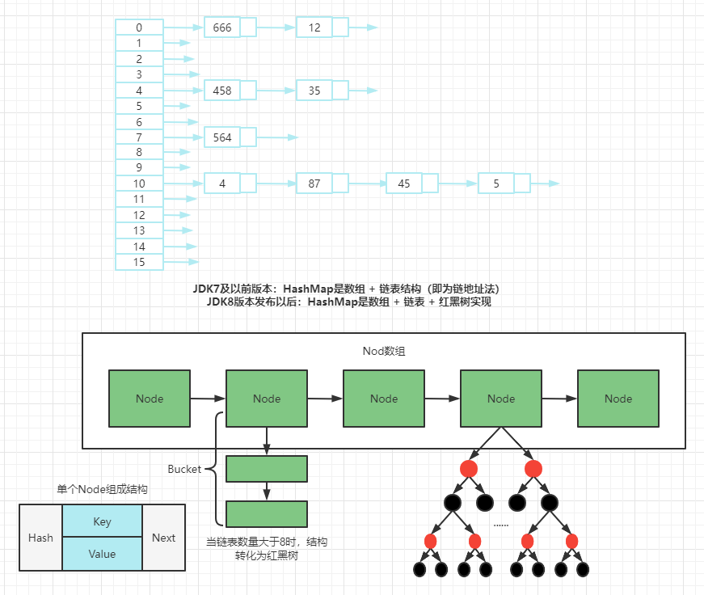
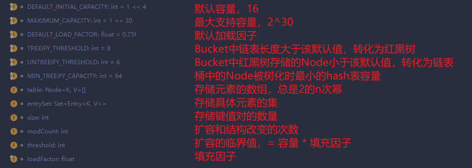
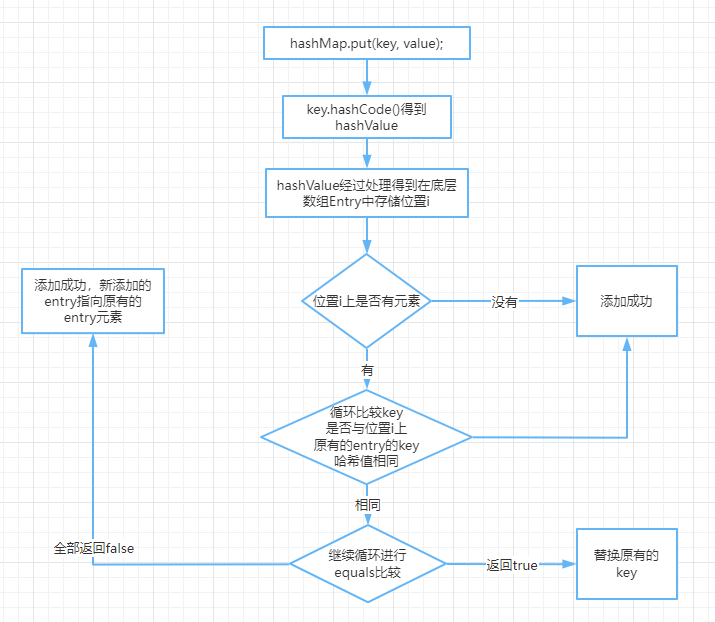
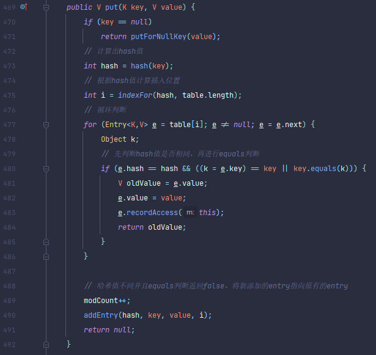
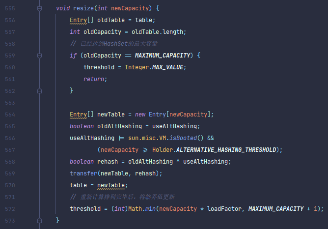

- Map与Collection并列存在。用于保存具有**映射关系**的数据：key-value。
- Map中的key和value都可以是任何引用类型的数据。
- Map中的**key用Set来存放，不允许重复**，即同一个Map对象所对应的类，须重写hashCode和equals方法。

- 常用String类作为Map的“键”。

- key和value之间存在单向一对一关系，即通过指定的key总能找到唯一的、确定的value。

- Map接口的常用实现类：HashMap、TreeMap、LinkedHashMap和Properties。其中，**HashMap是Map接口使用频率最高的实现类**。

## 常用方法

- 添加、删除、修改操作
  - Object put(Object key,Object value); 将指定key-value添加到(或修改)当前Map对象中
  - void putAll(Map m); 将m中所有key-value对存放到当前map中
  - Object remove(Object key); 移出指定key的key-value对，并返回value
  - void clear(); 清空当前map中的所有数据
- 元素查询的操作
  - Object get(Object key); 获取指定key对应的value
  - boolean containsKey(Object key); 是否包含指定的key
  - boolean containsValue(Object value); 是否包含指定的value
  - int size(); 返回map中key-value对的个数
  - boolean isEmpty(); 判断当前map是否为空
  - boolean equals(Object obj); 判断当前map和参数对象obj是否相等
- 元视图操作
  - Set keySet(); 返回所以key构成的Set集合
  - Collection values(); 返回所有value构成的Collection集合
  - Set entrySet(); 返回所有key-value对构成的Set集合

## HashMap

> - **HashMap是Map接口使用频率最高的实现类。**
> - 允许使用null键和null值，与HashSet一样，不保证映射的顺序。
> - 所有的key构成的集合是Set：无序的、不可重复的。所以要重写方法。
> - 所有value构成的集合是Collection：无序的、可以重复的。所以要重写equals。
> - 一个key-value构成一个entry。
> - 所有的entry构成的集合是Set：无序的、不可重复的。
> - HashMap判断两个key相等的标准是：两个key通过equals方法返回true，hashCode值也相等。
> - HashMap判断两个value相等的标准是：两个value通过equals方法返回true。

### HashMap的存储结构

### HashMap源码中的重要常量

### JDK 1.8之前

HashMap的内部存储结构其实是**<u>数组和链表</u>**的结合。当实例化一个HashMap时，系统会创建一个长度为Capacity的Entry数组，这个长度在哈希表中被称为容量(Capacity)，在这个数组中可以存放元素的位置我们称之为“桶”(bucket)，每个bucket都有自己的索引，系统可以根据索引快速的查找bucket中的元素。

每个bucket中存储一个元素，即一个Entry对象，但每一个Entry对象可以带一个引用变量，用于指向下一个元素，因此，在一个桶中，就有可能生成一个Entry链。而且**==新添加的元素作为链表的head==**。

- **添加元素的过程**

  向HashMap中添加entry1(key, value)，首先需要计算entry1中key的哈希值（根据key所在类的hashCode计算得到），这个哈希值经过处理以后，得到在底层Entry[]数组中要存储的位置i。如果位置i上没有元素，则entry1直接添加成功。如果位置i上已经存在entry2（或还有链表存在的entry3，entry4），则需要通过循环的方法，依次比较entry1中key和其它的entry。如果彼此hash值相同，则直接添加成功。如果hash值相同，继续比较二者是否equals。如果返回true，则使用entry1的value去替换equals为true的entry的value。如果遍历一遍以后，发现所有的equals返回都为false，则entry1仍可添加成功。entry1指向原有的entry元素。

  

  

- **HashMap的扩容**

  当HashMap中的元素越来越多的时候，hash冲突的几率也就越来越高，因为数组的长度是固定的，所以为了提高查询的效率，就要对HashMap的数组进行扩容，而**<u>在HashMap数组扩容之后，最消耗性能的点就出现了：原数组中的数据必须重新计算其在新数组中的位置，并放进去，这就是resize。</u>**

- **那么HashMap什么时候进行扩容呢？**

  当HashMap中的元素个数超过数组大小 * loadFactor时，就会进行数组扩容，而loadFactor默认值就是0.75.也就是说，默认数组大小为16，当元素个数超过16 * 0.75 = 12（这个值就是代码中的threshold值，也叫做临界值）的时候，就把数组的大小扩展为2 * 16 = 32，即扩大一倍，然后重新计算每个元素在数组中的位置，而这是一个非常消耗性能的操作，所以***如果我们已经预知HashMap中元素的个数，那么预设元素的个数能够有效的提高HashMap的性能***。

  

### JDK 1.8

HashMap的内部存储结构其实是**<u>数组 + 链表 + 红黑树</u>**的结合。当实例化一个HashMap时，会初始化initialCapacity和loadFactor，在put第一对映射关系时，系统会创建一个长度为initialCapacity的Node数组，这个长度在哈希表中被称为容量(Capacity)，在这个数组中可以存放元素的位置我们称之为“桶”(bucket)，每个bucket都有自己的索引，系统可以根据索引快速的查找bucket中的元素。

每个bucket中存储一个元素，即一个Node对象，但每一个Node对象可以带一个引用变量next，用于指向下一个元素，因此，在一个桶中，就有可能生成一个Node链。也可能是一个一个TreeNode对象，每一个TreeNode对象可以有两个叶子节点left和right，因此，在一个桶中，就有可能生成一个TreeNode树。而新添加的元素作为链表的last，或树的叶子节点。

- **扩容和树形化**

  扩容操作与JDK1.7相类似。当HashMap中的其中一个链的对象个数如果达到了8个，此时如果没有capacity没有达到64，那么HashMap会先扩容解决；如果已经达到了64，那么这个链会变成树，节点类型由Node变成TreeNode类型。当然，如果当映射关系被移除后，下次resize时判断树节点个数低于6个，也会把树再转化为链表。

- **关于映射关系的key是否可以修改？**

  不要修改！映射关系存储到HashMap中会存储key的hash值，这样就不用再每次查找时重新计算每一个Entry或Node(TreeNode)的hash值了，因此如果已经put到Map中的映射关系，再修改key的属性，而这个属性又参与hashCode值得计算，那么会导致匹配不上。

### 总结：JDK1.8相较于之前得变化

1. HashMap map = new HashMap(); // 默认情况下，先不创建长度为16的数组
2. 当首次调用map.put()时，再创建长度为16的数组
3. 数组为Node类型，在JDK1.7中称为Entry类型
4. 形成链表结构时，新添加的key-value对在链表的尾部（七上八下）
5. 当数组指定索引位置的链表长度 > 8时，且map中的数组的长度 > 64时，次索引位置上的所有key-value对使用红黑树进行存储。

## LinkedHashMap

- HashMap的子类。
- 在HashMap存储结构的基础上，使用了一对双向链表来记录添加元素的顺序。
- 与LinkedHashSet类似，LinkedHashMap可以维护Map的迭代顺序：迭代顺序与key-value对的插入顺序一致。

## TreeMap

- TreeMap存储key-value对时，需要根据key-value对进行排序，TreeMap可以保证所有的key-value对处于有序状态。
- TreeMap底层使用红黑树结构存储数据。
- TreeMap的key的排序：
  - 自然排序：TreeMap所有key必须实现Comparable接口，而且所有的key应该是同一个类的对象，否则将会抛出ClassCastException。
  - 定制排序：创建TreeMap时，传入一个Comparator对象。此时不需要Map的key实现Comparable接口。
- TreeMap判断两个key相等的标准：两个key通过compareTo方法或者compare方法返回0.

## Hashtable

- Hashtable是一个古老的Map实现类，JDK1.0就提供了，并且与HashMap不同的是，它是线程安全的。
- Hashtable实现原理和HashMap相同，功能相同。底层都使用哈希表结构，查询速度快，很多情况下可以互用。
- 与HashMap不同，Hashtable不允许使用null作为key和value。
- 与HashMap一样，Hashtable也不能保证其中key-value对的顺序。
- 判断key、value相等的标准，同HashMap。

## Properties

- Properties类是Hashtable的子类，该对象用于处理属性文件
- 由于属性文件里的key、value都是字符串类型，所以**<u>Properties里的key和value都是字符串类型</u>**。
- 存取数据时，建议使用setProperty(String key, String value)方法和getProperty(String key)方法。