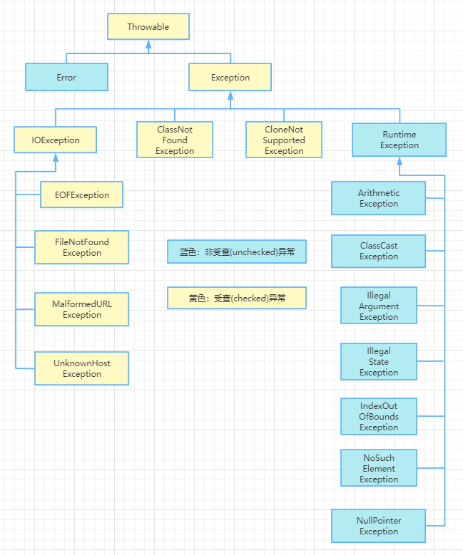

# JavaSE 常见面试题

## 写出 Java 的四类八种基本数据类型

| 整数 | byte(1 字节)、short(2 字节)、int(4 字节)、long(8 字节) |
| ---- | -------------------------------------------------- |
| 小数 | float(4 字节)、double(8 字节)                        |
| 布尔 | boolean(Oracle 的 JVM 占 1 个字节，Java 的 JVM 占 4 个字节)  |
| 字符 | char(2 字节)                                        |

## &和&&的区别

&符号的左右两边，无论真或假都要执行

&&符号的左边如果为假，那么右边不再执行，提高了代码的执行效率

## switch 的参数可以是什么类型

byte、short、int、char、String、枚举

## 说出成员变量和局部变量的区别

- 代码位置

  成员变量在类中方法外；局部变量在方法体的花括号里

- 内存位置

  成员变量的静态变量（类变量）存储在方法区，非静态变量（实例变量）存储在堆中；局部变量通常存储在栈内存中

- 生命周期

  成员变量的静态变量与类生命周期相同，非静态变量与所被调用的实例对象生命周期相同；局部变量随着方法的调用而产生，随着方法调用结束而消失

- 有无默认值

  成员变量有默认值（整数 0, 小数 0.0, 字符‘\u0000’, 布尔 false, 引用数据类型 null）；局部变量没有默认值，使用的时候必须先赋值

## static 关键字都能修饰什么？都有什么特点

- 修饰类（静态内部类）不依赖外部类实例，可直接通过其外部类【其外部类名.静态内部类名】来访问
- 修饰成员变量（静态变量）属于类本身，类所有实例共享，可直接通过【类名.】直接访问，节省内存空间
- 修饰方法（静态方法）属于类的方法，可以直接通过【类名.】进行调用
- 修饰代码块（静态代码块）在类加载时执行一次，用于初始化静态变量给静态变量进行赋值，或执行只需执行一次的代码

## overload 和 override 的区别

overload 是重载，必须写在同一个类中，说白了就是同一个类中，存在多个同名的方法（但方法的参数不同（参数不同表现在：个数不同，数据类型顺序不同，数据类型不同））

override 是重写，让一个子类继承了父类的一个方法，并保持：方法名相同、参数列表相同、返回类型相同，然后我们重新改写了这个子类方法的方法体（构造方法不能被重写，因为构造方法要求方法名与类名保持一致）

## final 和 finally 的区别

- final 是权限修饰符，表示最终的，能修饰类、方法、变量
  - 修饰变量：变成了常量
  - 修饰方法：变成了最终的方法，不能被重写，但是可以被正常调用
  - 修饰类：变成了最终的类，不能有子类，但是可以被正常创建对象
- finally 是一个代码块，只能与我们的 try 代码块连用，表示无论代码是否发生异常，finally 里面的代码都要执行

## this 和 super 都能用到哪些地方

- this 和 super 都能用于访问成员变量、方法和构造器上
- this 关键字能够用来帮助我们访问本类的成员变量、方法还有构造器，用来代指引当前 Class 类对应的对象实例，当遇到变量名冲突的时候，用来区分成员变量和局部变量
- super 则是专门用于子类访问父类的地方，它能够用来帮助我们访问父类的成员变量、方法还有构造器，确保了在子类中可以正确的使用和继承父类的功能。当遇到子类与父类有重名的成员变量和方法时，super 就可以帮助我们明确指出哪些是父类的成员变量和方法

## 接口与抽象类的区别

- 接口用 interface 定义，抽象类用 abstract class 定义
- 类实现接口用 implements, 而类继承抽象类用 extends
- 一个类可以实现多个接口，但只能继承一个抽象类（Java8 后接口可以多继承）
- 接口中的方法都是抽象的，不能有具体实现，而抽象类可以有抽象方法和非抽象方法
- 接口中的属性默认都是 public static final 的，而抽象类中的属性可以是各种类型的
- 接口不能被实例化，抽象类也不能被直接实例化，但可以通过子类实例化

::: tip

JDK8 之后，接口都是公共的抽象方法，允许有公共的静态方法和默认方法，JDK9 之后允许有私有方法

:::

## 静态变量与实例变量的区别

静态变量在方法区中，在字节码文件加载时创建，卸载时销毁。既可以通过类名直接调用，也可以通过对象名进行调用。使用 static 关键字声明，属于类本身，所有对象共享一个静态变量

实例变量在堆内存中，在对象创建时产生，在对象被 GC 时销毁。只能通过对象名访问，属于对象，每个对象有自己独立的实例变量

## throw 和 throws 的区别

- throw 是具体抛出一个异常对象，在方法内部，后面有且只能有一个异常对象。代码一旦遇到了 throw 证明出现了问题，代码就会停止，线程会异常退出
- throws 是异常的声明，在方法定义的小括号后面，后面可以跟多个异常的类型。方法有 throws, 代码不一定发生异常

## String、StringBuilder 和 StringBuffer 的区别

三者都是 final 类，也就是不允许被 `extends`

String 声明的数据被修改时会产生一个新的内存对象，而 StringBuilder 和 Buffer 则是可以直接对自身数据进行修改，不会产生新的内存对象

如果要对 StringBuilder 和 Buffer 所修饰的数据更改的话，首先 StringBuilder 适用于单线程环境中频繁修改字符串，而 StringBuffer 则适用于多线程环境中使用，这是由于 Buffer 类中大多数方法都是加了 synchronized 关键字修饰 

 三者底层都是 char 数组，但 String 是不可变的字符序列，而 StringBuilder 和 Buffer 都是可变的字符序列

## == 和 equals 的区别

== 既可以比较基本数据类型，也可以比较引用数据类型。比较基本数据类型的时候，比较的是具体的值；比较引用类型的时候，比较的是地址值

直接调用使用 equals 默认方法，比较的是两个对象的地址值，但常见的类，比如 String、包装类、集合类等，默认已经重写好了 equals 方法，因此比较的是值的内容

## 包装类的拆箱、装箱

装箱：将基本数据类型转换成包装类对象

拆箱：将包装类对象转换成基本类型的值

区别：以 int 和 Integer 为例

- Integer 是 int 的包装类，int 则是 Java 的一种基本数据类型
- Integer 变量必须实例化后才能使用，而 int 变量不需要
- Integer 实际是对象的引用，当 new 一个 Integer 时，实际上生成一个指针指向此对象，而 int 则是直接存储数据值
- Integer 默认值是 null, int 默认为 0

:::tip

Java为什么要引入自动装拆箱机制？这主要是为了更好的服务Java集合，比如List集合要放整数的话，只能放对象形式，不能放基本类型的形式，因此需要将整数自动装箱成对象形式

:::

## 异常结构图

## HashSet 的去重原理

当使用HashSet存储对象时，为了确保对象的唯一性，HashSet会依赖于Java默认给对象的hashCode和equals方法。如果两个对象的hashCode值不同，直接插入成功。如果两个对象的hashCode值相同，则继续比较两个对象的地址值。如果也相同，即为同一个对象，插入失败，反之，则会继续调用equals方法比较，如果返回true,插入失败，反之插入成功。

:::info

**HashSet中添加元素的过程**

1. 当向HashSet集合中存入一个元素时，会调用该对象的hashCode方法得到该对象的hashCode值，然后根据这个值，通过某个散列函数决定该对象在HashSet底层数组中的存储位置
2. 如果要在数组中存储的位置上没有元素，则直接添加成功
3. 如果这个位置上有元素，则继续比较
   - 如果两个元素的hashCode值不相等，则添加成功
   - 如果相同，则继续调用equals方法
     - 如果equals方法结果为false,则添加成功
     - 如果为true,则添加失败

第二步添加成功，元素会保存在底层数组中。第三步两种添加成功的操作，由于该底层数组的位置已经有元素了，则会通过链表的方式继续链接存储

:::

## 集合与数组的区别

- 集合与数组都是容器
- 数组既可以存基本数据类型，也可以存储引用数据类型，并且长度固定且不能发生改变
- 集合只能存储引用数据类型，且长度可变

## 多线程的五种实现方式

1. 继承Thread,重写run方法，最后创建Thread的子类对象，调用start方法开启线程任务
2. 实现Runnable接口，重写run方法，创建Runnable的实现类对象，通过Thread的构造传递，调用start方法开启线程任务
3. 实现Callable接口，重写call方法，创建Callable的实现类对象，将Callable的实现类对象，传递到FutureTask的构造方法中，最后将FutureTask传递到Thread的构造方法中，通过start方法开启线程任务
4. 使用线程池创建
5. 使用JDK8自带的异步编排方式（CompletableFuture）

其实不管是哪种方式创建，底层都是通过实现Runnable接口方式创建线程

## 多线程的生命周期

源码中一共定义了六种状态：

- 新建（NEW）：线程对象刚给创建，但未启动（start）
- 可运行（RUNNABLE）：线程已经启动，可以被调度或正在被调度
- 锁阻塞（BLOCKED）：当前线程要获取的锁对象正在被其他线程占用
- 等待阻塞（WAITING）：当前线程遇到了wait()、join()等方法
- 限时等待（TIMED_WAITING）：当前线程调用了sleep()、wait()、join()等方法
- 终止（TERMINATED）：线程正常结束或异常提前退出

## TreeSet 和 HashSet 的区别

简单来说，TreeSet和HashSet的主要区别体现在以下几个方面

- 排序
  - TreeSet的元素是有序的，它会按照元素的自然顺序或者通过Comparator指定的顺序进行排序
  - HashSet中的元素是无序的，它们不会按照任何特定的顺序存储或检索
- 唯一性
  - 两者都保证集合中元素的唯一性，但是TreeSet是通过元素的比较（自然顺序或Comparator）来确定唯一性，而HashSet则是通过元素的hashCode和equals方法来确定唯一性
- 性能
  - HashSet在大多数情况下提供了更快的插入、删除和查找操作，因为它的底层是哈希表
  - TreeSet的插入、删除和查找相对较慢，因为它需要维护一个有序的结构（红黑树），但这些操作的时间复杂度是对数级的
- 对null的处理
  - HashSet允许有一个null元素
  - TreeSet不允许有null元素
- 用途
  - 如果需要一个无序的、快速进行插入、删除和查找操作，那么HashSet是更好的选择
  - 如果需要一个有序的，或者需要按照特定顺序对元素进行排序，那么TreeSet是更合适的选择

## IO 流一共分为几类

根据流向有输入流和输出流两种，根据类型有字节流和字符流（InputStream、OutputStream、Reader、Writer）

字节流是万能流，可以处理任意的文件；字符流基本上用来处理纯文本文件

## Map 的三种遍历方式

1. 增强for循环迭代
2. entrySet迭代
3. keySet迭代

## HashMap 与 Hashtable 的区别

- 线程安全性不同
  - HashMap是线程不安全的
  - Hashtable中大多数方法都是synchronized的
- 是否提供contains方法
  - HashMap只有containsKey和containsValue方法
  - Hashtable还有contains方法，其中contains和containsValue方法功能相同
- key和value是否允许null值
  - Hashtable中，key和value都不允许null值
  - HashMap中，null可以作为键，并且可以有一个或多个键所对应的值为null
- 数组初始化和扩容机制
  - Hashtable的默认容量是11,而HashMap在不指定时，并不会提前构建指定长度大小的数组，而是当第一次put元素的时候才会去创建一个容量大小为16的数组
  - Hashtable扩容时变为原来的2倍加1,而HashMap扩容时变为原来两倍

## ArrayList 与 LinkedList 的区别

ArrayList是一个基于动态数组实现的数据集合列表，它能够在运行时根据需要改变数组的大小，并且提供了操作元素的快捷方法。当我们需要随机，也就是通过索引来快速访问数据的时候，适合使用ArrayList

LinkedList是一个双向链表结构的数据集合，它的每个节点包含了数据和对前一个节点和后一个节点的引用。当我们需要频繁插入或删除元素时，LinkedList是一个更好的选择

## 什么是反射

允许我们在类的外部通过各种方法获取和操作类本身的内部信息，具体来说，反射可以做到以下几点：

1. 获取类的信息：通过反射，你可以获取一个类的Class对象，进而了解该类的名称、包名、父类、接口、属性、方法、构造器等详细信息
2. 动态加载类：你可以根据配置文件或用户输入的类名，在运行时动态的加载相应的类
3. 创建类的实例：即使在不知道具体类名的情况下，通过发射传入类名字符串来创建类的实例
4. 调用类的方法：无论是公共方法，私有方法还是静态方法，都可以通过反射来调用
5. 修改类的属性：即使类的私有属性没有提供公共的setter方法，也能通过反射来修改它的值

## 深拷贝和浅拷贝

深拷贝和浅拷贝就是指对于对象的拷贝，一个对象中存在两种类型的属性，一种是基本数据类型，一种是引用数据类型：

- 对于基本数据类型，深拷贝和浅拷贝并无区别，都是直接复制值
- 对于引用数据类型
  - 浅拷贝只是复制引用地址，新旧对象会共享、共用同一个实例
  - 深拷贝则是复制实例及其内容数据，会完全复制出来一个新的对象来用，新旧对象完全独立
