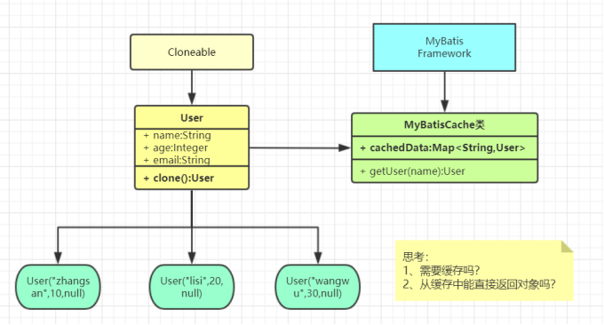

# 创建型模式

创建型模式的关注点是 `怎样创建出对象？`，它 “将对象的创建与使用分离”，以此来降低系统的耦合度，同时 使用者无需关注对象的创建细节。

创建型模式主要有以下四种：
1. 对象的创建由相关的工厂来完成；（各种工厂模式）
2. 对象的创建由一个建造者来完成；（建造者模式）
3. 对象的创建由原来对象克隆完成；（原型模式）
4. 对象始终在系统中只有一个实例；（单例模式）


## 单例模式（Singleton）

单例的核心思想就是 `一个单一的类，负责创建自己的对象，同时确保系统中只有单个对象被创建`，而这种思想造成它的特点就是：
- 某个类只能有一个实例；（构造器私有）
- 它必须自行创建这个实例；（自己编写实例化逻辑）
- 它必须自行向整个系统提供这个实例；（对外提供实例化方法）

下面来看一个简单的单例实例：
```java
public class Person {

    private String name;
    private int age;

    // 饿汉式
    // private final static Person instance = new Person();
    private volatile static Person instance;

    private Person() {
        System.out.println("Person constructor...");
    }

    // 双重检查锁 + 内存可见性
    public static Person getInstance() {
        if (instance == null) {
            synchronized (Person.class) {
                if (instance == null) {
                    instance = new Person();
                }
            }
        }
        return instance;
    }
}
```
我们给 Person 类的构造器设置访问权限为 private, 这能保证它不被外部容器创建实例，同时我们定义一个 `getInstance` 方法让外部容器能够获得 Person 类实例。
为了能被静态方法调用，因此我们还加上了 `static` 关键字

在 Person 来中定义一个 `private volatile static` 的 Person 类属性，在 `getInstance` 中使用 `synchronized` 对其进行实例化，通过 `双重检查锁 + 内存可见性` 来确保外部容器自始自终能且只能获取到唯一的一个 Person 实例

::: tip
关于单例模式的实现有饿汉式和懒汉式两种实现，而懒汉式为了保证多线程环境下的唯一性又有多种实现，这里的写法并不是唯一的！
:::

### 应用场景

什么场景用到单例模式？
- 多线程中的线程池
- 数据库的连接池
- 系统环境信息
- 上下文（ServletContext）
- ......

面试问题
- 系统环境信息（System.getProperties()）？
- Spring 中怎么保持组件单例的？
- ServletContext 是什么（封装 Servlet 的信息）？是单例吗？怎么保证？
- ApplicationContext 是什么？是单例吗？怎么保证？
- 数据库连接池一般怎么创建出来的，怎么保证单实例？
- ......

::: details 这些问题的答案
将在后面逐一揭晓 : blush:
:::

## 原型模式（Prototype）

原型模式（Prototype Pattern）是用于创建重复的对象，同时又能保证性能。下面以一个



如图，MyBatisCache 是一个简化的 MyBatis 框架，当我们根据用户名查找用户时，它可以返回

### 应用场景

- 资源优化
- 性能和安全要求
- 一个对象多个修改者的场景。
- 一个对象需要提供给其他对象访问，而且各个调用者可能都需要修改其值时可以考虑使用原型模式拷贝多个对象供调用者使用。
- 深（两个完全对象不一样的【递归克隆】，内容却完全一样）、浅（只是属性赋值）....
- ......

**原型模式已经与 Java 融为浑然一体，大家可以随手拿来使用**