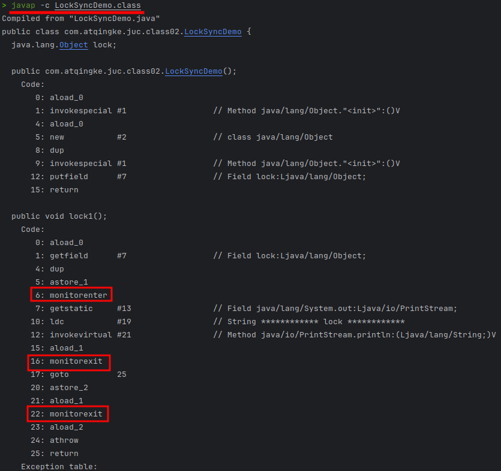

# 🔒 锁

[TOC]

## 悲观锁

认为自己在使用数据的时候一定会有别的线程来修改数据，因此在获取数据的时候都会先加锁，确保数据不会被别的线程修改。`synchronized` 关键字和 `Lock` 实现类都是悲观锁

适合写操作多的场景，先加锁可以保证写操作时数据是正确的

## 乐观锁

认为自己在使用数据的时候不会有别的线程修改数据或资源，所以不会添加锁。在 Java 中使用过 `无锁编程` 来实现的，只有当更新数据时，才会去判断之前有没有别的线程更新了数据。如果这个数据没有被更新，当前线程将自己的修改写入；否则，则根据不同的实现方式执行不同的操作，比如放弃修改、重试抢锁等

那么这个判断规则有两种：

1. 版本号机制 Version
2. CAS 算法，也是最常用的（Java 原子类中的递增操作就是通过 CAS 自旋实现的）

## 线程八锁

::: code-group

```java [Phone]
class Phone {
    public synchronized void sendEmail() {
        System.out.println("---------- send email ---------");
    }

    public synchronized void sendSMS() {
        System.out.println("---------- send SMS ---------");
    }
}
```

```java [Lock8Demo]
public class Lock8Demo {
  
    public static void main(String[] args) {
        lock1();
    }

    public static void lock1() {
        Phone phone = new Phone();
        new Thread(phone::sendEmail, "a").start();
        try {
            TimeUnit.MILLISECONDS.sleep(200);
        } catch (InterruptedException e) {
            throw new RuntimeException(e);
        }
        new Thread(phone::sendSMS, "b").start();
    }
}
```

:::

### 标准访问有 ab 两个线程，先打印邮件还是短信？

```shell
---------- send email ---------
---------- send SMS ---------
```

### sendEmail 方法加入暂停 3 秒钟，先打印邮件还是短信？

```shell
---------- send email ---------
---------- send SMS ---------
```

---

>一个对象里面有多个 synchronized 方法，某一时刻内，只要有一个线程去调用其中一个 synchronized 方法了，其他的线程都只能等待
>
>也就是说：锁的是当前对象 this, 被锁定后，其他线程不能进入当当前对象的其他 synchronized 方法

### 添加一个普通的 hello 方法，先打印邮件还是 hello？

```shell
---------- hello ---------
---------- send email ---------
```

### 有两部手机，先打印邮件还是短信？

```shell
---------- send SMS ---------
---------- send email ---------
```

---

> 加入普通方法后发现和同步锁无关；换成两个对象后，不是同一把锁了，情况立马发生变化

### 有两个静态同步方法，一部手机，先打印邮件还是短信？

```shell
---------- send email ---------
---------- send SMS ---------
```

### 有两个静态同步方法，两部手机，先打印邮件还是短信？

```shell
---------- send email ---------
---------- send SMS ---------
```

---

> - 对于普通同步方法，锁的是当前实例对象，通常是指 this
> - 对于静态同步方法，锁的是当前类的 Class 对象
> - 对于同步代码块，锁的是 synchronized 括号内的对象

### 有一个静态同步方法，一个普通同步方法，一部手机，先打印邮件还是短信？

```shell
---------- send SMS ---------
---------- send email ---------
```

### 有一个静态同步方法，一个普通同步方法，两部手机，先打印邮件还是短信？

```shell
---------- send SMS ---------
---------- send email ---------
```

---

> 当一个线程试图访问同步代码时，首先必须获取锁，正常退出或异常时必须释放锁
>
> 所有的普通同步方法用的都是同一把锁——实例对象本身，就是 new 出来的具体实例对象本身，本类 this
>
> 所有的静态同步方法用的也是同一把锁——类对象本身，就是唯一模板 Class
>
> 具体实例对象 this 和唯一模板 Class, 这两把锁是两个不同的对象，所以静态同步方法与普通同步方法之间是没有竞态条件的。但是一旦一个静态同步方法获取锁后，其他的静态同步方法都必须等待该方法释放锁后才能获取锁

## synchronized 字节码分析

### 同步代码块

```java
public class LockSyncDemo {

    Object lock = new Object();

    public void lock1() {
        synchronized (lock) {
            System.out.println("************ lock ************");
        }
    }

    public static void main(String[] args) {

    }
}
```



同步代码块使用的是 `monitorenter` 和 `monitorexit` 指令来实现的同步，一般而言是一个 enter 和两个 exit

### 同步方法

使用`javap -v LockSyncDemo.class`命令可以查看字节码文件的详细信息：


对于普通同步方法而言，它是通过`ACC_SYNCHRONIZED`实现同步的


而对于静态同步方法，它是通过` ACC_STATIC`、` ACC_SYNCHRONIZED`两个访问标识来实现同步的

> 为什么任何一个对象都可以成为一个锁🔒
>
> 每个对象天生都带着一个对象监视器，每一个被锁住的对象都会和Monitor关联起来（ObjectMonitor.java –> ObjectMonitor.cpp –> objectMonitor.hpp）

## 公平锁与非公平锁

:::code-group

```java [非公平锁]
package com.atqingke.juc.class02;

import java.util.concurrent.locks.ReentrantLock;

class Ticket {
    private int number = 50;
    ReentrantLock lock = new ReentrantLock();

    public void sale() {
        lock.lock();
        try {
            if (number > 0) {
                System.out.println(Thread.currentThread().getName() + "sale the: \t" + (number--) + "\t and have: \t" + number + "\tnow");
            }
        } finally {
            lock.unlock();
        }
    }
}

public class SaleTicketDemo {

    public static void main(String[] args) {
        Ticket ticket = new Ticket();
        new Thread(()->{
            for (int i = 0; i < 55; i++) ticket.sale();
        }, "aaa").start();
        new Thread(()->{
            for (int i = 0; i < 55; i++) ticket.sale();
        }, "bbb").start();
        new Thread(()->{
            for (int i = 0; i < 55; i++) ticket.sale();
        }, "ccc").start();
    }
}
```

```java [公平锁]
    ReentrantLock lock = new ReentrantLock(true); 
```

:::

> ❓为什么会有公平锁/非公平锁的设计，为什么默认非公平
>
> 恢复挂起的线程到真正锁的获取还是有时间差的，从开发人员来看这个时间微乎其微，但是从CPU的角度来看，这个时间差存在的还是很明显的。所以非公平锁能更充分利用CPU的时间片，尽量减少CPU空闲状态时间
>
> 使用多线程很重要的考量就是线程切换的开销，当采用非公平锁时，一个线程请求锁获取同步状态，然后释放同步状态，所以刚释放锁的线程在此刻再次获取同步状态的概率变得非常大，所以就减少了线程切换的开销

## 可重入锁（递归锁）

是指同一个线程在外层方法获取锁的时候，再进入该线程的内层方法会自动获取锁（前提是锁对象是同一个对象），不会因为之前已经获取过还没释放而阻塞

:::tip

如果一个有synchronized修饰的递归调用方法，程序第二次进入被自己阻塞了岂不是天大的消化，出现了作茧自缚。所以Java中的ReentrantLock和synchronized都是可重入锁，优点就是在一定程度上可以避免死锁

:::

### 实现原理

每个锁对象拥有一个锁计数器和一个指向持有该锁的线程的指针。当执行monitorenter时，如果目标锁对象的计数器为零，那么说明它没有被其他线程所持有，Java虚拟机会将该锁对象的持有线程设置为当前线程，并且将其计数器加一

在目标锁对象的计数器不为零的情况下，如果锁对象的持有线程是当前线程，那么Java虚拟机可以将其计数器加一，否则需要等待，直至持有线程释放锁

当执行monitorexit时，Java虚拟机则需要将锁对象的计数器减一，计数器为零则代表锁已被释放

## 死锁排查

```shell
# 查看当前系统正在执行的Java进程及其标识信息
jps -l
# 查看特定进程的状态和堆栈信息
jstack 进程id
```

