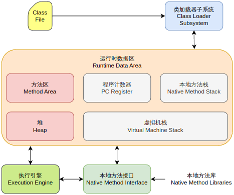

# 字节码篇

Java虚拟机的指令由一个字节长度的操作码 + 操作数构成（许多只包含操作码）

## 字节码相关面试题

Java虚拟机中，数据类型可以分为哪几类

为什么不把基本类型放在堆中

## Class文件结构

Class文件的结构并不是一成不变的，也会随着Java虚拟机的发展，做出一些调整，但整体的结构和框架还是非常稳定的。Class文件总体结构如下：

- 魔数
- Class文件版本
- 常量池
- 访问标识
- 类索引、父类索引、接口索引集合
- 字段表集合
- 方法表集合
- 属性表集合

## 字节码指令

按用途大致分为9类：

1. 算术指令
2. 加载与存储指令
3. 类型转换指令
4. 对象创建与访问指令
5. 方法调用与返回指令
6. 操作数栈管理指令
7. 控制转移指令
8. 异常处理指令
9. 同步控制指令