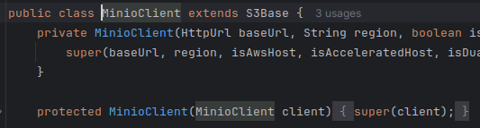

# 专辑管理

## 准备工作

::: tip

这里的准备工作对后面所有模块都是通用的，因此只在这里说明一次！

:::

### 关于 Nacos 中配置文件的说明

专辑管理对应的模块是 service-album，首先我们将 application.properties 中的 nacos 配置修改为自己本机的配置。其次，我们需要访问 nacos，增加一个关于 service-album 和 service-gateway 的配置，所有模块的配置内容参见 `/tingshu-parent/aNacos` 目录下（后续某个模块第一次启动，都需要在 nacos 中添加对应的配置，你可以在这里一次性将所有配置文件都导入/新建到 nacos 中）。同样的，也需要将相关的地址配置等信息修改为自己本机配置。


### 关于数据库表设计

除非实在没有必要，否则每张表都有以下四个字段：

```mysql
id          bigint auto_increment comment '编号' primary key,
create_time timestamp default CURRENT_TIMESTAMP not null comment '创建时间',
update_time timestamp default CURRENT_TIMESTAMP not null on update CURRENT_TIMESTAMP,
is_deleted  tinyint   default 0                 not null
```

对应的也就是所有实体类都继承的 BaseEntity 类中的四个属性：

```java
@TableId(type = IdType.AUTO)
private Long id;

@TableField("create_time")
private Date createTime;

@JsonIgnore
@TableField("update_time")
private Date updateTime;

@JsonIgnore
@TableLogic
@TableField("is_deleted")
private Integer isDeleted;
```


---


专辑管理的主要功能如下：

1. 先获取到专辑分类
2. 查询专辑标签
3. 文件上传
4. 保存专辑

功能入口：运行 app 项目--> 我的--> 创作中心点击 + 添加专辑


## 分类业务

### 功能设计

分类业务主要涉及以下三个功能：

1. 页面中的各个分类数据的展示
2. 根据一级分类 id，查询这个分类下所有的二级和三级分类数据
3. 展示某个一级分类下 7 个三级分类

### 表结构设计

专辑的分类是一个三级分类，设计了三个表 `base_category1`、`base_category2`、`base_category3`，分别对应了一级分类、二级分类和三级分类。同时，一级分类还具有属性，因此又设计了两张表 `base_attribute`、`base_attribute_value`。


三张分类表没有什么特殊的地方，在二级/三级分类表中有字段 `category1_id/category2_id` 来存储二级/三级分类对应的一级/二级分类 id。

分类的属性类似于商品的标签，比如一本专辑，它的一级分类是 `有声书`，那么这本专辑是属于男频小说还是女频小说，播讲人是多人还是双人，专辑是付费还是免费。这些对应的就是一级分类 `有声书` 具备的属性 `有声书分类`、`播讲形式`、`是否付费`、`是否完本` 等，存储在 `base_attribute` 表中，对应的就是 `category1_id` 和 `attribute_name` 字段。而 `男频小说`、`女频小说`、`多人`、`双人`、`付费` 等就属于属性的值，存储在 `base_attribute_value` 表中，对应的就是 `attribute_id`、`value_name` 字段。

除此之外，从图中还可以看到一张表 `base_category_view`，实际上这是一张视图。首先我们来看到前端需要的分类数据格式如下：

```json
[
  {
    "categoryName":"音乐",                 
    "categoryId":1,                       
    "categoryChild":[
      {
        "categoryName": "音乐音效",
        "categoryId": 101,
        "categoryChild": [
          {
            "categoryName": "催眠音乐",
            "categoryId": 1001
          },
          {
            "categoryName": "放松音乐",
            "categoryId": 1002
          },
          {
            "categoryName": "提神音乐",
            "categoryId": 1003
          }
        ]
      }
    ]
  }
]
```
如果我们直接对三张分类表进行处理，那么在 MySQL 层面，可以实现的方法多种多样，比如子查询，连接查询等。而三张表的数据都需要，因此在这里可以使用内连接：
```mysql
select 
    t1.id as category1_id, t1.name as category1_name, 
    t2.id as category2_id, t2.name as category2_name,
    t3.id as category3_id, t3.name as category3_name
from tingshu_album.base_category1 t1
inner join tingshu_album.base_category2 t2 on t1.id = t2.category1_id
inner join tingshu_album.base_category3 t3 on t2.id = t3.category2_id
```
但是需要考虑的一个问题就是，如果使用上面的 SQL 语句，那么每次需要获取分类数据的时候，都需要向 MySQL 发送这个请求，而这毕竟算是一个多表连接的复杂查询，需要消耗较多的资源。
因此我们可以考虑让这个做到 `不需要每一次请求分类数据都要执行复杂SQL`。这里我们就可以使用 `视图`，将上面 SQL 执行的结果保存在视图 `base_category_view` 中，只有当分类表发生变化才会执行这段复杂 SQL。

```mysql
create view base_category_view as
select
    t3.id as id,
    t1.id as category1_id, t1.name as category1_name,
    t2.id as category2_id, t2.name as category2_name,
    t3.id as category3_id, t3.name as category3_name
from tingshu_album.base_category1 t1
         inner join tingshu_album.base_category2 t2 on t1.id = t2.category1_id
         inner join tingshu_album.base_category3 t3 on t2.id = t3.category2_id
```
这样，当我们需要获取分类数据的时候，只需要向视图表中执行一条普通的查询。在三级分类中，一级分类以及二级分类都不是唯一的记录，只有三级分类是唯一的，因此可以直接将三级分类的 id 作为 `base_category_view` 的主键 id

### 代码实现

MySQL 返回的结果中有大量的一级分类和二级分类的重复，而我们返回给前端的数据中，所有分类都只会出现一次。从 MySQL 中获取到的数据类型是 `List<BaseCategoryView>`，我们可以对其进行遍历，先根据一级分类进行分组，再根据二级分类进行分组。要返回上面的 JSON 格式的数据，就需要考虑后端的返回数据的格式了，毫无疑问，Map 是最符合要求的。

综上所诉，对于返回结果的设计是：`以一级分类id作为key,其对应的所有二级分类信息作为value。同时，这个value也是一个Map类型，它的key是二级分类id，value是其对应的所有三级分类信息`。

最终，我们可以得到如下的代码实现：
::: code-group
```java [BaseCategoryApiController]
@Autowired
private BaseCategoryService baseCategoryService;

@GetMapping("/getBaseCategoryList")
public Result getBaseCategoryList() {
    return Result.ok(baseCategoryService.getBaseCategoryList());
}
```
```java [BaseCategoryServiceImpl]
@Autowired
private BaseCategoryViewMapper baseCategoryViewMapper;

@Override
public List<JSONObject> getBaseCategoryList() {
    // 获取base_category_view视图中所有数据
    List<BaseCategoryView> c1List = baseCategoryViewMapper.selectList(null);
    // 根据一级分类进行分组，以一级分类的id为key
    Map<Long, List<BaseCategoryView>> c1Map = c1List.stream().collect(Collectors.groupingBy(BaseCategoryView::getCategory1Id));
    return c1Map.entrySet().stream().map(c1 -> {
        JSONObject c1Json = new JSONObject();
        c1Json.put("categoryId", c1.getKey());
        List<BaseCategoryView> c2List = c1.getValue();
        c1Json.put("categoryName", c2List.get(0).getCategory1Name());
        // 根据二级分类进行分组，以二级分类的id为key
        Map<Long, List<BaseCategoryView>> c2Map = c2List.stream().collect(Collectors.groupingBy(BaseCategoryView::getCategory2Id));
        List<JSONObject> c2Collect = c2Map.entrySet().stream().map(c2 -> {
            JSONObject c2Json = new JSONObject();
            c2Json.put("categoryId", c2.getKey());
            List<BaseCategoryView> c3List = c2.getValue();
            c2Json.put("categoryName", c3List.get(0).getCategory2Name());
            // 遍历以二级分类为分组的数据，取出其中的三级分类
            List<JSONObject> c3Collect = c3List.stream().map(c3 -> {
                JSONObject c3Json = new JSONObject();
                c3Json.put("categoryId", c3.getCategory3Id());
                c3Json.put("categoryName", c3.getCategory3Name());
                return c3Json;
            }).collect(Collectors.toList());
            c2Json.put("categoryChild", c3Collect);
            return c2Json;
        }).collect(Collectors.toList());
        c1Json.put("categoryChild", c2Collect);
        return c1Json;
    }).collect(Collectors.toList());
}
```
:::

## 文件上传

要实现的功能如图：


文件上传的操作实现主要是对 Minio 提供的 API 使用，关于 Minio 这里不过多赘述，如何使用它的 Java SDK 参考 [官网](https://min.io/docs/minio/linux/developers/minio-drivers.html#java-sdk)，上传完成后需要返回图片的访问地址给前端。

::: tip
文件上传时，需要调整一下 linux 服务器的时间与 windows 时间一致！


```shell
第一步：安装 ntp 服务
yum -y install ntp
# 第二步：开启开机启动服务
systemctl enable ntpd
# 第三步：启动服务
systemctl start ntpd
# 第四步：更改时区
timedatectl set-timezone Asia/Shanghai
# 第五步：启用 ntp 同步
timedatectl set-ntp yes
# 第六步：同步时间
ntpq -p
```
:::

要上传图片到 Minio，需要使用的 MinioClient 容器，它提供了 putObject 方法进行文件上传。要获取到这个容器，需要传入一些必备参数，比如：Minio 服务器地址、身份验证信息、需要操作的 bucket。对于这些信息，我们都存放在 nacos 的配置文件中，通过 MinioConstantProperties 来获取。

由于文件上传操作的通用性，在这里将其封装成一个工具类。同时，对于 MinioClient，查看它的源码可以发现，它的两个构造器分别是 private 和 protected 的，因此只能通过 builder 来获取。




代码实现：
::: code-group
```java [FileUploadApiController]
@SneakyThrows
@PostMapping("/fileUpload")
public Result fileUpload(@RequestPart("file") MultipartFile file) {
    return Result.ok(fileUtil.upload(file));
}
```
```java [FileUtil]
@Component
public class FileUtil {

    @Autowired
    private MinioConstantProperties minioConstantProperties;

    private MinioClient minioClient;

    @PostConstruct
    public void init() {
        minioClient = MinioClient.builder()
                .endpoint(minioConstantProperties.getEndpointUrl())
                .credentials(minioConstantProperties.getAccessKey(), minioConstantProperties.getSecreKey())
                .build();
    }

    @SneakyThrows
    public String upload(MultipartFile file) {
        String bucketName = minioConstantProperties.getBucketName();
        BucketExistsArgs bucketExistsArgs = BucketExistsArgs.builder().bucket(bucketName).build();
        if (!minioClient.bucketExists(bucketExistsArgs)) {
            MakeBucketArgs makeBucketArgs = MakeBucketArgs.builder().bucket(bucketName).build();
            minioClient.makeBucket(makeBucketArgs);
        }
        String fileName = UUID.randomUUID().toString();
        PutObjectArgs putObjectArgs = PutObjectArgs.builder()
                .bucket(bucketName)
                .object(fileName)
                .contentType(file.getContentType())
                .stream(file.getInputStream(), file.getSize(), -1)
                .build();
        minioClient.putObject(putObjectArgs);
        return minioConstantProperties.getEndpointUrl() + "/" + bucketName + "/" + fileName;
    }
}
```
:::

::: info

首先需要注意的是，这里的 file 参数使用的是 `@RequestPart` 注解来接收，它是 SpringMVC 提供的主要用来处理 `multipart/form-data` 类型的请求，也就是文件上传或者复杂结构的请求。

其次，这里的 MinioClient 使用了 `单例` 的思想，通过 `构造器 + @PostConstruct` 将其注入容器，这样规避了因批量上传而创建大量的 MinioClient 对象造成的 OOM 风险。

@PostConstruct 的执行时机是在 bean 实例化并完成所有依赖项注入后调用被其标记的方法，这里将 MinioClient 的实例化放在其标记的方法中，既确保了当调用上传接口时，minioClient 已完成实例化，又能保证程序在运行过程中只会创建这一个实例。

当然，这里将 MinioClient 注入容器内的方法不唯一，比如使用 `@Compoent + @Bean`。

:::

## 保存专辑


### 功能设计

当用户点击创作专辑，选好分类，上传封面，设置好相关信息，点击提交一个 AlbumInfoVo 对象，后端需要从中提取出一个 AlbumInfo 对象保存到数据库

### 表结构设计

首先需要将专辑信息保存到 `album_info` 中，作为一个初始化动作，还应该将其状态设为 `审核未通过`，也就是 `下架` 的状态

其次专辑有播放量、订阅量、购买量和评论数等统计信息，这些作为专辑的额外信息保存在独立的表单 `album_stat` 中。在专辑统计表中，`stat_type` 表示统计的类型，`stat_num` 表示对应类型的统计数目，`album_id` 字段用来标识当前记录属于哪个专辑

最后还有上面实现的分类业务中提到的属性也作为专辑的额外信息存储在 `album_attribute_value` 中：

- `album_id` 表明该条记录对应 `album_info` 表中哪个专辑
- `attribute_id` 表明该条记录对应 `base_attribute` 中哪个属性
- `value_id` 表明该条记录对应 `base_attribute_value` 中哪个属性值


::: tip

这里不需要将上面实现的分类业务也作为额外信息存储在单独的表中，这是因为专辑和分类是一对一的关系，一个专辑只能有一个三级分类，因此只需要在 `album_info` 设置一个 `category3_id` 来存储专辑所属三级分类的 id 即可。而专辑和属性是一对多的关系，在专辑信息表中仅仅添加一两个字段无法解决存储它的需求。对于统计信息，如果也将其放入 `album_info` 中，那么至少需要四个字段来存储，并且使用也并不方便。对于这些额外的数字类信息，就单独抽离组成一张新的表，这也有利于进行数据统计。

:::

### 代码实现

::: code-group

```java [AlbumInfoApiController]
@PostMapping("/saveAlbumInfo")
public Result saveAlbumInfo(@RequestBody AlbumInfoVo albumInfoVo) {
  albumInfoService.saveAlbumInfo(albumInfoVo);
  return Result.ok();
}
```

```java [AlbumInfoServiceImpl]
@Transactional(rollbackFor = Exception.class)
@Override
public void saveAlbumInfo(AlbumInfoVo albumInfoVo) {
  // 保存对应的专辑信息
  AlbumInfo albumInfo = new AlbumInfo();
  BeanUtils.copyProperties(albumInfoVo, albumInfo);
  // 设置为审核不通过的状态
  albumInfo.setStatus(SystemConstant.ALBUM_STATUS_NO_PASS);
  albumInfo.setUserId(AuthContextHolder.getUserId());
  if (!save(albumInfo)) {
    throw new GuiguException(201, "保存专辑信息失败");
  }
  Long albumId = albumInfo.getId();
  // 保存对应的标签数据
  saveAlbumAttributeValue(albumInfoVo.getAlbumAttributeValueVoList(), albumId);
  // 初始化专辑统计信息
  initAlbumStat(albumId);
  // 上架数据写入es
  kafkaTemplate.send(KafkaConstant.QUEUE_ALBUM_UPPER, "专辑上架", albumId + "");
}

private void initAlbumStat(Long albumId) {
  AlbumStat albumStat = new AlbumStat();
  albumStat.setAlbumId(albumId);
  albumStat.setStatType(SystemConstant.ALBUM_STAT_PLAY);
  int insert1 = albumStatMapper.insert(albumStat);
  // 这里开始需要将统计信息的id设置为null,这是由于在这个方法中共用的是一个AlbumStat对象实例
  // 那么当第一次insert执行完成后，数据库会返回当前的albumStat主键id
  // 如果不将这个id置为null,在后续的insert中就会给数据库传递这个id
  // 而这个id的记录在数据库中已经存在了，造成insert失败
  albumStat.setId(null);
  albumStat.setStatType(SystemConstant.ALBUM_STAT_SUBSCRIBE);
  int insert2 = albumStatMapper.insert(albumStat);
  albumStat.setId(null);
  albumStat.setStatType(SystemConstant.ALBUM_STAT_BROWSE);
  int insert3 = albumStatMapper.insert(albumStat);
  albumStat.setId(null);
  albumStat.setStatType(SystemConstant.ALBUM_STAT_COMMENT);
  int insert4 = albumStatMapper.insert(albumStat);
  if (insert1 <= 0 || insert2 <= 0 || insert3 <= 0 || insert4 <= 0) {
    throw new GuiguException(201, "初始化专辑统计信息失败");
  }
}

private void saveAlbumAttributeValue(List<AlbumAttributeValueVo> albumAttributeValueVoList, Long albumId) {
  albumAttributeValueVoList.forEach(albumAttributeValueVo -> {
    AlbumAttributeValue albumAttributeValue = new AlbumAttributeValue();
    BeanUtils.copyProperties(albumAttributeValueVo, albumAttributeValue);
    albumAttributeValue.setAlbumId(albumId);
    int insert = albumAttributeValueMapper.insert(albumAttributeValue);
    if (insert <= 0) {
      throw new GuiguException(201, "保存专辑标签失败");
    }
  });
}
```

:::

::: tip

上架数据写入ES和下架的KafkaListener参见[专辑上下架](./13-KafkaJob#专辑上下架)

:::

## 查询专辑（分页）


### 功能设计

用户登陆后，点击我的 -> 创作中心可以看到自己的所有作品，这时需要返回一个 **AlbumListVo** 的分页对象，同时也可携带一个 **AlbumInfoQuery** 的请求对象来获取指定的专辑数据。

### 数据库设计

除了需要从 `album_info` 中获取 `id`、`album_title`、`cover_url`、`include_track_count`、`is_finished`、`status` 字段信息，还需要从 `album_stat` 中获取专辑对应的四种类型的统计数据

### 代码实现

::: code-group

```java [AlbumInfoApiController]
@PostMapping("/findUserAlbumPage/{page}/{size}")
public Result<Page<AlbumListVo>> findUserAlbumPage(@PathVariable("page") Integer page, @PathVariable("size") Integer size, @RequestBody AlbumInfoQuery albumInfoQuery) {
  return Result.ok(albumInfoService.findUserAlbumPage(page, size, albumInfoQuery));
}
```

```java [AlbumInfoServiceImpl]
@Override
public Page<AlbumListVo> findUserAlbumPage(Integer page, Integer size, AlbumInfoQuery albumInfoQuery) {
  return albumInfoMapper.selectAlbumListPage(new Page<AlbumListVo>(page, size), albumInfoQuery);
}
```

```java [AlbumInfoMapper]
Page<AlbumListVo> selectAlbumListPage(Page<AlbumListVo> albumListVos,@Param("vo") AlbumInfoQuery albumInfoQuery);
```

```xml [AlbumInfoMapper]
<select id="selectAlbumListPage" resultType="com.atguigu.tingshu.vo.album.AlbumListVo">
  select
  t1.id as albumId,
  t1.album_title as albumTitle,
  t1.cover_url as coverUrl,
  t1.include_track_count as includeTrackCount,
  t1.is_finished as isFinished,
  t1.status,
  max(if(t2.stat_type = '0401', t2.stat_num, 0)) as playStatNum,
  max(if(t2.stat_type = '0402', t2.stat_num, 0)) as subscribeStatNum,
  max(if(t2.stat_type = '0403', t2.stat_num, 0)) as buyStatNum,
  max(if(t2.stat_type = '0404', t2.stat_num, 0)) as albumCommentStatNum
  from tingshu_album.album_info t1
  inner join tingshu_album.album_stat t2
  on t1.id = t2.album_id
  <where>
    <if test="vo.albumTitle != null and vo.albumTitle != ''">and t1.album_title = concat('%', #{vo.albumTitle}, '%')</if>
    <if test="vo.status != null and vo.status != ''">and t1.status = #{vo.status}</if>
    <if test="vo.userId != null">and t1.user_id = #{vo.userId}</if>
    and t1.is_deleted = 0 and t2.is_deleted = 0
  </where>
  group by t1.id
  order by t1.id desc
</select>
```

:::

## 删除专辑


### 功能设计

点击删除，后端根据专辑 id, 删除对应专辑信息，同时，根据保存信息时的操作，还需要删除该专辑的统计信息和属性信息

### 代码实现

::: code-group

```java [AlbumInfoApiController]
@DeleteMapping("/removeAlbumInfo/{albumId}")
public Result removeAlbumInfo(@PathVariable("albumId") Long albumId) {
  albumInfoService.removeAlbumInfo(albumId);
  return Result.ok();
}
```

```java [AlbumInfoServiceImpl]
@Transactional(rollbackFor = Exception.class)
@Override
public void removeAlbumInfo(Long albumId) {
  boolean remove = remove(
    new LambdaQueryWrapper<AlbumInfo>()
    .eq(AlbumInfo::getId, albumId)
    .eq(AlbumInfo::getUserId, AuthContextHolder.getUserId())
  );
  if (!remove) throw new GuiguException(201, "删除专辑信息失败");
  int delete = albumAttributeValueMapper.delete(new LambdaQueryWrapper<AlbumAttributeValue>().eq(AlbumAttributeValue::getAlbumId, albumId));
  if (delete <= 0) throw new GuiguException(201, "删除专辑标签失败");
  delete = albumStatMapper.delete(new LambdaQueryWrapper<AlbumStat>().eq(AlbumStat::getAlbumId, albumId));
  if (delete <= 0) throw new GuiguException(201, "删除专辑统计信息失败");
  kafkaTemplate.send(KafkaConstant.QUEUE_ALBUM_LOWER, "专辑下架", albumId + "");
}
```

:::

## 更新专辑


### 功能设计

点击编辑，回显专辑信息，修改后，提交一个 **AlbumInfoVo** 对象

### 数据库设计

首先需要根据 `album_id` 从 `album_info` 中获取该专辑的信息，同时还需要从 `album_attribute_value` 中获取对应的属性信息

用户修改提交后，需要将最新的数据保存到 `album_info` 中。而对于属性数据，采取的办法是删除旧数据，再新增修改后的属性数据

### 代码实现

::: code-group

```java [AlbumInfoApiController]
@GetMapping("/getAlbumInfo/{albumId}")
public Result getAlbumInfo(@PathVariable("albumId") Long albumId) {
  return Result.ok(albumInfoService.getAlbumInfoById(albumId));
}

@PutMapping("/updateAlbumInfo/{albumId}")
public Result updateAlbumInfo(@PathVariable("albumId") Long albumId, @RequestBody AlbumInfoVo albumInfoVo) {
  albumInfoService.updateAlbumInfo(albumId, albumInfoVo);
  return Result.ok();
}
```

```java [AlbumInfoServiceImpl]
@Override
public AlbumInfo getAlbumInfoById(Long albumId) {
  AlbumInfo albumInfo = getById(albumId);
  if (albumInfo != null) {
    List<AlbumAttributeValue> albumAttributeValues = albumAttributeValueMapper.selectList(new LambdaQueryWrapper<AlbumAttributeValue>().eq(AlbumAttributeValue::getAlbumId, albumId));
    albumInfo.setAlbumAttributeValueVoList(albumAttributeValues);
  }
  return albumInfo;
}

@Transactional(rollbackFor = Exception.class)
@Override
public void updateAlbumInfo(Long albumId, AlbumInfoVo albumInfoVo) {
  AlbumInfo albumInfo = new AlbumInfo();
  BeanUtils.copyProperties(albumInfoVo, albumInfo);
  update(albumInfo, new LambdaQueryWrapper<AlbumInfo>().eq(AlbumInfo::getId, albumId).eq(AlbumInfo::getUserId, AuthContextHolder.getUserId()));
  // 先删除旧标签，再新增标签
  int delete = albumAttributeValueMapper.delete(new LambdaQueryWrapper<AlbumAttributeValue>().eq(AlbumAttributeValue::getAlbumId, albumId));
  if (delete < 0) throw new GuiguException(201, "删除专辑标签失败");
  saveAlbumAttributeValue(albumInfoVo.getAlbumAttributeValueVoList(), albumId);
  if (albumInfo.getIsOpen().equals("0")) {
    kafkaTemplate.send(KafkaConstant.QUEUE_ALBUM_LOWER, "专辑下架", albumId + "");
  } else {
    kafkaTemplate.send(KafkaConstant.QUEUE_ALBUM_UPPER, "专辑上架", albumId + "");
  }
}
```

:::
