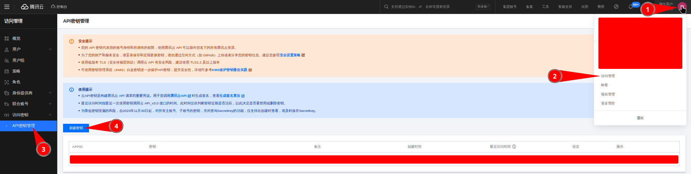
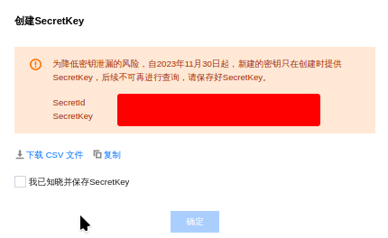
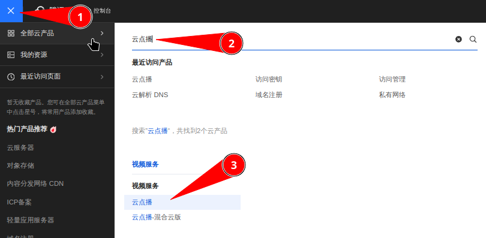
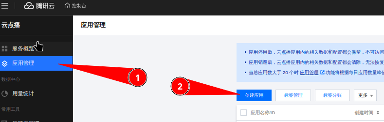
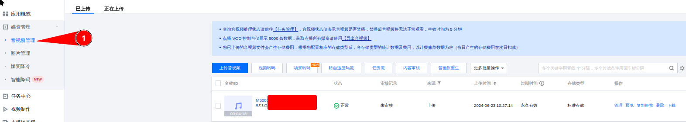
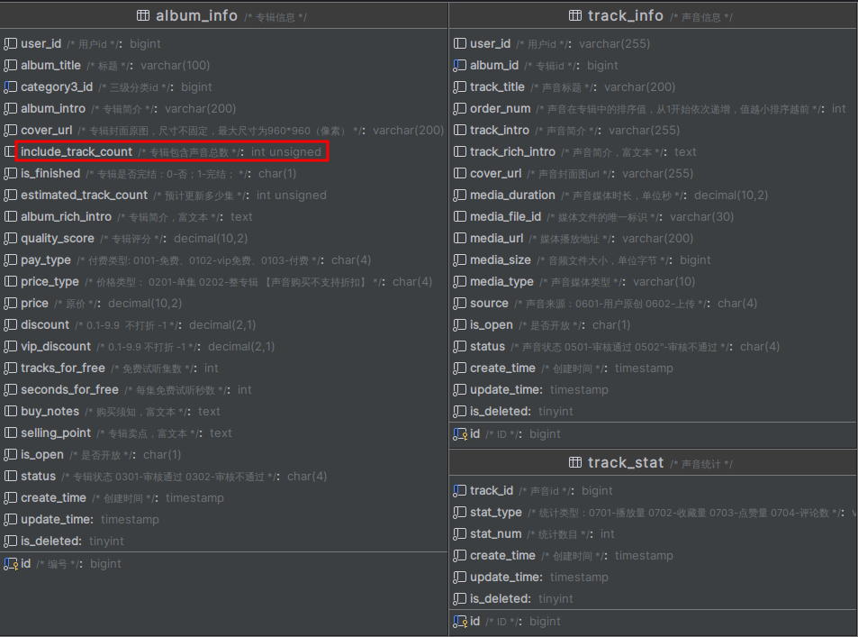

# 声音管理

## 声音上传

声音的上传是将声音文件上传到腾讯云点播服务，主要是对腾讯提供的上传 SDK 的使用。上传成功后返回一个文件 ID 和访问地址，那么借助这个访问地址我们就可以播放这个声音，而通过文件 ID 就可以向腾讯云获取保存的文件信息。在这一步中，也不需要进行数据库的交互。

要上传到腾讯云点播，首先就需要注册并实名认证一个 [腾讯云](https://cloud.tencent.com) 账号！！！

### 创建 API 密钥





### 创建应用





### 代码实现

关于腾讯云提供的云点播 SDK 的 API 详细使用，参见 [官网](https://cloud.tencent.com/document/product/266/10276)

#### 修改配置文件

将 Nacos 中的 service-album-dev.yaml 中的 vod 配置修改为自己的


#### Java 代码

::: code-group

```java [TrackInfoApiController]
@Autowired
private TrackInfoService trackInfoService;

@PostMapping("/uploadTrack")
public Result<JSONObject> uploadTrack(@RequestParam MultipartFile file) {
  return Result.ok(trackInfoService.uploadTrack(file));
}
```

```java [TrackInfoServiceImpl]
@SneakyThrows
@Override
public JSONObject uploadTrack(MultipartFile file) {
  // 根据密钥创建一个云点播上传客户端对象
  VodUploadClient vodUploadClient = new VodUploadClient(vodConstantProperties.getSecretId(), vodConstantProperties.getSecretKey());
  // 获取云点播上传请求对象
  VodUploadRequest request = new VodUploadRequest();
  // 将文件上传到本地临时目录
  String tempPath = UploadFileUtil.uploadTempPath(vodConstantProperties.getTempPath(), file);
  request.setMediaFilePath(tempPath);
  // 执行上传操作
  VodUploadResponse response = vodUploadClient.upload(vodConstantProperties.getRegion(), request);
  JSONObject result = new JSONObject();
  // 返回腾讯云点播的文件ID
  result.put("mediaFileId", response.getFileId());
  // 返回腾讯云点播的文件访问地址
  result.put("mediaUrl", response.getMediaUrl());
  return result;
}
```

```java [UploadFileUtil]
public class UploadFileUtil {
    /**
     * 文件上传到临时路径
     */
    @SneakyThrows
    public static String uploadTempPath(String tempPath, MultipartFile file) {
        if (null == file) return "";
        String date = new DateTime().toString("yyyyMMdd");
        String filePath = tempPath + File.separator + date;
        File curFlie = new File(filePath);
        if (!curFlie.exists()) {
            curFlie.mkdirs();
        }
        filePath = filePath + File.separator + file.getOriginalFilename();
        file.transferTo(new File(filePath));
        return filePath;
    }
}
```

:::

上传成功后，就可以在你第二步 [创建的应用](./03-TrackManagement#创建应用) 中看到：



## 声音保存


### 功能设计

保存声音是指在创作音频的时候，将填写好的声音信息保存到数据库。其中，前端会给我们一个 **TrackInfoVo** 对象

### 表结构设计

这个过程涉及三张表 `track_info`、`track_stat`、`album_info`：



`track_info` 是专门用来保存声音信息的，其中 `media_duration`、`media_size`、`media_type` 是根据声音上传时返回的 `mediaFileId` 从腾讯云获取的。`album_id` 是表示该声音所属的专辑 id, 每个声音都有唯一的所属专辑，但是每张专辑下有多个声音，也就是专辑和声音的关系是一对多的。`user_id` 用来表示声音所属的作者 id, 同样的，作者和声音也是一对多的关系，一个声音只能有唯一的所属作者，但一个作者可以有多个声音

`track_stat` 是用来保存声音的统计信息，包括播放量、收藏量、点赞量和评论数

而这里之所以还需要 `album_info`，是因为它里面有一个 `include_track_count` 字段，表示该专辑下所拥有的声音数量。

### 代码实现

::: code-group

```java [TrackInfoApiController]
@PostMapping("/saveTrackInfo")
public Result saveTrackInfo(@RequestBody @Validated TrackInfoVo trackInfoVo) {
  trackInfoService.saveTrackInfo(trackInfoVo);
  return Result.ok();
}
```

```java [TrackInfoServiceImpl]
@Transactional(rollbackFor = Exception.class)
@Override
public void saveTrackInfo(TrackInfoVo trackInfoVo) {
  // 从前端传过来的对象中获取声音上传时返回的mediaFileId
  String mediaFileId = trackInfoVo.getMediaFileId();
  // 根据mediaFileId从腾讯云获取声音相关信息
  DescribeMediaInfosResponse response = getVodFileInfo(mediaFileId);
  if (response == null || response.getMediaInfoSet() == null) {
    throw new GuiguException(201, "获取腾讯云声音信息失败");
  }
  TrackInfo trackInfo = new TrackInfo();
  BeanUtils.copyProperties(trackInfoVo, trackInfo);
  MediaInfo mediaInfo = response.getMediaInfoSet()[0];
  trackInfo.setMediaDuration(new BigDecimal(mediaInfo.getMetaData().getDuration().toString()));
  trackInfo.setMediaSize(mediaInfo.getMetaData().getSize());
  trackInfo.setMediaType(mediaInfo.getBasicInfo().getType());
  trackInfo.setMediaFileId(mediaFileId);
  trackInfo.setUserId(AuthContextHolder.getUserId());
  if (!save(trackInfo)) {
    throw new GuiguException(201, "保存声音失败");
  }
  // 获取保存成功后的声音id
  Long trackInfoId = trackInfo.getId();
  // 初始化声音统计信息
  initTrackInfoStat(trackInfoId);
  // 更新专辑包含的声音数量
  albumInfoMapper.updateAlbumTrackCount(trackInfo.getAlbumId(), 1);
}

// 从腾讯云获取声音文件详细信息
@SneakyThrows
private DescribeMediaInfosResponse getVodFileInfo(String mediaFileId) {
  Credential credential = new Credential(vodConstantProperties.getSecretId(), vodConstantProperties.getSecretKey());
  VodClient vodClient = new VodClient(credential, vodConstantProperties.getRegion());
  DescribeMediaInfosRequest request = new DescribeMediaInfosRequest();
  request.setFileIds(new String[]{mediaFileId});
  return vodClient.DescribeMediaInfos(request);
}

private void initTrackInfoStat(Long trackInfoId) {
  // 每成功添加一条声音，需要新建四条声音统计信息（播放量、收藏量、点赞量和评论数）
  TrackStat trackStat = new TrackStat();
  trackStat.setTrackId(trackInfoId);
  // 只需要设置统计的类型，数量在数据库已经设置了默认值0
  trackStat.setStatType(SystemConstant.TRACK_STAT_PLAY);
  trackStatMapper.insert(trackStat);
  // 这里开始需要将统计信息的id设置为null,这是由于在这个方法中共用的是一个TrackStat对象实例
  // 那么当第一次insert执行完成后，数据库会返回当前的trackStat主键id
  // 如果不将这个id置为null,在后续的insert中就会给数据库传递这个id
  // 而这个id的记录在数据库中已经存在了，造成insert失败
  trackStat.setId(null);
  trackStat.setStatType(SystemConstant.TRACK_STAT_COLLECT);
  trackStatMapper.insert(trackStat);
  trackStat.setId(null);
  trackStat.setStatType(SystemConstant.TRACK_STAT_PRAISE);
  trackStatMapper.insert(trackStat);
  trackStat.setId(null);
  trackStat.setStatType(SystemConstant.TRACK_STAT_COMMENT);
  trackStatMapper.insert(trackStat);
}
```

```java [AlbumInfoMapper]
@Update("update tingshu_album.album_info set include_track_count = include_track_count + #{num} where id = #{albumId}")
int updateAlbumTrackCount(@Param("albumId") Long albumId, @Param("num") int num);
```

:::

## 声音查询（分页）


### 功能设计

需要根据用户 Id，状态或标题查询当前声音列表！这三个条件被封装到一个实体类中 **TrackInfoQuery**, 返回结果对象封装到 **TrackListVo** 实体类中

### 表结构设计

这个过程中除了需要从 `track_info` 表中获取声音的基本信息，还需要从 `track_stat` 中获取这个声音的统计信息

### 代码实现

::: code-group

```java [TrackInfoApiController]
@PostMapping("/findUserTrackPage/{page}/{size}")
public Result<IPage<TrackListVo>> findUserTrackPage(@Parameter(name = "page",description = "当前页面",required = true)
                                                    @PathVariable Long page,
                                                    @Parameter(name = "size",description = "每页记录数",required = true)
                                                    @PathVariable Long size,
                                                    @Parameter(name = "trackInfoQuery",description = "查询对象",required = false)
                                                    @RequestBody TrackInfoQuery trackInfoQuery){
  return Result.ok(trackInfoService.findUserTrackPage(page, size, trackInfoQuery));
}
```

```java [TrackInfoServiceImpl]
@Override
public IPage<TrackListVo> findUserTrackPage(Long page, Long size, TrackInfoQuery trackInfoQuery) {
  return trackInfoMapper.selectUserTrackPage(new Page<>(page, size), trackInfoQuery);
}
```

```java [TrackInfoMapper]
IPage<TrackListVo> selectUserTrackPage(Page<Object> objectPage, @Param("vo") TrackInfoQuery trackInfoQuery);
```

```xml [TrackInfoMapper]
<select id="selectUserTrackPage" resultType="com.atguigu.tingshu.vo.album.TrackListVo">
  select
  t1.album_id as albumId,
  t1.id as trackId,
  t1.track_title as trackTitle,
  t1.cover_url as coverUrl,
  t1.media_duration as mediaDuration,
  t1.status,
  max(if(t2.stat_type = '0701', t2.stat_num, 0)) as playStatNum,
  max(if(t2.stat_type = '0702', t2.stat_num, 0)) as subscribeStatNum,
  max(if(t2.stat_type = '0703', t2.stat_num, 0)) as buyStatNum,
  max(if(t2.stat_type = '0704', t2.stat_num, 0)) as albumCommentStatNum
  from tingshu_album.track_info t1
  inner join tingshu_album.track_stat t2
  on t1.id = t2.track_id
  <where>
    <if test="vo.trackTitle != null and vo.trackTitle != ''">and t1.track_title = concat('%', #{vo.trackTitle}, '%')</if>
    <if test="vo.status != null and vo.status != ''">and t1.status = #{vo.status}</if>
    <if test="vo.userId != null">and t1.user_id = #{vo.userId}</if>
    and t1.is_deleted = 0 and t2.is_deleted = 0
  </where>
  group by t1.id
  order by t1.id desc
</select>
```

:::

## 声音的修改

### 功能设计

要修改声音，那么首先要做的就是回显声音，也就是根据 Id 获取数据并将数据封装到 TrackInfo 对象，然后由用户修改完成之后保存修改之后的数据

### 表结构设计

修改的时候，传递的有声音 Id ，还有修改的 Json 字符串，那么只修改 `track_info` 表中的数据就可以了

如果还修改了声音，那么就需要重新从腾讯云获取声音的声音，也就是还需要修改 media_duration , media_size , media_type, media_url 这些字段信息

### 代码实现

::: code-group

```java [TrackInfoApiController]
@GetMapping("/getTrackInfo/{id}")
public Result<TrackInfo> getTrackInfo(@PathVariable Long id) {
  // MyBatisPlus提供的Service层接口，根据主键id获取表单信息
  return Result.ok(trackInfoService.getById(id));
}


@PutMapping("/updateTrackInfo/{id}")
public Result updateById(@PathVariable Long id, @RequestBody @Validated TrackInfoVo trackInfoVo) {
  trackInfoService.updateTrackInfo(id, trackInfoVo);
  return Result.ok();
}
```

```java [TrackInfoServiceImpl]
@Transactional(rollbackFor = Exception.class)
@Override
public void updateTrackInfo(Long id, TrackInfoVo trackInfoVo) {
  //	获取到声音对象
  TrackInfo trackInfo = this.getById(id);
  //  获取传递的fileId
  String mediaFileId = trackInfo.getMediaFileId();
  //	进行属性拷贝
  BeanUtils.copyProperties(trackInfoVo, trackInfo);
  //	获取声音信息页面传递的fileId 与 数据库的 fileId 不相等就修改
  if (!trackInfoVo.getMediaFileId().equals(mediaFileId)) {
    deleteMediaFileId(trackInfo.getMediaFileId());
    //	说明已经修改过了，重新获取声音的相关信息
    DescribeMediaInfosResponse response = getVodFileInfo(trackInfoVo.getMediaFileId());
    //	判断对象不为空.
    if (null == response || response.getMediaInfoSet() == null){
      //	抛出异常
      throw new GuiguException(ResultCodeEnum.VOD_FILE_ID_ERROR);
    }
    MediaInfo mediaInfo = response.getMediaInfoSet()[0];
    trackInfo.setMediaFileId(trackInfoVo.getMediaFileId());
    trackInfo.setMediaUrl(mediaInfo.getBasicInfo().getMediaUrl());
    trackInfo.setMediaType(mediaInfo.getBasicInfo().getType());
    trackInfo.setMediaDuration(BigDecimal.valueOf(mediaInfo.getMetaData().getDuration()));
    trackInfo.setMediaSize(mediaInfo.getMetaData().getSize());
    trackInfo.setUserId(AuthContextHolder.getUserId());
  }
  //	修改数据
  this.updateById(trackInfo);
}
// 删除腾讯云中已经无效的声音文件
@SneakyThrows
private void deleteMediaFileId(String mediaFileId) {
  Credential credential = new Credential(vodConstantProperties.getSecretId(), vodConstantProperties.getSecretKey());
  VodClient vodClient = new VodClient(credential, vodConstantProperties.getRegion());
  DeleteMediaRequest request = new DeleteMediaRequest();
  request.setFileId(mediaFileId);
  vodClient.DeleteMedia(request);
}
```

:::

## 声音的删除

### 表结构设计

删除声音的逆过程也就是添加声音，那么添加声音的逆操作就是删除声音了。也就是我们需要删除 `track_info`、`track_stat` 中这条声音的相关记录，以及更新 `album_info` 中 `include_track_count` 的值。除此之外，我们还应该删除腾讯云中保存的声音文件。

### 代码实现

::: code-group

```java [TrackInfoApiController]
@DeleteMapping("/removeTrackInfo/{id}")
public Result removeTrackInfo(@PathVariable("id") Long id) {
  trackInfoService.removeTrackInfo(id);
  return Result.ok();
}
```

```java [TrackInfoServiceImpl]
@Transactional(rollbackFor = Exception.class)
@Override
public void removeTrackInfo(Long id) {
  TrackInfo trackInfo = getById(id);
  Long albumId = trackInfo.getAlbumId();
  boolean remove = remove(new LambdaQueryWrapper<TrackInfo>().eq(TrackInfo::getId, id).eq(TrackInfo::getUserId, AuthContextHolder.getUserId()));
  if (!remove) throw new GuiguException(201, "删除声音信息失败");
  int delete = trackStatMapper.delete(new LambdaQueryWrapper<TrackStat>().eq(TrackStat::getTrackId, id));
  if (delete <= 0) throw new GuiguException(201, "删除声音统计信息失败");
  albumInfoMapper.updateAlbumTrackCount(albumId, -1);
}
```

:::

## 根据专辑查询声音


### 功能设计

在进入专辑详情页时，需要获取该专辑所有声音列表，以及用户可以收听对应的声音。因此传入一个专辑 id，返回一个分页的 **AlbumTrackListVo** 对象，它拥有以下属性：

- trackId
- trackTitle
- mediaDuration
- orderNum
- playStatNum
- commentStatNum
- createTime
- isShowPaidMark

也就是返回该专辑下所有声音的 id、标题、时长、排序、播放量、评论量、发布时间和是否购买。isShowPaidMark 为显示付费标识，默认不显示，即默认用户可以收听该声音。

### 表结构设计

**AlbumTrackListVo** 对象需要获取 `track_info` 表中的 `id`、`track_title`、`media_duration`、`order_num`、`create_time` 字段，另外还需要从 `track_stat` 表中获取播放量和评论量。同时，还需要从 `album_info` 中获取该专辑的是否付费等信息

专辑的设计分为免费、Vip 免费和付费三种，其中付费又分为整专付费和按集付费，因此对于非免费情况，还需要根据当前用户，判断其能够收听的声音。

那么对于 Vip 免费的专辑来说，这就需要根据 userId 从 `user_info` 表中获取 `is_vip` 字段的值，判断其是否为 Vip

对于付费整专来说，需要根据 `user_id` 和 `album_id` 从 `user_paid_album` 表中查看是否存在用户购买记录

对于按集付费来说，需要根据 `user_id` 和 `track_id` 从 `user_paid_track` 表中查看是否存在用户购买记录

综上所述，要实现获取专辑详情页的声音信息的功能，最多可涉及到 `track_info`、`track_stat`、`album_info`、`user_paid_album`、`user_paid_track` 五张表

### 代码实现

::: code-group

```java [TrackInfoApiController]
@GetMapping("/findAlbumTrackPage/{albumId}/{page}/{size}")
public Result<IPage<AlbumTrackListVo>> findAlbumTrackPage(@PathVariable(value = "albumId") Long albumId, @PathVariable(value = "page") Long page, @PathVariable(value = "size") Long size){
  return Result.ok(trackInfoService.findAlbumTrackPage(albumId, page, size));
}
```

```java [TrackInfoServiceImpl]
@Override
public IPage<AlbumTrackListVo> findAlbumTrackPage(Long albumId, Long page, Long size) {
  IPage<AlbumTrackListVo> result = null;
  // 根据专辑id,获取对应专辑下所有的声音信息
  IPage<AlbumTrackListVo> albumTrackListVoIPage = trackInfoMapper.selectAlbumTrancPage(new Page<>(page, size), albumId);
  // 获取专辑的类型
  AlbumInfo albumInfo = albumInfoMapper.selectById(albumId);
  // 获取专辑的免费集数
  Integer tracksForFree = albumInfo.getTracksForFree();
  // 判断类型：0101-免费、0102-vip免费、0103-付费
  switch (albumInfo.getPayType()) {
    // 免费专辑，直接返回即可
    case SystemConstant.ALBUM_PAY_TYPE_FREE -> result = albumTrackListVoIPage;
    // Vip免费
    case SystemConstant.ALBUM_PAY_TYPE_VIPFREE -> result = albumTrackVipFree(albumTrackListVoIPage, tracksForFree);
    // 付费专辑
    case SystemConstant.ALBUM_PAY_TYPE_REQUIRE -> result = albumTrackNotFree(albumTrackListVoIPage, tracksForFree, albumInfo.getPriceType(), albumId);
  }
  return result;
}

private IPage<AlbumTrackListVo> albumTrackVipFree(IPage<AlbumTrackListVo> albumTrackListVoIPage, Integer tracksForFree) {
  List<AlbumTrackListVo> albumTrackListVoList = albumTrackListVoIPage.getRecords();
  // 获取用户信息
  Long userId = AuthContextHolder.getUserId();
  UserInfo userInfo = userInfoFeignClient.getUserInfo(userId);
  // 只需处理非vip用户，无法观看orderNum > tracksForFree。
  // 对于Vip用户，它可以免费观看，也就是可以观看传入的albumTrackListVoIPage
  if (userInfo.getIsVip().equals(0)) {
    List<AlbumTrackListVo> albumTrackListVoListNew = albumTrackListVoList.stream().peek(albumTrackListVo -> {
      // 对于无法观看的非Vip用户，显示付费标识
      if (albumTrackListVo.getOrderNum() > tracksForFree) {
        albumTrackListVo.setIsShowPaidMark(true);
      }
    }).toList();
    albumTrackListVoIPage.setRecords(albumTrackListVoListNew);
  }
  return albumTrackListVoIPage;
}

private IPage<AlbumTrackListVo> albumTrackNotFree(IPage<AlbumTrackListVo> albumTrackListVoIPage, Integer tracksForFree, String priceType, Long albumId) {
  List<AlbumTrackListVo> albumTrackListVoList = albumTrackListVoIPage.getRecords();
  if (priceType.equals(SystemConstant.ALBUM_PRICE_TYPE_ONE)) {
    // 单集购买，获取用户已购买的声音
    Map<String, String> userTrackIds = userInfoFeignClient.getUserTrackIds(albumId);
    // 遍历该专辑下的声音
    List<AlbumTrackListVo> albumTrackListVoListNew = albumTrackListVoList.stream().peek(albumTrackListVo -> {
      // 如果当前声音需要付费
      if (albumTrackListVo.getOrderNum() > tracksForFree &&
          // 并且用户未购买
          StringUtils.isEmpty(userTrackIds.get(albumTrackListVo.getTrackId().toString()))) {
        // 设置付费标识
        albumTrackListVo.setIsShowPaidMark(true);
      }
    }).toList();
    albumTrackListVoIPage.setRecords(albumTrackListVoListNew);
  } else {
    // 整专购买，如果用户未购买当前专辑
    if (!userInfoFeignClient.getUserIsBuyAlbum(albumId)) {
      List<AlbumTrackListVo> albumTrackListVoListNew = albumTrackListVoList.stream().peek(albumTrackListVo -> {
        // 并且当前声音非免费
        if (albumTrackListVo.getOrderNum() > tracksForFree) {
          // 设置付费标识
          albumTrackListVo.setIsShowPaidMark(true);
        }
      }).toList();
      albumTrackListVoIPage.setRecords(albumTrackListVoListNew);
    }
  }
  return albumTrackListVoIPage;
}
```

```java [TrackInfoMapper]
IPage<AlbumTrackListVo> selectAlbumTrancPage(Page<Object> objectPage, @Param("albumId") Long albumId);
```

```xml [TrackInfoMapper]
<select id="selectAlbumTrancPage" resultType="com.atguigu.tingshu.vo.album.AlbumTrackListVo">
  select
  t1.id as trackId,
  t1.track_title as trackTitle,
  t1.media_duration as mediaDuration,
  t1.order_num as orderNum,
  t1.create_time as createTime,
  max(if(t2.stat_type = '0701', t2.stat_num, 0)) as playStatNum,
  max(if(t2.stat_type = '0704', t2.stat_num, 0)) as commentStatNum
  from tingshu_album.track_info t1
  inner join tingshu_album.track_stat t2 on t1.id = t2.track_id
  where t1.album_id = #{albumId}
  and t1.is_deleted = 0
  and t2.is_deleted = 0
  group by t1.id
</select>
```

```java [UserInfoFeignClient]
@GetMapping("/getUserInfo/{userId}")
public UserInfo getUserInfo(@PathVariable(value = "userId") Long userId);

@GetMapping("/getUserIsBuyAlbum/{albumId}")
public Boolean getUserIsBuyAlbum(@PathVariable(value = "albumId") Long albumId);

@GetMapping("/getUserTrackIds/{albumId}")
public Map<String, String> getUserTrackIds(@PathVariable(value = "albumId") Long albumId);
```

```java [UserInfoClientController]
@GetMapping("/getUserInfo/{userId}")
public UserInfo getUserInfo(@PathVariable(value = "userId") Long userId) {
  return userInfoService.getById(userId);
}

@GetMapping("/getUserIsBuyAlbum/{albumId}")
public Boolean getUserIsBuyAlbum(@PathVariable(value = "albumId") Long albumId) {
  return userInfoService.getUserIsBuyAlbum(albumId);
}

@GetMapping("/getUserTrackIds/{albumId}")
public Map<String, String> getUserTrackIds(@PathVariable(value = "albumId") Long albumId) {
  return userInfoService.getUserTrackIds(albumId);
}
```

```java [UserInfoServiceImpl]
@Override
public Boolean getUserIsBuyAlbum(Long albumId) {
  UserPaidAlbum userPaidAlbum = userPaidAlbumMapper.selectOne(new LambdaQueryWrapper<UserPaidAlbum>()
                                                              .eq(UserPaidAlbum::getUserId, AuthContextHolder.getUserId())
                                                              .eq(UserPaidAlbum::getAlbumId, albumId));
  return null != userPaidAlbum;
}

@Override
public Map<String, String> getUserTrackIds(Long albumId) {
  List<UserPaidTrack> userPaidTracks = userPaidTrackMapper.selectList(new LambdaQueryWrapper<UserPaidTrack>()
                                                                      .eq(UserPaidTrack::getAlbumId, albumId)
                                                                      .eq(UserPaidTrack::getUserId, AuthContextHolder.getUserId()));
  // 这里返回Map集合，用户已购买的声音id作为key,“1”作为值
  // 值是什么无所谓，主要是key,这样就可以从“用户已购买的声音id集合中 get 需要判断是否购买的声音id”的结果是否为空，来知道当前用户是否购买当前声音
  return userPaidTracks.stream().collect(Collectors.toMap(
    key -> key.getTrackId().toString(),
    value -> "1"
  ));
}
```

:::

## 显示声音购买集数


### 功能设计

当用户在按集付费专辑中购买声音时，点击购买图标，需要弹出可下单列表，让用户选择购买套餐是：

- 本集
- 后 10 集
- 后 20 集
- 后 30 集
- 后【未购买的集数】集

最多有五个套餐供用户选择


那么前端传入的是一个声音 id，需要返回给用户的是一个 List 集合，集合中存储着 Map 集合，对应的就是上面的购买套餐。因此，每个 Map 集合中存储三个元素，分别是 `name`、`price` 和 `trackCount`，对应的就是套餐的标题、套餐的价格和套餐包含的声音数量

### 表结构设计

由于前端只提供一个 `track_id`，那么首先就需要根据这个 id，从 `track_info` 中查到其所属的 `album_id`，再根据 `album_id` 从 `user_paid_track` 获取用户已购买的声音 id 集合

获得用户已购买的声音后，还需要从 `track_info` 获取用户点击的当前声音及其后面的声音，再从这个声音集合中去除用户已购买的声音

这样，就得到了用户购买点击的声音及其后面尚未购买的声音集合。那么只要再从 `album_info` 中获取 `price`，也就是每集的价格，就可以构建套餐的 Map 了

### 代码实现

::: code-group

```java [TrackInfoApiController]
@GetMapping("/findUserTrackPaidList/{trackId}")
public Result<List<Map<String, Object>>> findUserTrackPaidList(@PathVariable Long trackId) {
  return Result.ok(trackInfoService.findUserTrackPaidList(trackId));
}
```

```java [TrackInfoServiceImpl]
@Override
public List<Map<String, Object>> findUserTrackPaidList(Long trackId) {
  // 获取用户拥有的对应专辑下所有声音
  TrackInfo trackInfo = trackInfoMapper.selectById(trackId);
  Long albumId = trackInfo.getAlbumId();
  Map<String, String> userTrackIds = userInfoFeignClient.getUserTrackIds(albumId);
  // 获取大于当前的全部声音
  List<TrackInfo> trackInfos = trackInfoMapper.selectList(new LambdaQueryWrapper<TrackInfo>().eq(TrackInfo::getAlbumId, albumId)
                                                          .gt(TrackInfo::getOrderNum, trackInfo.getOrderNum()));
  // 去除已经支付过的
  List<Long> trackIds = trackInfos.stream().map(TrackInfo::getId)
    .filter(t -> StringUtils.isEmpty(userTrackIds.get(t.toString())))
    .limit(50).toList();
  // 构造声音分集购买数据
  List<Map<String, Object>> resultList = new ArrayList<>();
  JSONObject result = new JSONObject();
  BigDecimal price = albumInfoMapper.selectById(albumId).getPrice();
  result.put("name", "本集");
  result.put("price", price);
  result.put("trackCount", 1);
  resultList.add(result);
  // 未购买的声音总数
  int size = trackIds.size();
  // 定义区间大小
  int range = 10;
  // 后面总共有几个购买区间
  int total = size % range == 0 ? size / range : size / range + 1;
  // 集数计数器
  int num = 0;
  // 遍历构建剩余区间
  for (int i = 1; i <= total; i++) {
    result = new JSONObject();
    num = i * range;
    if (num >= size) {
      result.put("name", "后" + size + "集");
      result.put("price", price.multiply(new BigDecimal(size)));
      result.put("trackCount", size + 1);
      resultList.add(result);
      break;
    }
    result.put("name", "后" + num + "集");
    result.put("price", price.multiply(new BigDecimal(num)));
    result.put("trackCount", num + 1);
    resultList.add(result);
  }
  return resultList;
}
```

:::