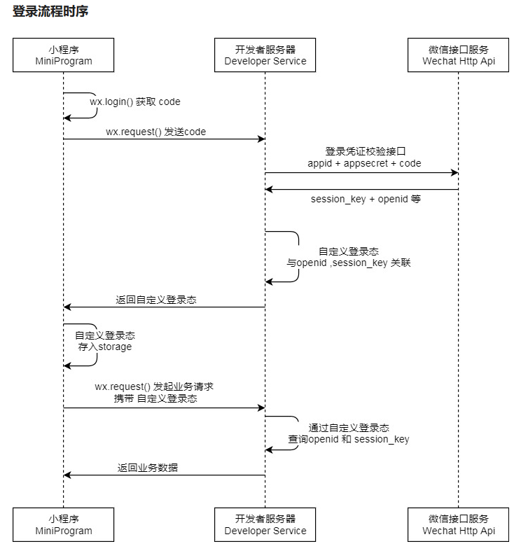
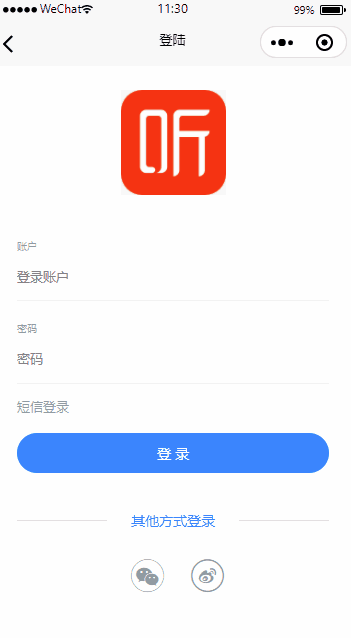
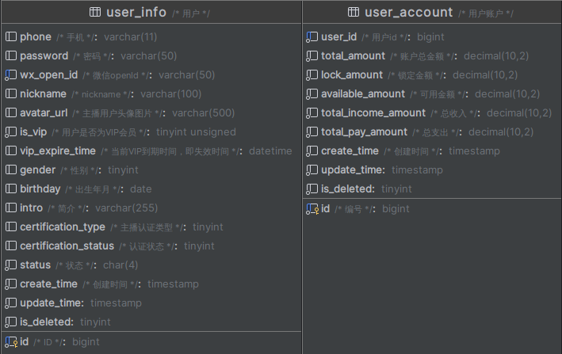

# 用户登录

## 小程序登录流程

> 具体信息请参考 [小程序登录 | 微信开放文档 (qq.com)](https://developers.weixin.qq.com/miniprogram/dev/framework/open-ability/login.html)



在这一过程中，我们开发者需要调用微信提供的两个接口：

1. 调用 [wx.login()](https://developers.weixin.qq.com/miniprogram/dev/api/open-api/login/wx.login.html) 获取 **临时登录凭证 code** ，并回传到开发者服务器。
2. 调用 [auth.code2Session](https://developers.weixin.qq.com/miniprogram/dev/OpenApiDoc/user-login/code2Session.html) 接口，换取 **用户唯一标识 OpenID** 、 用户在微信开放平台账号下的 **唯一标识 UnionID**（若当前小程序已绑定到微信开放平台账号） 和 **会话密钥 session_key**。

然后开发者服务器可以根据用户标识来生成自定义登录态，用于后续业务逻辑中前后端交互时识别用户身份

::: tip

1. 会话密钥 `session_key` 是对用户数据进行 [加密签名](https://developers.weixin.qq.com/miniprogram/dev/framework/open-ability/signature.html) 的密钥。为了应用自身的数据安全，开发者服务器 **不应该把会话密钥下发到小程序，也不应该对外提供这个密钥**。
2. 临时登录凭证 code 只能使用一次

:::

## 用户登录



### 功能设计

结合小程序登录流程，我们需要完成的就是：

1. 根据微信的 WxMaService 对象获取到 openId
2. 根据 openId 获取查看是否有用户信息
   1. 如果不存在，则注册用户，将用户的昵称、头像、openId 等保存到数据库表中，并发送消息初始化账户信息
   2. 如果存在，将用户信息保存到缓存中，并返回 token 给前端页面

### 表结构设计

关于用户登录主要有两个表 `user_info` 和 `user_account`：



需要注意的是，本系统在前端只支持小程序登录，并未对手机号登录提供支持，但是在 `user_info` 中仍然设计了 `phone` 和 `password` 字段。对于首次登录用户，会进行注册，也就是在 `user_info` 中生成一条记录，并保存其 `wx_open_id`。然后再向 `service-account` 服务发送一条消息，为该用户初始化一个账户，也就是在 `user_account` 新增一条该用户的记录

### 代码实现

::: code-group

```java [WxLoginApiController]
@GetMapping("/wxLogin/{code}")
public Result wxLogin(@PathVariable("code") String code) {
  return Result.ok(userInfoService.wxLogin(code));
}
```

```java [UserInfoServiceImpl]
@SneakyThrows
@Override
public Object wxLogin(String code) {
  // 参数校验
  if (StringUtils.isEmpty(code)) {
    throw new GuiguException(ResultCodeEnum.LOGIN_AUTH);
  }
  JSONObject result = new JSONObject();
  // 重复登陆问题
  ServletRequestAttributes servletRequestAttributes = (ServletRequestAttributes) RequestContextHolder.getRequestAttributes();
  String ipAddress = IpUtil.getIpAddress(servletRequestAttributes.getRequest());
  Object o = redisTemplate.opsForValue().get("User_Login_Info_" + ipAddress);
  // 缓存获取不到，说明该用户未登录
  if (o != null) {
    result.put("token", o);
  } else {
    // 使用这个code 和微信端进行交互
    WxMaJscode2SessionResult wxResult = wxMaService.jsCode2SessionInfo(code);
    // 确认当前登陆的用户是谁（微信系统的谁）
    String openid = wxResult.getOpenid();
    // 这个用户在我这个系统有没有注册过
    UserInfo userInfo = getOne(new LambdaQueryWrapper<UserInfo>().eq(UserInfo::getWxOpenId, openid));
    if (userInfo == null) {
      // 没有注册过，完成注册，生成一个token返回
      userInfo = new UserInfo();
      userInfo.setWxOpenId(openid);
      userInfo.setNickname("PengBin");
      userInfo.setAvatarUrl("https://wpimg.wallstcn.com/f778738c-e4f8-4870-b634-56703b4acafe.gif?imageView2/1/w/80/h/80");
      userInfo.setIsVip(0);
      save(userInfo);
      // 初始化一个账户
      rabbitTemplate.convertAndSend("user_exchange", "user.account", userInfo.getId() + "");
    }
    // 注册过，获取这个用户的信息，生成一个token返回
    // 生成一个token，包含用户id、角色和登录时间
    JSONObject jwtInfo = new JSONObject();
    jwtInfo.put("userId", userInfo.getId().toString());
    jwtInfo.put("role", userInfo.getIsVip().toString());
    jwtInfo.put("e_times", System.currentTimeMillis() + "");
    Jwt jwt = JwtHelper.encode(jwtInfo.toJSONString(), new RsaSigner(rsaPrivateKey));
    String token = jwt.getEncoded();
    redisTemplate.opsForValue().set("User_Login_Info_" + ipAddress, token, 1, TimeUnit.DAYS);
    result.put("token", token);
  }
  return result;
}
```

```java [IpUtil]
public class IpUtil {

    public static String getIpAddress(HttpServletRequest request) {
        String ipAddress = null;
        try {
            ipAddress = request.getHeader("x-forwarded-for");
            if (ipAddress == null || ipAddress.length() == 0 || "unknown".equalsIgnoreCase(ipAddress)) {
                ipAddress = request.getHeader("Proxy-Client-IP");
            }
            if (ipAddress == null || ipAddress.length() == 0 || "unknown".equalsIgnoreCase(ipAddress)) {
                ipAddress = request.getHeader("WL-Proxy-Client-IP");
            }
            if (ipAddress == null || ipAddress.length() == 0 || "unknown".equalsIgnoreCase(ipAddress)) {
                ipAddress = request.getRemoteAddr();
                if (ipAddress.equals("127.0.0.1")) {
                    // 根据网卡取本机配置的IP
                    InetAddress inet = null;
                    try {
                        inet = InetAddress.getLocalHost();
                    } catch (UnknownHostException e) {
                        e.printStackTrace();
                    }
                    ipAddress = inet.getHostAddress();
                }
            }
            // 对于通过多个代理的情况，第一个IP为客户端真实IP,多个IP按照','分割
            if (ipAddress != null && ipAddress.length() > 15) { // "***.***.***.***".length()
                // = 15
                if (ipAddress.indexOf(",") > 0) {
                    ipAddress = ipAddress.substring(0, ipAddress.indexOf(","));
                }
            }
        } catch (Exception e) {
            ipAddress="";
        }
        // ipAddress = this.getRequest().getRemoteAddr();

        return ipAddress;
    }

    public static String getGatwayIpAddress(ServerHttpRequest request) {
        HttpHeaders headers = request.getHeaders();
        String ip = headers.getFirst("x-forwarded-for");
        if (ip != null && ip.length() != 0 && !"unknown".equalsIgnoreCase(ip)) {
            // 多次反向代理后会有多个ip值，第一个ip才是真实ip
            if (ip.indexOf(",") != -1) {
                ip = ip.split(",")[0];
            }
        }
        if (ip == null || ip.length() == 0 || "unknown".equalsIgnoreCase(ip)) {
            ip = headers.getFirst("Proxy-Client-IP");
        }
        if (ip == null || ip.length() == 0 || "unknown".equalsIgnoreCase(ip)) {
            ip = headers.getFirst("WL-Proxy-Client-IP");
        }
        if (ip == null || ip.length() == 0 || "unknown".equalsIgnoreCase(ip)) {
            ip = headers.getFirst("HTTP_CLIENT_IP");
        }
        if (ip == null || ip.length() == 0 || "unknown".equalsIgnoreCase(ip)) {
            ip = headers.getFirst("HTTP_X_FORWARDED_FOR");
        }
        if (ip == null || ip.length() == 0 || "unknown".equalsIgnoreCase(ip)) {
            ip = headers.getFirst("X-Real-IP");
        }
        if (ip == null || ip.length() == 0 || "unknown".equalsIgnoreCase(ip)) {
            ip = request.getRemoteAddress().getAddress().getHostAddress();
        }
        return ip;
    }
}
```

```java [LoginJwtPrivateKeyConfig]
@Configuration
public class LoginJwtPrivateKeyConfig {

    @Value("${encrypt.location}")
    private String location;
    @Value("${encrypt.secret}")
    private String secret;
    @Value("${encrypt.alias}")
    private String alias;
    @Value("${encrypt.password}")
    private String password;

    @Bean
    public RSAPrivateKey rsaPrivateKey() {
        // 密钥文件的工厂对象初始化
        KeyStoreKeyFactory keyStoreKeyFactory = new KeyStoreKeyFactory(new ClassPathResource(location), secret.toCharArray());
        // 访问这个文件中的一对钥匙
        KeyPair keyPair = keyStoreKeyFactory.getKeyPair(alias, password.toCharArray());
        // 获取私钥
        PrivateKey aPrivate = keyPair.getPrivate();
        // 返回注入容器
        return (RSAPrivateKey) aPrivate;
    }
}
```

```java [WxLoginConfig]
@Configuration
public class WxLoginConfig {

    @Value("${wechat.login.appId}")
    private String appId;

    @Value("${wechat.login.appSecret}")
    private String appSecret;

    @Bean
    public WxMaService wxMaService() {
        WxMaDefaultConfigImpl config = new WxMaDefaultConfigImpl();
        config.setAppid(appId);
        config.setSecret(appSecret);
        config.setMsgDataFormat("JSON");
        WxMaService service = new WxMaServiceImpl();
        service.setWxMaConfig(config);
        return service;
    }
}
```

:::

::: tip

1. 要使用 WxMaService，你需要先在 Nacos 的 service-user-dev.yaml 中配置你自己的 appId 和 appSecret（你在 [准备工作](./01-GettingStart#前端部署) 中已经获取到了）
2. 关于初始化一个账户的 RabbitMQ 操作参见 [初始化账户](./12-RabbitMQJob#初始化一个账户)

:::

#### 重复登录解决方案

为了解决重复登录的问题，目前采取的是在将 token 存入 Redis 缓存中时，在 key 上增加了可识别的 ip 地址

#### JWT JSON Web Tokens

这里的 token 使用了 JWT 生成，关于 JWT 更多信息请参考 [官网](https://jwt.io/)

#### 自定义 RSA 算法

在进行 JWT 加密时，使用了在 `LoginJwtPrivateKeyConfig` 中配置的自定义 RSA 算法。在算法中使用了由 Oracle 提供的 keytool 工具生成的公钥私钥文件，关于该工具更多使用参考 [官网](https://docs.oracle.com/javase/8/docs/technotes/tools/unix/keytool.html)

::: code-group

```shell [命令行运行]
# 命令行运行，得到tingshu.jks文件
keytool -genkeypair -alias tingshu -keyalg RSA -keypass tingshu -keystore tingshu.jks -storepass tingshu -validity 365
# 解析tingshu.jsk文件得到公钥和私钥，复制 PUBLIC_KEY 部分到SystemConstant（这里回车后需要输入密码，也就是上面设置的"-keypass" tingshu）
keytool -list -rfc --keystore tingshu.jks | openssl x509 -inform pem -pubkey
# 输入密码tingshu
```

```java [SystemConstant]
public static final String PUBLIC_KEY = "-----BEGIN PUBLIC KEY-----...-----END PUBLIC KEY-----";
```

```yaml [service-user-dev.yaml]
encrypt:
  location: tingshu.jks
  secret: tingshu
  alias: tingshu
  password: tingshu
```

:::

## 登录认证

登录接口有了，接下来就是对需要登录的资源进行认证保护了。在之前写的所有接口，都是无需登录任何人都可访问，实际上我们应该对绝大多数接口资源进行限制访问。要实现认证的方法多种多样，这里采用 `注解 + AOP` 实现

在这里设计一个接口 `@GuiguLogin` 作用于方法上，在需要登录才能访问的资源添加这个注解。然后对这个注解配置一个切面类，在切面类中判断用户能否访问该资源。而用户能否访问的关键就是是否登录，登录与否取决于能否从 Redis 中获取该用户 token

::: code-group

```java [GuiguLogin]
@Documented
@Retention(RetentionPolicy.RUNTIME)
@Target({ElementType.METHOD})
public @interface GuiguLogin {

    boolean isLogin() default true;

    // 访问权限：0-普通会员 1-Vip会员 2-超级管理员
    int role() default 0;
}
```

```java [LoginAspect]
@Component
@Aspect
public class LoginAspect {

    @Autowired
    private RedisTemplate redisTemplate;

    @SneakyThrows
    @Around(value = "@annotation(com.atguigu.tingshu.common.login.GuiguLogin)")
    public Object loginAspect(ProceedingJoinPoint point) {
        // 获取方法签名
        MethodSignature signature = (MethodSignature) point.getSignature();
        // 获取方法对象
        Method method = signature.getMethod();
        // 获取这个方法的注解
        GuiguLogin guiguLogin = method.getAnnotation(GuiguLogin.class);
        // 获取是否需要登陆属性
        Object[] args = point.getArgs();
        // 测试方便，不进行拦截
        if (!guiguLogin.isLogin()) {
            // 不需要则获取方法的参数，直接执行方法返回
            return point.proceed(args);
        }

        // 在实际控制层方法执行前，获取这个用户是否登陆 token请求头
        ServletRequestAttributes requestAttributes = (ServletRequestAttributes) RequestContextHolder.getRequestAttributes();
        if (requestAttributes == null) {
            // 已登陆，直接执行方法返回
            return point.proceed(args);
        }

        // 未登录获取请求
        HttpServletRequest request = requestAttributes.getRequest();
        // 从请求头中获取token参数
        String token = request.getHeader("token");
        // token 为空引导用户登陆（返回LOGIN_AUTH）
        if (StringUtils.isEmpty(token)) {
            throw new GuiguException(ResultCodeEnum.LOGIN_AUTH);
        }

        // 校验token
        Jwt jwt = JwtHelper.decodeAndVerify(token, new RsaVerifier(SystemConstant.PUBLIC_KEY));
        // 判断盗用问题：ip/设备绑定
        String ipAddress = IpUtil.getIpAddress(request);
        Object o = redisTemplate.opsForValue().get("User_Login_Info_" + ipAddress);
        if (o == null || !o.equals(token)) {
            throw new GuiguException(ResultCodeEnum.LOGIN_AUTH);
        }
        // 获取载荷
        String claims = jwt.getClaims();
        // 反序列化
        Map<String, String> map = JSONObject.parseObject(claims, Map.class);
        String userId = map.get("userId");
        int role = Integer.parseInt(map.get("role"));
        int roleInfo = guiguLogin.role();
        if (role < roleInfo) {
            throw new GuiguException(ResultCodeEnum.PERMISSION);
        }

        AuthContextHolder.setUserId(Long.valueOf(userId));

        // 令牌到期时间
        Long eTimes = Long.valueOf(map.get("e_times"));
        Long time = System.currentTimeMillis() - eTimes;
        // 剩余有效期大于12小时，延长token过期时间
        if (time >= 3600000 * 12) {
             redisTemplate.expire("User_Login_Info_" + ipAddress, 12, TimeUnit.HOURS);
        }

        Object result = point.proceed(args);
        AuthContextHolder.removeUserId();
        return result;
    }
}
```

:::

::: tip

1. 该功能的实现应该是作为一个基础功能被所有 Service 调用，所以将其放在 `common` 中的 `service-util` 中
2. 这切面类中，除了对用户进行登录认证，还对已登录用户再次访问进行了 token 刷新。具体做法就是借助登录时在 JWT 中存储的 `e_times` 来判断用户当前访问时间距离上次访问时间间隔是否小于十二小时

:::

功能实现了，最后就是对注解的使用，在 `GuiguLogin` 中已经使用了 `@Target({ElementType.METHOD})` 定义了其只能在方法上使用，这里以 service-album 为例，我们可以在接口的每个方法上添加该注解：

::: code-group

```java [AlbumInfoApiController]
@Autowired
private AlbumInfoService albumInfoService;

@GuiguLogin // [!code ++]
@PostMapping("/saveAlbumInfo")
public Result saveAlbumInfo(@RequestBody AlbumInfoVo albumInfoVo) {
    albumInfoService.saveAlbumInfo(albumInfoVo);
    return Result.ok();
}

@GuiguLogin // [!code ++]
@PostMapping("/findUserAlbumPage/{page}/{size}")
public Result<Page<AlbumListVo>> findUserAlbumPage(@PathVariable("page") Integer page, @PathVariable("size") Integer size, @RequestBody AlbumInfoQuery albumInfoQuery) {
    return Result.ok(albumInfoService.findUserAlbumPage(page, size, albumInfoQuery));
}

@GuiguLogin // [!code ++]
@DeleteMapping("/removeAlbumInfo/{albumId}")
public Result removeAlbumInfo(@PathVariable("albumId") Long albumId) {
    albumInfoService.removeAlbumInfo(albumId);
    return Result.ok();
}

@GuiguLogin // [!code ++]
@GetMapping("/getAlbumInfo/{albumId}")
public Result getAlbumInfo(@PathVariable("albumId") Long albumId) {
    return Result.ok(albumInfoService.getAlbumInfoById(albumId));
}

@GuiguLogin // [!code ++]
@PutMapping("/updateAlbumInfo/{albumId}")
public Result updateAlbumInfo(@PathVariable("albumId") Long albumId, @RequestBody AlbumInfoVo albumInfoVo) {
    albumInfoService.updateAlbumInfo(albumId, albumInfoVo);
    return Result.ok();
}
```

:::

## 获取用户信息

登录完成后，前端会请求一个 UserInfoVo 对象，这个对象中包含用户 id、微信 openId、nickname、主播用户头像图片、用户是否为 VIP 会员、当前 VIP 到期时间

::: code-group

```java [WxLoginApiController]
@GuiguLogin
@GetMapping("/getUserInfo")
public Result getUserInfo(){
  Long userId = AuthContextHolder.getUserId();
  return Result.ok(userInfoService.getUserInfoVoByUserId(userId));
}
```

```java [UserInfoServiceImpl]
@Override
public UserInfoVo getUserInfoVoByUserId(Long userId) {
  UserInfo userInfo = this.getById(userId);
  UserInfoVo userInfoVo = new UserInfoVo();
  BeanUtils.copyProperties(userInfo,userInfoVo);
  return userInfoVo;
}
```

:::

## 更新用户信息


用户在“我的”页面点击头像后可以修改昵称和用户名

::: code-group

```java [WxLoginApiController]
@GuiguLogin
@PostMapping("/updateUser")
public Result updateUser(@RequestBody UserInfoVo userInfoVo){
  userInfoService.updateUser(userInfoVo);
  return Result.ok();
}
```

```java [UserInfoServiceImpl]
@Override
public void updateUser(UserInfoVo userInfoVo) {
  Long userId = AuthContextHolder.getUserId();
  UserInfo userInfo = new UserInfo();
  BeanUtils.copyProperties(userInfoVo, userInfo);
  userInfo.setId(userId);
  updateById(userInfo);
}
```

:::
