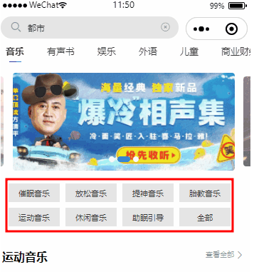

# 专辑搜索

## 专辑数据从DB写入写出ES

专辑数据从DB写入写出ElasticSearch的过程，其实就是专辑上下架的实现。在这一过程中，需要写入ES的对象是**AlbumInfoIndex**，其中包含专辑的基础属性、一二三/级分类id、作者、专辑统计信息和标签信息。因此，要实现这一功能，先要从数据库获取以下信息：

1. 先从`album_info`中获取专辑的基础信息
2. 根据`album_info`中获取的`user_id`从`user_info`中获取作者信息
3. 根据`album_info`中获取的`id`从`base_category_view`中获取各级分类的id
4. 根据`album_info`中获取的`id`从`album_stat`中获取专辑统计信息
5. 根据`album_info`中获取的`id`从`album_attribute_value`中获取专辑标签信息

### 查询专辑信息

:::code-group

```java [AlbumInfoFeignClient]
@FeignClient(value = "service-album", path = "/client/album/albumInfo", contextId = "albumInfoFeignClient")
public interface AlbumInfoFeignClient {

    @GetMapping("/getAlbumInfo/{albumId}")
    public AlbumInfo getAlbumInfo(@PathVariable(value = "albumId") Long albumId);
}
```

```java [AlbumInfoClientController]
@RestController
@RequestMapping("/client/album/albumInfo")
public class AlbumInfoClientController {

    @Autowired
    private AlbumInfoService albumInfoService;

    @GetMapping("/getAlbumInfo/{albumId}")
    public AlbumInfo getAlbumInfo(@PathVariable(value = "albumId") Long albumId) {
        return albumInfoService.getById(albumId);
    }
}
```

:::

### 查询作者信息

:::code-group

```java [UserInfoFeignClient]
@FeignClient(value = "service-user", path = "/client/user/userInfo", contextId = "userInfoFeignClient")
public interface UserInfoFeignClient {

    @GetMapping("/getUserInfo/{userId}")
    public UserInfo getUserInfo(@PathVariable(value = "userId") Long userId);
}
```

```java [UserInfoClientController]
@RestController
@RequestMapping("/client/user/userInfo")
public class UserInfoClientController {

    @Autowired
    private UserInfoService userInfoService;

    @GetMapping("/getUserInfo/{userId}")
    public UserInfo getUserInfo(@PathVariable(value = "userId") Long userId) {
        return userInfoService.getById(userId);
    }
}
```

:::

### 查询各级分类id

:::code-group

```java [CategoryFeignClient]
@FeignClient(value = "service-album", path = "/client/album/category", contextId = "categoryFeignClient")
public interface CategoryFeignClient {

    @GetMapping("/getBaseCategoryView/{category3Id}")
    public BaseCategoryView getBaseCategoryView(@PathVariable(value = "category3Id") Long category3Id);
}
```

```java [BaseCategoryClientController]
@RestController
@RequestMapping(value="/client/album/category")
public class BaseCategoryClientController {

    @Autowired
    private BaseCategoryViewMapper baseCategoryViewMapper;

    @GetMapping("/getBaseCategoryView/{category3Id}")
    public BaseCategoryView getBaseCategoryView(@PathVariable(value = "category3Id") Long category3Id) {
        return baseCategoryViewMapper.selectById(category3Id);
    }
}
```

:::

### 查询专辑统计信息

:::code-group

```java [AlbumInfoClientController]
@GetMapping("/getAlbumStatInfo/{albumId}")
public Map<String, Integer> getAlbumStatInfo(@PathVariable(value = "albumId") Long albumId) {
  return albumInfoService.getAlbumStatInfo(albumId);
}
```

```java [AlbumInfoServiceImpl]
@Override
public Map<String, Integer> getAlbumStatInfo(Long albumId) {
  List<AlbumStat> albumStats = albumStatMapper.selectList(new LambdaQueryWrapper<AlbumStat>().eq(AlbumStat::getAlbumId, albumId));
  return albumStats.stream().collect(Collectors.toMap(
    AlbumStat::getStatType,
    AlbumStat::getStatNum
  ));
}
```

:::

### 查询专辑标签信息

:::code-group

```java [AlbumInfoClientController]
@GetMapping("/getAlbumAttributeValue/{albumId}")
public List<AlbumAttributeValue> getAlbumAttributeValue(@PathVariable(value = "albumId") Long albumId) {
  return albumInfoService.getAlbumAttributeValue(albumId);
}
```

```java [AlbumInfoServiceImpl]
@Override
public List<AlbumAttributeValue> getAlbumAttributeValue(Long albumId) {
  return albumAttributeValueMapper.selectList(new LambdaQueryWrapper<AlbumAttributeValue>().eq(AlbumAttributeValue::getAlbumId, albumId));
}
```

:::

### 实现上下架

:::code-group

```java [ItemServiceImpl]
@Override
public void addAlbumFromDbToEs(Long albumId) {
  AlbumInfo albumInfo = albumInfoFeignClient.getAlbumInfo(albumId);
  if (albumInfo == null) {
    throw new GuiguException(201, "专辑不存在");
  }
  AlbumInfoIndex albumInfoIndex = new AlbumInfoIndex();
  albumInfoIndex.setId(albumInfo.getId());
  albumInfoIndex.setAlbumTitle(albumInfo.getAlbumTitle());
  albumInfoIndex.setAlbumIntro(albumInfo.getAlbumIntro());
  // 查询作者名字
  UserInfo userInfo = userInfoFeignClient.getUserInfo(albumInfo.getUserId());
  if (null == userInfo) {
    albumInfoIndex.setAnnouncerName(albumInfo.getUserId().toString());
  } else {
    albumInfoIndex.setAnnouncerName(userInfo.getNickname());
  }
  albumInfoIndex.setCoverUrl(albumInfo.getCoverUrl());
  albumInfoIndex.setIncludeTrackCount(albumInfo.getIncludeTrackCount());
  albumInfoIndex.setIsFinished(albumInfo.getIsFinished().toString());
  albumInfoIndex.setPayType(albumInfo.getPayType());
  albumInfoIndex.setCreateTime(new Date());
  // 查询分类信息
  BaseCategoryView baseCategoryView = categoryFeignClient.getBaseCategoryView(albumInfo.getCategory3Id());
  albumInfoIndex.setCategory1Id(baseCategoryView.getCategory1Id());
  albumInfoIndex.setCategory2Id(baseCategoryView.getCategory2Id());
  albumInfoIndex.setCategory3Id(albumInfo.getCategory3Id());
  // 查询专辑统计信息
  Map<String, Integer> albumStatInfo = albumInfoFeignClient.getAlbumStatInfo(albumId);
  albumInfoIndex.setPlayStatNum(albumStatInfo.get(SystemConstant.ALBUM_STAT_PLAY));
  albumInfoIndex.setSubscribeStatNum(albumStatInfo.get(SystemConstant.ALBUM_STAT_SUBSCRIBE));
  albumInfoIndex.setBuyStatNum(albumStatInfo.get(SystemConstant.ALBUM_STAT_BROWSE));
  albumInfoIndex.setCommentStatNum(albumStatInfo.get(SystemConstant.ALBUM_STAT_COMMENT));
  albumInfoIndex.setHotScore(0d);
  // 查询专辑标签
  List<AlbumAttributeValue> albumAttributeValues = albumInfoFeignClient.getAlbumAttributeValue(albumId);
  List<AttributeValueIndex> attributeValueIndexList = albumAttributeValues.stream().map(albumAttributeValue -> {
    AttributeValueIndex attributeValueIndex = new AttributeValueIndex();
    attributeValueIndex.setAttributeId(albumAttributeValue.getAttributeId());
    attributeValueIndex.setValueId(albumAttributeValue.getValueId());
    return attributeValueIndex;
  }).collect(Collectors.toList());
  albumInfoIndex.setAttributeValueIndexList(attributeValueIndexList);
  albumInfoIndexDao.save(albumInfoIndex);
}

@Override
public void removeAlbumFromEs(Long albumId) {
  albumInfoIndexDao.deleteById(albumId);
}
```

:::

## 查询一级分类下排序最靠前的7个分类



在首页的轮播图下面，有当前一级分类下的排序最靠前的七个三级分类

:::code-group

```java [BaseCategoryApiController]
@GetMapping("/findTopBaseCategory3/{category1Id}")
public Result<List<BaseCategory3>> findTopBaseCategory3(@PathVariable("category1Id") Long category1Id) {
  return Result.ok(baseCategoryService.findTopBaseCategory3(category1Id));
}
```

```java [BaseCategoryServiceImpl]
@Override
public List<BaseCategory3> findTopBaseCategory3(Long category1Id) {
  List<BaseCategory2> category2List = baseCategory2Mapper.selectList(new LambdaQueryWrapper<BaseCategory2>().eq(BaseCategory2::getCategory1Id, category1Id));
  List<Long> category2IdList = category2List.stream().map(BaseEntity::getId).toList();
  return baseCategory3Mapper.selectPage(new Page<>(1, 7), new LambdaQueryWrapper<BaseCategory3>()
                                        .in(BaseCategory3::getCategory2Id, category2IdList)
                                        .orderByAsc(BaseCategory3::getOrderNum)
                                       ).getRecords();
}
```

:::

## 查询一级分类下全部信息

在首页的排序最靠前的七个三级分类后，还有一个全部按钮。点击后会显示当前一级分类的所有信息，实现思路类似与专辑管理中的[分类业务](./02-AlbumManagement#分类业务)：

1. 根据一级分类Id 查询一级分类对象

2. 根据一级分类Id查询当前一级分类Id 下对应的集合数据

3. 根据二级分类Id进行分组获取二级分类对象

4. 获取二级下对应的三级分类数据

5. 将数据统一封装到一级分类对象中

   格式如下：

```json
{
	"categoryChild": [{
		"categoryChild": [{
			"categoryName": "催眠音乐",
			"categoryId": 1001
		}, {
			"categoryName": "放松音乐",
			"categoryId": 1002
		}, {
			"categoryName": "提神音乐",
			"categoryId": 1003
		}, {
			"categoryName": "胎教音乐",
			"categoryId": 1004
		}, {
			"categoryName": "运动音乐",
			"categoryId": 1005
		}, {
			"categoryName": "休闲音乐",
			"categoryId": 1006
		}],
		"categoryName": "音乐音效",
		"categoryId": 101
	}, {
		"categoryChild": [{
			"categoryName": "助眠引导",
			"categoryId": 1007
		}, {
			"categoryName": "放松引导",
			"categoryId": 1008
		}, {
			"categoryName": "专注引导",
			"categoryId": 1009
		}, {
			"categoryName": "儿童入睡引导",
			"categoryId": 1010
		}, {
			"categoryName": "其他",
			"categoryId": 1011
		}],
		"categoryName": "课程引导",
		"categoryId": 102
	}, {
		"categoryChild": [{
			"categoryName": "经典音乐推荐",
			"categoryId": 1012
		}, {
			"categoryName": "热歌盘点",
			"categoryId": 1013
		}, {
			"categoryName": "歌曲翻唱",
			"categoryId": 1014
		}, {
			"categoryName": "音乐教学",
			"categoryId": 1015
		}, {
			"categoryName": "音乐故事",
			"categoryId": 1016
		}, {
			"categoryName": "其他",
			"categoryId": 1017
		}],
		"categoryName": "主播音乐节目",
		"categoryId": 103
	}],
	"categoryName": "音乐",
	"categoryId": 1
}
```

:::code-group

```java [BaseCategoryApiController]
@GetMapping("/getBaseCategoryList/{category1Id}")
public Result<List<BaseCategory3>> getBaseCategoryList(@PathVariable("category1Id") Long category1Id) {
  return Result.ok(baseCategoryService.getBaseCategoryListById(category1Id));
}
```

```java []
@Override
public List<BaseCategory3> getBaseCategoryListById(Long category1Id) {
  List<BaseCategory2> category2List = baseCategory2Mapper.selectList(new LambdaQueryWrapper<BaseCategory2>().eq(BaseCategory2::getCategory1Id, category1Id));
  List<Long> category2IdList = category2List.stream().map(BaseEntity::getId).toList();
  return baseCategory3Mapper.selectList(new LambdaQueryWrapper<BaseCategory3>()
                                        .in(BaseCategory3::getCategory2Id, category2IdList)
                                        .orderByAsc(BaseCategory3::getOrderNum)
                                       );
}
```


:::