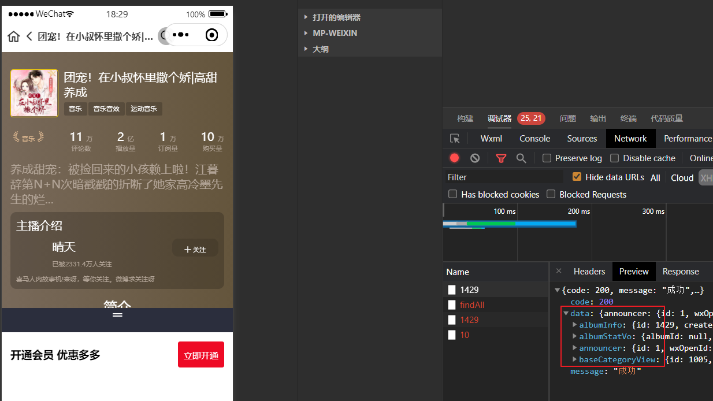
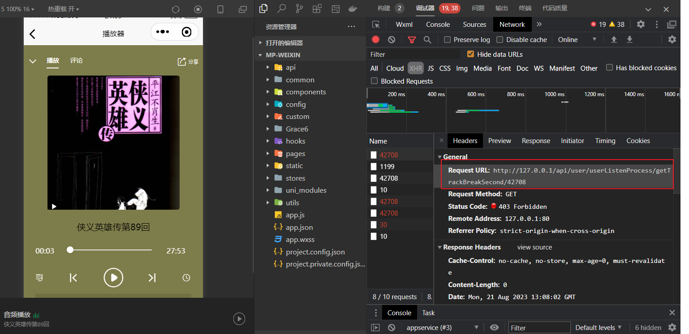
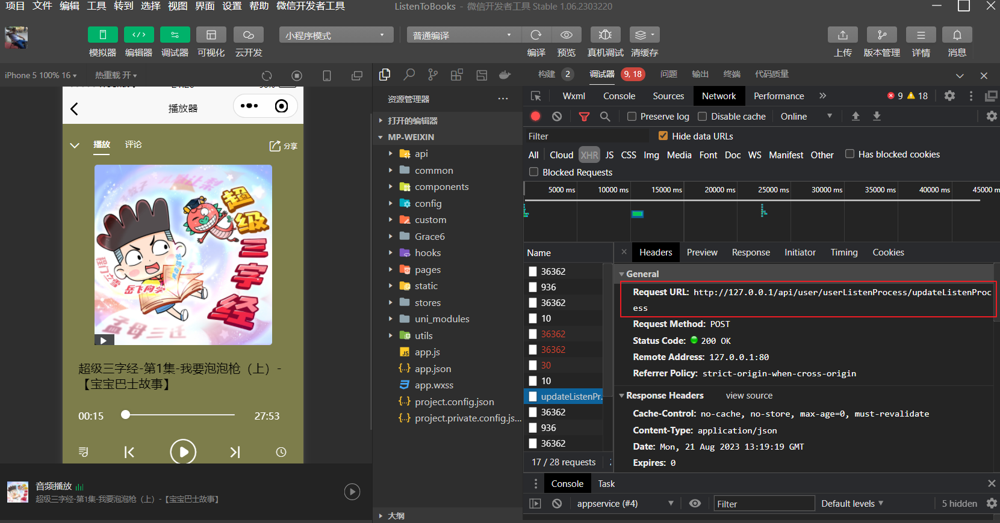

# 专辑详情


主要功能如下：


我的--> 创作中心--> 专辑详情 查看专辑详细信息  或在检索列表中直接点击专辑都可以查看专辑详细信息！




## 根据专辑 id 获取专辑详情

以下是详情需要获取到的数据集：

1. 根据专辑 Id 获取专辑数据
2. 根据专辑 Id 获取专辑统计信息
3. 根据三级分类 Id 获取到分类数据
4. 根据用户 Id 获取到主播信息

专辑详情的接口也是在 `service-search` 服务中实现的，因此要获取这四个数据集，需要进行远程调用


::: code-group

```java [SearchApiController]
@GetMapping("/{albumId}")
public Result<Map<String, Object>> getAlbumDetails(@PathVariable(value = "albumId") Long albumId) {
  return Result.ok(searchService.getAlbumDetails(albumId));
}
```

```java [SearchServiceImpl]
@Override
public JSONObject getAlbumDetails(Long albumId) {
  JSONObject result = new JSONObject();
  // 获取专辑详情
  AlbumInfo albumInfo = albumInfoFeignClient.getAlbumInfo(albumId);
  if (albumInfo == null || albumInfo.getId() == null) {
    throw new GuiguException(201, "专辑不存在");
  }
  // 获取专辑统计信息
  Map<String, Integer> albumStatInfo = albumInfoFeignClient.getAlbumStatInfo(albumId);
  AlbumStatVo albumStatVo = new AlbumStatVo();
  albumStatVo.setAlbumId(albumId);
  albumStatVo.setPlayStatNum(albumStatInfo.get(SystemConstant.ALBUM_STAT_PLAY));
  albumStatVo.setSubscribeStatNum(albumStatInfo.get(SystemConstant.ALBUM_STAT_SUBSCRIBE));
  albumStatVo.setBuyStatNum(albumStatInfo.get(SystemConstant.ALBUM_STAT_BROWSE));
  albumStatVo.setCommentStatNum(albumStatInfo.get(SystemConstant.ALBUM_STAT_COMMENT));
  // 获取专辑分类信息
  BaseCategoryView baseCategoryView = categoryFeignClient.getBaseCategoryView(albumInfo.getCategory3Id());
  // 获取作者信息
  UserInfo userInfo = userInfoFeignClient.getUserInfo(albumInfo.getUserId());
  UserInfoVo userInfoVo = new UserInfoVo();
  BeanUtils.copyProperties(userInfo, userInfoVo);

  result.put("albumInfo", albumInfo);
  result.put("albumStatVo", albumStatVo);
  result.put("baseCategoryView", baseCategoryView);
  result.put("announcer", userInfoVo);
  return result;
}
```

```java [AlbumInfoClientController]
@GetMapping("/getAlbumInfo/{albumId}")
public AlbumInfo getAlbumInfo(@PathVariable(value = "albumId") Long albumId) {
  return albumInfoService.getById(albumId);
}

@GetMapping("/getAlbumStatInfo/{albumId}")
public Map<String, Integer> getAlbumStatInfo(@PathVariable(value = "albumId") Long albumId) {
  return albumInfoService.getAlbumStatInfo(albumId);
}
```

```java [AlbumInfoServiceImpl]
@Override
public Map<String, Integer> getAlbumStatInfo(Long albumId) {
  List<AlbumStat> albumStats = albumStatMapper.selectList(new LambdaQueryWrapper<AlbumStat>().eq(AlbumStat::getAlbumId, albumId));
  return albumStats.stream().collect(Collectors.toMap(
    AlbumStat::getStatType,
    AlbumStat::getStatNum
  ));
}
```

```java [BaseCategoryClientController]
@GetMapping("/getBaseCategoryView/{category3Id}")
public BaseCategoryView getBaseCategoryView(@PathVariable(value = "category3Id") Long category3Id) {
  return baseCategoryViewMapper.selectById(category3Id);
}
```

:::

### 异步编排优化

::: code-group

```java [SearchServiceImpl]
@Autowired
private ThreadPoolExecutor threadPoolExecutor;

@Override
public Map<String, Object> getAlbumDetails(Long albumId) {
  Map<String, Object> result = new ConcurrentHashMap<>();
  // 获取专辑详情
  CompletableFuture<AlbumInfo> albumInfoCompletableFuture = CompletableFuture.supplyAsync(() -> {
    AlbumInfo albumInfo = albumInfoFeignClient.getAlbumInfo(albumId);
    if (albumInfo == null || albumInfo.getId() == null) {
      return null;
    }
    result.put("albumInfo", albumInfo);
    return albumInfo;
  }, threadPoolExecutor);
  // 获取专辑统计信息
  CompletableFuture<Void> albumStatCompletableFuture = CompletableFuture.runAsync(() -> {
    Map<String, Integer> albumStatInfo = albumInfoFeignClient.getAlbumStatInfo(albumId);
    AlbumStatVo albumStatVo = new AlbumStatVo();
    albumStatVo.setAlbumId(albumId);
    albumStatVo.setPlayStatNum(albumStatInfo.get(SystemConstant.ALBUM_STAT_PLAY));
    albumStatVo.setSubscribeStatNum(albumStatInfo.get(SystemConstant.ALBUM_STAT_SUBSCRIBE));
    albumStatVo.setBuyStatNum(albumStatInfo.get(SystemConstant.ALBUM_STAT_BROWSE));
    albumStatVo.setCommentStatNum(albumStatInfo.get(SystemConstant.ALBUM_STAT_COMMENT));
    result.put("albumStatVo", albumStatVo);
  }, threadPoolExecutor);
  // 获取专辑分类信息
  CompletableFuture<Void> categoryCompletableFuture = albumInfoCompletableFuture.thenAcceptAsync(albumInfo -> {
    BaseCategoryView baseCategoryView = categoryFeignClient.getBaseCategoryView(albumInfo.getCategory3Id());
    result.put("baseCategoryView", baseCategoryView);
  }, threadPoolExecutor);
  // 获取作者信息
  CompletableFuture<Void> userInfoCompletableFuture = albumInfoCompletableFuture.thenAcceptAsync(albumInfo -> {
    UserInfo userInfo = userInfoFeignClient.getUserInfo(albumInfo.getUserId());
    UserInfoVo userInfoVo = new UserInfoVo();
    BeanUtils.copyProperties(userInfo, userInfoVo);
    result.put("announcer", userInfoVo);
  }, threadPoolExecutor);
  CompletableFuture.allOf(albumStatCompletableFuture, categoryCompletableFuture, userInfoCompletableFuture).join();
  return result;
}
```

```java [SearchThreadPoolConfig]
@Configuration
public class SearchThreadPoolConfig {

    @Bean
    public ThreadPoolExecutor threadPoolExecutor() {
        return new ThreadPoolExecutor(
                8,
                16,
                3,
                TimeUnit.SECONDS,
                new ArrayBlockingQueue<>(40000)
        );
    }
}
```

:::

## 获取声音播放进度



### 功能设计

在播放声音的时候，会有触发一个获取播放进度的控制器！因为页面每隔 10s 会自动触发一次保存功能，会将数据写入 MongoDB 中。所以我们直接从 MongoDB 中获取到声音的播放时间即可！

### 代码实现

::: code-group

```java [UserListenProcessApiController]
@GetMapping("/getTrackBreakSecond/{trackId}")
public Result<BigDecimal> getTrackBreakSecond(@PathVariable("trackId") Long trackId) {
  return Result.ok(userListenProcessService.getTrackBreakSecond(trackId));
}
```

```java [UserListenProcessServiceImpl]
@Override
public BigDecimal getTrackBreakSecond(Long trackId) {
  Long userId = AuthContextHolder.getUserId();
  Query query = Query.query(Criteria.where("userId").is(userId).and("trackId").is(trackId));
  UserListenProcess userListenProcess = mongoTemplate.findOne(query, UserListenProcess.class,
                                                              MongoUtil.getCollectionName(MongoUtil.MongoCollectionEnum.USER_LISTEN_PROCESS, userId));
  if (null == userListenProcess) {
    return new BigDecimal(0);
  }
  return userListenProcess.getBreakSecond();
}
```

```java [MongoUtil]
public class MongoUtil {

    @Getter
    public enum MongoCollectionEnum {

        USER_SUBSCRIBE(100,"userSubscribe"),
        USER_COLLECT(100,"userCollect"),
        USER_LISTEN_PROCESS(100,"userListenProcess"),
        COMMENT(100,"comment"),
        COMMENT_PRAISE(100,"commentPraise"),
        ;

        private Integer partition;
        private String collectionPrefix;

        MongoCollectionEnum(Integer partition, String collectionPrefix) {
            this.partition = partition;
            this.collectionPrefix = collectionPrefix;
        }

    }


    /**
     * 获取mongo表名
     * @param mongoCollection Collection前缀
     * @param route 路由
     * @return
     */
    public static String getCollectionName(MongoCollectionEnum mongoCollection, Long route) {
        return mongoCollection.getCollectionPrefix() + "_" + route % mongoCollection.getPartition();
    }
}
```

:::

## 更新保存播放进度



::: code-group

```java [UserListenProcessApiController]
@PostMapping("/updateListenProcess")
public Result updateListenProcess(@RequestBody UserListenProcessVo userListenProcessVo) {
  userListenProcessService.updateListenProcess(userListenProcessVo);
  return Result.ok();
}
```

```java [UserListenProcessServiceImpl]
@Override
public void updateListenProcess(UserListenProcessVo userListenProcessVo) {
  Long userId = AuthContextHolder.getUserId();
  // 查询用户播放进度
  Query query = Query.query(Criteria.where("userId").is(userId).and("trackId").is(userListenProcessVo.getTrackId()));
  UserListenProcess userListenProcess = mongoTemplate.findOne(query, UserListenProcess.class,
                                                              MongoUtil.getCollectionName(MongoUtil.MongoCollectionEnum.USER_LISTEN_PROCESS, userId));
  if (null == userListenProcess) {
    // 若无则新增
    userListenProcess = new UserListenProcess();
    BeanUtils.copyProperties(userListenProcessVo, userListenProcess);
    userListenProcess.setId(UUID.randomUUID().toString().replaceAll("-", ""));
    userListenProcess.setUserId(userId);
    userListenProcess.setIsShow(1);
    userListenProcess.setCreateTime(new Date());
    userListenProcess.setUpdateTime(new Date());
  } else {
    // 有则更新
    userListenProcess.setUpdateTime(new Date());
    userListenProcess.setBreakSecond(userListenProcessVo.getBreakSecond());
  }
  mongoTemplate.save(userListenProcess, MongoUtil.getCollectionName(MongoUtil.MongoCollectionEnum.USER_LISTEN_PROCESS, userId));
}
```

:::