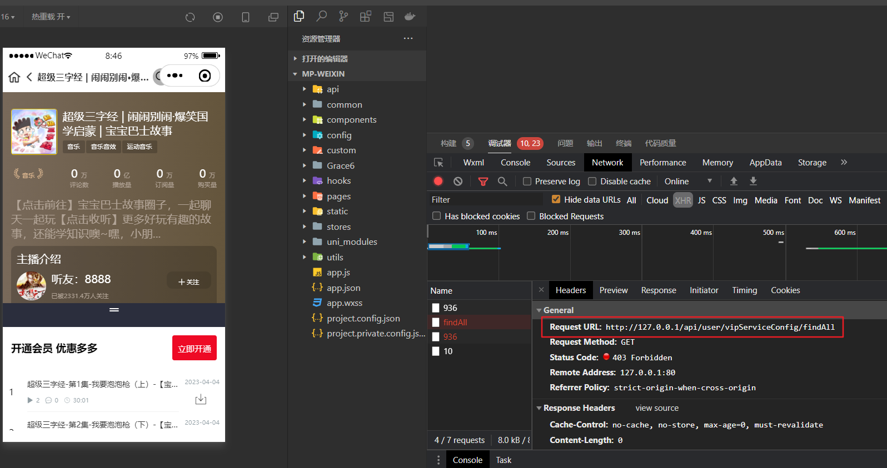
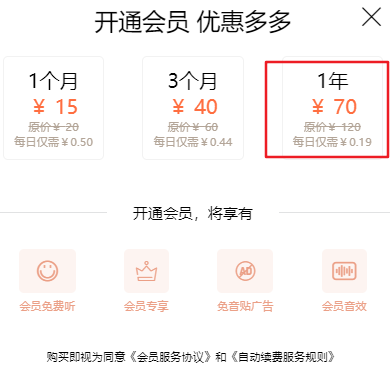
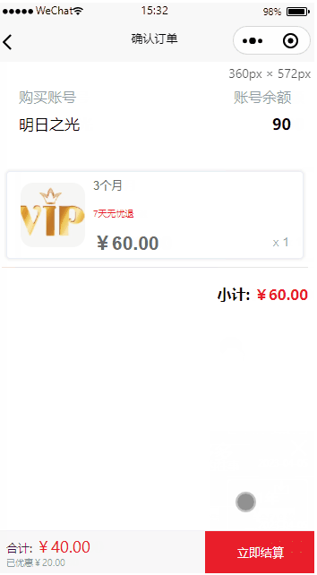
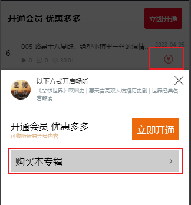
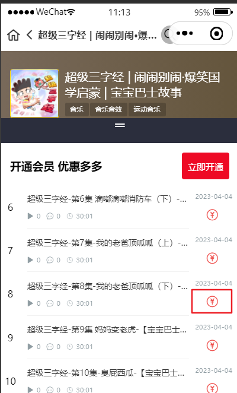
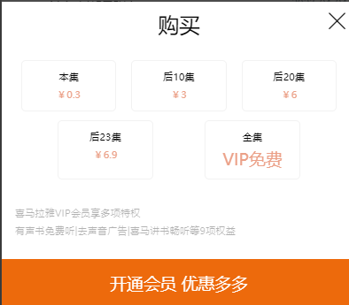
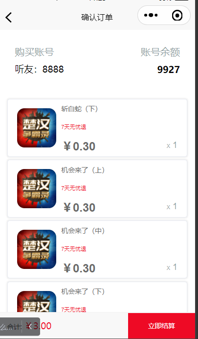
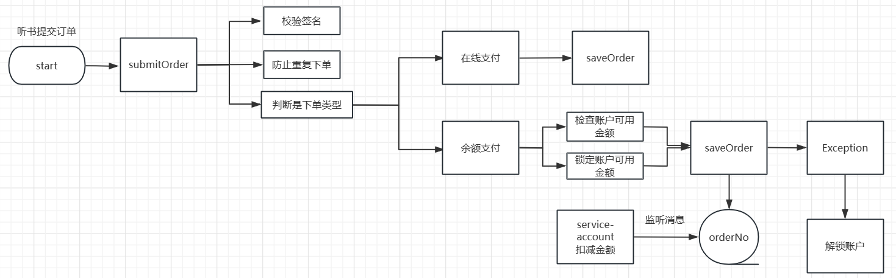

# 订单管理

目前在项目中的订单有三种：会员订单、专辑订单和声音订单，这三种订单都是在专辑详情页点击触发

- 点击开通会员，选择要开通的套餐，进入会员订单确认页面
- 点击购买专辑，进入专辑订单确认页面
- 点击声音后面的付费标识，选择要购买的集数，进入声音订单确认页面

## 获取所有 Vip 类型

在 **首页** 点击 **VIP 免费** 的专辑会进入该专辑详情页并访问 VIP 服务配置管理接口：



其实也就是返回 Vip 套餐，在 `vip_service_config` 表中初始化了三种套餐：月度套餐、季度套餐和年度套餐：



```java
@Tag(name = "VIP服务配置管理接口")
@RestController
@RequestMapping("/api/user/vipServiceConfig")
@SuppressWarnings({"unchecked", "rawtypes"})
public class VipServiceConfigApiController {

	@Autowired
	private VipServiceConfigService vipServiceConfigService;

	@GuiguCache(prefix = "vipServiceConfig:")
	@GuiguLogin
	@GetMapping("/findAll")
	public Result<List<VipServiceConfig>> findAll() {
		return Result.ok(vipServiceConfigService.list());
	}
}
```

## 会员购买确认接口



::: code-group

```java [OrderInfoApiController]
@GuiguLogin
@PostMapping("/trade")
public Result trade(@RequestBody TradeVo tradeVo) {
  return Result.ok(orderInfoService.trade(tradeVo));
}
```

```java [OrderInfoServiceImpl]
@Override
public Object trade(TradeVo tradeVo) {
  OrderInfoVo result = new OrderInfoVo();

  switch (tradeVo.getItemType()) {
    case SystemConstant.ORDER_ITEM_TYPE_VIP -> result = tradeVip(tradeVo);
  }
  return result;
}

private OrderInfoVo tradeVip(TradeVo tradeVo) {
  OrderInfoVo orderInfoVo = new OrderInfoVo();
  Long itemId = tradeVo.getItemId();

  orderInfoVo.setTradeNo(UUID.randomUUID().toString().replaceAll("-", ""));
  orderInfoVo.setItemType(SystemConstant.ORDER_ITEM_TYPE_VIP);

  VipServiceConfig vipServiceConfig = vipServiceConfigFeignClient.getVipServiceConfig(itemId);

  BigDecimal price = vipServiceConfig.getPrice();
  BigDecimal discountPrice = vipServiceConfig.getDiscountPrice();
  orderInfoVo.setOriginalAmount(price);
  orderInfoVo.setDerateAmount(price.subtract(discountPrice));
  orderInfoVo.setOrderAmount(discountPrice);

  List<OrderDetailVo> orderDetailVoList = new ArrayList<>();
  OrderDetailVo orderDetailVo = new OrderDetailVo();
  orderDetailVo.setItemId(itemId);
  orderDetailVo.setItemName(vipServiceConfig.getName());
  orderDetailVo.setItemUrl(vipServiceConfig.getImageUrl());
  orderDetailVo.setItemPrice(discountPrice);
  orderDetailVoList.add(orderDetailVo);
  orderInfoVo.setOrderDetailVoList(orderDetailVoList);

  List<OrderDerateVo> orderDerateVoList = new ArrayList<>();
  OrderDerateVo orderDerateVo = new OrderDerateVo();
  orderDerateVo.setDerateAmount(price.subtract(discountPrice));
  orderDerateVo.setDerateType(SystemConstant.ORDER_DERATE_VIP_SERVICE_DISCOUNT);
  orderDerateVo.setRemarks("会员充值折扣！");
  orderDerateVoList.add(orderDerateVo);

  orderInfoVo.setOrderDerateVoList(orderDerateVoList);
  orderInfoVo.setTimestamp(System.currentTimeMillis());
  return orderInfoVo;
}
```

:::

## 专辑购买确认接口



::: code-group

```java [OrderInfoServiceImpl]
@Override
public Object trade(TradeVo tradeVo) {
  OrderInfoVo result = new OrderInfoVo();

  switch (tradeVo.getItemType()) {
    case SystemConstant.ORDER_ITEM_TYPE_ALBUM -> result = tradeAlbum(tradeVo); // [!code ++]
    case SystemConstant.ORDER_ITEM_TYPE_VIP -> result = tradeVip(tradeVo);
  }
  return result;
}

private OrderInfoVo tradeAlbum(TradeVo tradeVo) {
  OrderInfoVo orderInfoVo = new OrderInfoVo();
  Long albumId = tradeVo.getItemId();
  // 用户已经购买过本专辑，不可重复购买
  if (userInfoFeignClient.getUserIsBuyAlbum(albumId)) {
    throw new GuiguException(201, "您已经购买过本专辑了，无需重复购买");
  }

  orderInfoVo.setTradeNo(UUID.randomUUID().toString().replaceAll("-", ""));
  orderInfoVo.setItemType(SystemConstant.ORDER_ITEM_TYPE_ALBUM);

  AlbumInfo albumInfo = albumInfoFeignClient.getAlbumInfo(albumId);
  UserInfo userInfo = userInfoFeignClient.getUserInfo(AuthContextHolder.getUserId());
  Integer isVip = userInfo.getIsVip();

  // 原价
  BigDecimal price = albumInfo.getPrice();
  BigDecimal divide = null;
  if (isVip == 0) {
    // 普通折扣
    BigDecimal discount = albumInfo.getDiscount().intValue() == -1 ? BigDecimal.valueOf(10) : albumInfo.getDiscount();
    // 折后价
    divide = price.multiply(discount).divide(BigDecimal.valueOf(10));
  } else {
    // 会员折扣
    BigDecimal vipDiscount = albumInfo.getVipDiscount().intValue() == -1 ? BigDecimal.valueOf(10) : albumInfo.getVipDiscount();
    divide = price.multiply(vipDiscount).divide(BigDecimal.valueOf(10));
  }
  orderInfoVo.setOriginalAmount(price);
  orderInfoVo.setDerateAmount(price.subtract(divide));
  orderInfoVo.setOrderAmount(divide);

  List<OrderDetailVo> orderDetailVoList = new ArrayList<>();
  OrderDetailVo orderDetailVo = new OrderDetailVo();
  orderDetailVo.setItemId(albumId);
  orderDetailVo.setItemName(albumInfo.getAlbumTitle());
  orderDetailVo.setItemUrl(albumInfo.getCoverUrl());
  orderDetailVo.setItemPrice(divide);
  orderDetailVoList.add(orderDetailVo);
  orderInfoVo.setOrderDetailVoList(orderDetailVoList);

  List<OrderDerateVo> orderDerateVoList = new ArrayList<>();
  OrderDerateVo orderDerateVo = new OrderDerateVo();
  orderDerateVo.setDerateAmount(price.subtract(divide));
  orderDerateVo.setDerateType(SystemConstant.ORDER_DERATE_ALBUM_DISCOUNT);
  orderDerateVo.setRemarks("专辑购买折扣！");
  orderDerateVoList.add(orderDerateVo);

  orderInfoVo.setOrderDerateVoList(orderDerateVoList);
  orderInfoVo.setTimestamp(System.currentTimeMillis());
  return orderInfoVo;
}
```

:::

## 声音购买确认接口







::: code-group

```java [OrderInfoServiceImpl]
@Override
public Object trade(TradeVo tradeVo) {
  OrderInfoVo result = new OrderInfoVo();

  switch (tradeVo.getItemType()) {
    case SystemConstant.ORDER_ITEM_TYPE_ALBUM -> result = tradeAlbum(tradeVo);
    case SystemConstant.ORDER_ITEM_TYPE_TRACK -> result = tradeTrack(tradeVo); // [!code ++]
    case SystemConstant.ORDER_ITEM_TYPE_VIP -> result = tradeVip(tradeVo);
  }
  return result;
}

private OrderInfoVo tradeTrack(TradeVo tradeVo) {
  OrderInfoVo orderInfoVo = new OrderInfoVo();
  Long trackId = tradeVo.getItemId();

  orderInfoVo.setTradeNo(UUID.randomUUID().toString().replaceAll("-", ""));
  orderInfoVo.setItemType(SystemConstant.ORDER_ITEM_TYPE_TRACK);

  AlbumInfo albumInfo = albumInfoFeignClient.getAlbumInfoByTrackId(trackId);
  Integer trackCount = tradeVo.getTrackCount();
  List<TrackInfo> trackPaidList = trackInfoFeignClient.getTrackPaidList(trackId, trackCount);

  BigDecimal price = albumInfo.getPrice();
  orderInfoVo.setOriginalAmount(price.multiply(new BigDecimal(trackCount)));
  orderInfoVo.setDerateAmount(new BigDecimal(0));
  orderInfoVo.setOrderAmount(price.multiply(new BigDecimal(trackCount)));

  List<OrderDetailVo> orderDetailVoList = trackPaidList.stream().map(trackInfo -> {
    OrderDetailVo orderDetailVo = new OrderDetailVo();
    orderDetailVo.setItemId(trackInfo.getId());
    orderDetailVo.setItemName(trackInfo.getTrackTitle());
    orderDetailVo.setItemUrl(trackInfo.getCoverUrl());
    orderDetailVo.setItemPrice(price);
    return orderDetailVo;
  }).toList();
  orderInfoVo.setOrderDetailVoList(orderDetailVoList);

  List<OrderDerateVo> orderDerateVoList = new ArrayList<>();
  orderInfoVo.setOrderDerateVoList(orderDerateVoList);

  orderInfoVo.setTimestamp(System.currentTimeMillis());
  return orderInfoVo;
}
```

:::

## 下单确认签名生成

订单对象 **OrderInfoVo** 中有一个 `sign` 属性，该属性是由订单信息加密而成的 JWT 字符串，防止数据在传输过程中被篡改（由于当前仅仅是下单确认，并未支付，因此后面还需要用到这些订单信息。有了 sign 签名后，后续操作所需数据都是通过对 sign 解密得到）

::: code-group

```java [OrderInfoServiceImpl]
@Override
public Object trade(TradeVo tradeVo) {
  OrderInfoVo result = new OrderInfoVo();

  switch (tradeVo.getItemType()) {
    case SystemConstant.ORDER_ITEM_TYPE_ALBUM -> result = tradeAlbum(tradeVo);
    case SystemConstant.ORDER_ITEM_TYPE_TRACK -> result = tradeTrack(tradeVo);
    case SystemConstant.ORDER_ITEM_TYPE_VIP -> result = tradeVip(tradeVo);
  }
  Jwt encode = JwtHelper.encode(JSONObject.toJSONString(result), new RsaSigner(rsaPrivateKey)); // [!code ++]
  result.setSign(encode.getEncoded()); // [!code ++]
  return result;
}
```

```java [LoginJwtPrivateKeyConfig]
@Configuration
public class LoginJwtPrivateKeyConfig {

    @Value("${encrypt.location}")
    private String location;
    @Value("${encrypt.secret}")
    private String secret;
    @Value("${encrypt.alias}")
    private String alias;
    @Value("${encrypt.password}")
    private String password;

    @Bean
    public RSAPrivateKey rsaPrivateKey() {
        // 密钥文件的工厂对象初始化
        KeyStoreKeyFactory keyStoreKeyFactory = new KeyStoreKeyFactory(new ClassPathResource(location), secret.toCharArray());
        // 访问这个文件中的一对钥匙
        KeyPair keyPair = keyStoreKeyFactory.getKeyPair(alias, password.toCharArray());
        // 获取私钥
        PrivateKey aPrivate = keyPair.getPrivate();
        // 返回注入容器
        return (RSAPrivateKey) aPrivate;
    }
}
```

:::

## 提交订单保存到数据库



### 功能设计

订单确认完成后，点击立即结算，会弹出支付方式，目前有两种方式：余额和微信。付款完成后，订单完成！

### 表结构设计

如果是余额支付，首先需要去 `user_account` 中根据 `available_amount` 来判断是否足够支付这笔订单。如果可以，锁定账户，进行余额扣除操作

如果是微信支付，用户支付即可

在这一过程中，还需要：

- 保存订单信息到 `order_info` 中（PS：此时订单并未支付，因此 `order_status` 字段的值仍是 `未支付`）
- 保存订单详情到 `order_detail` 中
- 保存订单折扣到 `order_derate` 中

### 代码实现

::: code-group

```java [OrderInfoApiController]
@GuiguLogin
@PostMapping("/submitOrder")
public Result<Map<String, Object>> submitOrder(@RequestBody OrderInfoVo orderInfoVo) {
  return Result.ok(orderInfoService.submitOrder(orderInfoVo));
}
```

```java [OrderInfoServiceImpl]
@Transactional(rollbackFor = Exception.class)
@Override
public Map<String, Object> submitOrder(OrderInfoVo orderInfoVo) {
  Long userId = AuthContextHolder.getUserId();
  RLock lock = redissonClient.getLock("User_Submit_Order_Lock_" + userId);
  try {
    if (lock.tryLock()) {
      try {
        String sign = orderInfoVo.getSign();
        Jwt jwt = JwtHelper.decodeAndVerify(sign, new RsaVerifier(SystemConstant.PUBLIC_KEY));
        // checkOrder
        String payWay = orderInfoVo.getPayWay();
        String claims = jwt.getClaims();
        orderInfoVo = JSONObject.parseObject(claims, OrderInfoVo.class);

        OrderInfo orderInfo = new OrderInfo();
        BeanUtils.copyProperties(orderInfoVo, orderInfo);
        orderInfo.setUserId(userId);
        orderInfo.setOrderNo(orderInfoVo.getTradeNo());
        orderInfo.setPayWay(payWay);
        String itemType = orderInfoVo.getItemType();
        switch (itemType) {
          case SystemConstant.ORDER_ITEM_TYPE_ALBUM -> orderInfo.setOrderTitle("购买【" + orderInfoVo.getOrderDetailVoList().get(0).getItemName() + "】专辑");
          case SystemConstant.ORDER_ITEM_TYPE_TRACK -> orderInfo.setOrderTitle("购买【" + orderInfoVo.getOrderDetailVoList().get(0).getItemName() + "】等声音");
          case SystemConstant.ORDER_ITEM_TYPE_VIP -> orderInfo.setOrderTitle("购买【" + orderInfoVo.getOrderDetailVoList().get(0).getItemName() + "】会员");
        }
        if (!save(orderInfo)) {
          throw new GuiguException(201, "保存订单信息失败");
        }
        Long orderId = orderInfo.getId();

        orderInfoVo.getOrderDetailVoList().stream().forEach(orderDetailVo -> {
          OrderDetail orderDetail = new OrderDetail();
          BeanUtils.copyProperties(orderDetailVo, orderDetail);
          orderDetail.setOrderId(orderId);
          int insert = orderDetailMapper.insert(orderDetail);
          if (insert <= 0) {
            throw new GuiguException(201, "保存订单详情失败");
          }
        });

        orderInfoVo.getOrderDerateVoList().stream().forEach(orderDerateVo -> {
          OrderDerate orderDerate = new OrderDerate();
          BeanUtils.copyProperties(orderDerateVo, orderDerate);
          orderDerate.setOrderId(orderId);
          int insert = orderDerateMapper.insert(orderDerate);
          if (insert <= 0) {
            throw new GuiguException(201, "保存订单折扣信息失败");
          }
        });

        JSONObject result = new JSONObject();
        result.put("orderNo", orderInfo.getOrderNo());

        if (payWay.equals(SystemConstant.ORDER_PAY_ACCOUNT)) {
          // 发送余额扣款消息
          rabbitTemplate.convertAndSend("order_pay_change", "order.pay", JSONObject.toJSONString(orderInfo));
        } else {
          // 发送延迟消息，开始倒计时（非余额支付）
          rabbitTemplate.convertAndSend("order_normal_change", "order.dead", userId + ":" + orderInfo.getOrderNo(), message -> {
            MessageProperties messageProperties = message.getMessageProperties();
            messageProperties.setExpiration(900000 + "");
            return message;
          });
        }

        return result;
      } catch (Exception e) {
        log.error("下单逻辑异常，原因是：{}", e.getMessage());
      } finally {
        lock.unlock();
      }
    } else {
      throw new GuiguException(201, "并发下单失败，请重试");
    }
  } catch (Exception e) {
    log.error("下单失败，原因是：{}", e.getMessage());
  }
  return null;
}
```

:::

::: tip

此时仅仅是提交订单，并不意味着 `已支付，订单结束`。因此，在这里，对于余额支付，发送消息到 `service-account` 进行对应操作，具体操作参见 [余额扣款](./12-RabbitMQJob#余额扣款)；对于微信支付，发送一个延迟消息，当用户在十五分钟未完成支付，自动取消订单，具体操作参见 [自动取消订单](./12-RabbitMQJob#自动取消订单)

:::

## 场景校验

目前已经实现了对用户下单余额付款的全流程，但是在确认订单时，没有校验未支付订单中是否包含当前购买的内容

::: code-group

```java [OrderInfoServiceImpl]
@Override
public Object trade(TradeVo tradeVo) {
  OrderInfoVo result = new OrderInfoVo();

  // 校验未支付订单中是否包含当前购买的内容 // [!code ++]
  checkOrder(tradeVo); // [!code ++]

  switch (tradeVo.getItemType()) {
    case SystemConstant.ORDER_ITEM_TYPE_ALBUM -> result = tradeAlbum(tradeVo);
    case SystemConstant.ORDER_ITEM_TYPE_TRACK -> result = tradeTrack(tradeVo);
    case SystemConstant.ORDER_ITEM_TYPE_VIP -> result = tradeVip(tradeVo);
  }
  Jwt encode = JwtHelper.encode(JSONObject.toJSONString(result), new RsaSigner(rsaPrivateKey));
  result.setSign(encode.getEncoded());
  return result;
}

private void checkOrder(TradeVo tradeVo) {
  Long userId = AuthContextHolder.getUserId();
  Long itemId = tradeVo.getItemId();
  switch (tradeVo.getItemType()) {
    case SystemConstant.ORDER_ITEM_TYPE_ALBUM -> {
      // 查询所有已支付/未支付专辑中是否包含当前要购买的专辑
      int count = orderInfoMapper.selectAlbumOrderCount(userId, itemId);
      if (count > 0) {
        throw new GuiguException(201, "专辑已经购买过或存在未支付的该专辑订单，请确认后处理");
      }
    }
    case SystemConstant.ORDER_ITEM_TYPE_TRACK -> {
      // 获取当前要购买的声音集合A
      Set<Long> trackIds = trackInfoFeignClient.getTrackPaidList(itemId, tradeVo.getTrackCount()).stream().map(BaseEntity::getId).collect(Collectors.toSet());
      // 获取当前未支付的声音集合B
      Set<Long> list = orderInfoMapper.selectTrackOrderIds(userId);
      // B.contains(A) ?
      trackIds.stream().forEach(trackId -> {
        if (list.contains(trackId)) {
          throw new GuiguException(201, "声音在其他未支付订单中");
        }
      });
    }
    case SystemConstant.ORDER_ITEM_TYPE_VIP -> {
      // 查询是否有未支付的订单
      OrderInfo orderInfo = getOne(new LambdaQueryWrapper<OrderInfo>()
                                   .eq(OrderInfo::getUserId, userId)
                                   .eq(OrderInfo::getItemType, SystemConstant.ORDER_ITEM_TYPE_VIP)
                                   .eq(OrderInfo::getOrderStatus, SystemConstant.ORDER_STATUS_UNPAID));
      if (null != orderInfo) {
        throw new GuiguException(201, "您存在未支付的会员订单，请先取消支付或支付订单后处理");
      }
    }
  }
}
```

:::

## 我的订单


::: code-group

```java [OrderInfoApiController]
@GuiguLogin
@GetMapping("/findUserPage/{page}/{size}")
public Result findUserPage(@PathVariable("page") Integer page, @PathVariable("size") Integer size) {
  return Result.ok(orderInfoService.page(new Page<>(page, size),
                                         new LambdaQueryWrapper<OrderInfo>().eq(OrderInfo::getUserId, AuthContextHolder.getUserId())
                                         .orderByDesc(OrderInfo::getCreateTime)));
}
```

:::

## 获取订单详情

::: code-group

```java [OrderInfoApiController]
@GuiguLogin
@GetMapping("/getOrderInfo/{orderNo}")
public Result<OrderInfo> getOrderInfo(@PathVariable("orderNo") String orderNo) {
  return Result.ok(orderInfoService.getOne(new LambdaQueryWrapper<OrderInfo>()
                                           .eq(OrderInfo::getUserId, AuthContextHolder.getUserId())
                                           .eq(OrderInfo::getOrderNo, orderNo)));
}
```

:::

## 主动取消订单

::: code-group

```java [OrderInfoApiController]
@GuiguLogin
@PostMapping("/cancelOrder/{orderNo}")
public Result cancelOrder(@PathVariable("orderNo") String orderNo) {
  orderInfoService.cancelOrder(null, orderNo);
  return Result.ok();
}
```

```java [OrderInfoServiceImpl]
@Override
public void cancelOrder(Long userId, String orderNo) {
  String status = SystemConstant.ORDER_STATUS_CANCEL;
  if (userId == null) {
    userId = AuthContextHolder.getUserId();
  } else {
    status = SystemConstant.ORDER_STATUS_AUTO_CANCEL;
  }
  RLock lock = redissonClient.getLock("Cancel_OrderInfo_UserId_" + userId + "_" + orderNo);
  try {
    if (lock.tryLock()) {
      try {
        OrderInfo orderInfo = getOne(new LambdaQueryWrapper<OrderInfo>()
                                     .eq(OrderInfo::getUserId, userId)
                                     .eq(OrderInfo::getOrderNo, orderNo)
                                     .eq(OrderInfo::getOrderStatus, SystemConstant.ORDER_STATUS_UNPAID)
                                    );
        orderInfo.setOrderStatus(status);
        updateById(orderInfo);
      }catch (Exception e) {
        throw e;
      } finally {
        lock.unlock();
      }
    }
  } catch (Exception e) {
    throw e;
  }
}
```

:::
