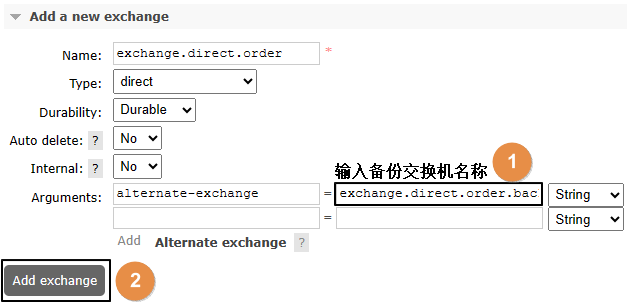

RabbitMQ 体系结构如图所示：


从图中可以知道：

- 生产者和消费者之间通过 Broker 来通信，而它们和 Broker 又通过 Channel 进行连接
- Broker 中有多个 VirtualHost, 每个 VirtualHost 中有多个交换机 Exchange 和多个队列 Queue.
- 交换机和队列之间具有绑定 Binding 关系，一个交换机可以 Binding 多个队列

另外，队列 Queue 是消息的实际存储的地方！

## 安装

```shell
拉取镜像
docker pull rabbitmq:3.13-management

# -d 参数：后台运行 Docker 容器
# --name 参数：设置容器名称
# -p 参数：映射端口号，格式是“宿主机端口号: 容器内端口号”。5672 供客户端程序访问，15672 供后台管理界面访问
# -v 参数：卷映射目录
# -e 参数：设置容器内的环境变量，这里我们设置了登录 RabbitMQ 管理后台的默认用户和密码
docker run -d --name rabbitmq-study -p 5672:5672 -p 15672:15672 -v rabbitmq-plugin:/plugins -e RABBITMQ_DEFAULT_USER=guest -e RABBITMQ_DEFAULT_PASS=guest rabbitmq:3.13-management
```

## HelloWorld

生产者发送消息，消费者接收消息，用最简单的方式实现。官网说明参见 [RabbitMQ tutorial - "Hello World!" — RabbitMQ](https://www.rabbitmq.com/tutorials/tutorial-one-java.html)

::: code-group

```xml [pom.xml]
<dependencies>
  <dependency>
    <groupId>com.rabbitmq</groupId>
    <artifactId>amqp-client</artifactId>
    <version>5.20.0</version>
  </dependency>
</dependencies>
```

```java [Producer]
public class Producer {

    public static void main(String[] args) throws Exception {

        // 创建连接工厂
        ConnectionFactory connectionFactory = new ConnectionFactory();

        // 设置主机地址
        connectionFactory.setHost("127.0.0.1");

        // 设置连接端口号：默认为 5672
        connectionFactory.setPort(5672);

        // 虚拟主机名称：默认为 /
        connectionFactory.setVirtualHost("/");

        // 设置连接用户名；默认为guest
        connectionFactory.setUsername("guest");

        // 设置连接密码；默认为guest
        connectionFactory.setPassword("guest");

        // 创建连接
        Connection connection = connectionFactory.newConnection();

        // 创建频道
        Channel channel = connection.createChannel();

        // 声明（创建）队列
        // queue      参数1：队列名称
        // durable    参数2：是否定义持久化队列，当 MQ 重启之后还在
        // exclusive  参数3：是否独占本次连接。若独占，只能有一个消费者监听这个队列且 Connection 关闭时删除这个队列
        // autoDelete 参数4：是否在不使用的时候自动删除队列，也就是在没有Consumer时自动删除
        // arguments  参数5：队列其它参数
        channel.queueDeclare("simple_queue", true, false, false, null);

        // 要发送的信息
        String message = "你好；小兔子！";

        // 参数1：交换机名称,如果没有指定则使用默认Default Exchange
        // 参数2：路由key,简单模式可以传递队列名称
        // 参数3：配置信息
        // 参数4：消息内容
        channel.basicPublish("", "simple_queue", null, message.getBytes());

        System.out.println("已发送消息：" + message);

        // 关闭资源
        channel.close();
        connection.close();
    }
}
```

```java [Consumer]
public class Consumer {
  
    public static void main(String[] args) throws Exception {  
  
        // 1.创建连接工厂  
        ConnectionFactory factory = new ConnectionFactory();
  
        // 2. 设置参数  
        factory.setHost("127.0.0.1");
        factory.setPort(5672);  
        factory.setVirtualHost("/");  
        factory.setUsername("guest");
        factory.setPassword("guest");
  
        // 3. 创建连接 Connection        
        Connection connection = factory.newConnection();
  
        // 4. 创建Channel  
        Channel channel = connection.createChannel();
  
        // 5. 创建队列  
        // 如果没有一个名字叫simple_queue的队列，则会创建该队列，如果有则不会创建  
        // 参数1. queue：队列名称  
        // 参数2. durable：是否持久化。如果持久化，则当MQ重启之后还在  
        // 参数3. exclusive：是否独占。  
        // 参数4. autoDelete：是否自动删除。当没有Consumer时，自动删除掉  
        // 参数5. arguments：其它参数。  
        channel.queueDeclare("simple_queue",true,false,false,null);  
  
        // 接收消息  
        DefaultConsumer consumer = new DefaultConsumer(channel){
  
            // 回调方法,当收到消息后，会自动执行该方法  
            // 参数1. consumerTag：标识  
            // 参数2. envelope：获取一些信息，交换机，路由key...  
            // 参数3. properties：配置信息  
            // 参数4. body：数据  
            @Override  
            public void handleDelivery(String consumerTag, Envelope envelope, AMQP.BasicProperties properties, byte[] body) throws IOException {
  
                System.out.println("consumerTag："+consumerTag);  
                System.out.println("Exchange："+envelope.getExchange());  
                System.out.println("RoutingKey："+envelope.getRoutingKey());  
                System.out.println("properties："+properties);  
                System.out.println("body："+new String(body));  
  
            }  
  
        };  
  
        // 参数1. queue：队列名称  
        // 参数2. autoAck：是否自动确认，类似咱们发短信，发送成功会收到一个确认消息  
        // 参数3. callback：回调对象  
        // 消费者类似一个监听程序，主要是用来监听消息  
        channel.basicConsume("simple_queue",true,consumer);  
  
    }  
  
}
```

:::

## 工作模式

RabbitMQ 官网演示了 [七种用法](https://www.rabbitmq.com/tutorials)，如下图所示：


### 工作队列模式

本质上我们刚刚写的 HelloWorld 程序就是这种模式，只是 HelloWorld 简化到了最简单的情况：

- 生产者只有一个 
- 发送一个消息 
- 消费者也只有一个

消息也只能被这个消费者消费所以 HelloWorld 也称为简单模式。 现在我们还原一下常规情况： 

- 生产者发送多个消息 
- 由多个消费者来竞争 
- 谁抢到算谁的 

::: code-group

```java [ConnectionUtil]
public class ConnectionUtil {
  
    public static final String HOST_ADDRESS = "127.0.0.1";
  
    public static Connection getConnection() throws Exception {
        // 定义连接工厂  
        ConnectionFactory factory = new ConnectionFactory();
        // 设置服务地址  
        factory.setHost(HOST_ADDRESS);
        // 端口  
        factory.setPort(5672);
        //设置账号信息，用户名、密码、vhost  
        factory.setVirtualHost("/");  
        factory.setUsername("guest");  
        factory.setPassword("guest");
        // 通过工程获取连接  
        Connection connection = factory.newConnection();
        return connection;  
    }
    
    public static void main(String[] args) throws Exception {
        Connection con = ConnectionUtil.getConnection();
        System.out.println(con);
        con.close();
    }
}
```

```java [Producer]
package com.atqingke.rabbitmq.work;

import com.atqingke.rabbitmq.util.ConnectionUtil;
import com.rabbitmq.client.Channel;
import com.rabbitmq.client.Connection;

public class Producer {
  
    public static final String QUEUE_NAME = "work_queue";  
  
    public static void main(String[] args) throws Exception {  
  
        Connection connection = ConnectionUtil.getConnection();
  
        Channel channel = connection.createChannel();
  
        channel.queueDeclare(QUEUE_NAME,true,false,false,null);  
  
        for (int i = 1; i <= 10; i++) {  
  
            String body = i+"hello rabbitmq~~~";  
  
            channel.basicPublish("",QUEUE_NAME,null,body.getBytes());  
  
        }  
  
        channel.close();  
  
        connection.close();  
  
    }  
  
}
```

```java [Consumer1]
package com.atqingke.rabbitmq.work;

import com.atqingke.rabbitmq.util.ConnectionUtil;
import com.rabbitmq.client.*;

import java.io.IOException;

public class Consumer1 {
  
    static final String QUEUE_NAME = "work_queue";  
  
    public static void main(String[] args) throws Exception {  
  
        Connection connection = ConnectionUtil.getConnection();
  
        Channel channel = connection.createChannel();
  
        channel.queueDeclare(QUEUE_NAME,true,false,false,null);  
  
        Consumer consumer = new DefaultConsumer(channel) {
            @Override  
            public void handleDelivery(String consumerTag, Envelope envelope, AMQP.BasicProperties properties, byte[] body) throws IOException {
                System.out.println("Consumer1 body："+new String(body));
            }
        };  
  
        channel.basicConsume(QUEUE_NAME,true,consumer);
    }
}
```

:::

结论： 多个消费者监听同一个队列，则各消费者之间对同一个消息是竞争的关系。Work Queues 工作模式适用于任务较重或任务较多的情况，多消费者分摊任务可以提高消息处理的效率。

### 发布订阅模式

生产者不是把消息直接发送到队列，而是发送到交换机

- 交换机接收消息，而如何处理消息取决于交换机的类型
- 交换机有如下 3 种常见类型 
  - Fanout：广播，将消息发送给所有绑定到交换机的队列
  - Direct：定向，把消息交给符合指定 routing key 的队列
  - Topic：通配符，把消息交给符合 routing pattern（路由模式）的队列
- 注意：Exchange（交换机）只负责转发消息，不具备存储消息的能力，因此如果没有任何队列与 Exchange 绑定，或者没有符合路由规则的队列，那么消息会丢失！

- 组件之间关系： 
  - 生产者把消息发送到交换机 
  - 队列直接和交换机绑定 
- 工作机制：消息发送到交换机上，就会以广播的形式发送给所有已绑定队列
- 理解概念： 
  - Publish：发布，这里就是把消息发送到交换机上 
  - Subscribe：订阅，这里只要把队列和交换机绑定，事实上就形成了一种订阅关系

::: code-group

```java [Producer]
package com.atqingke.rabbitmq.fanout;

import com.atqingke.rabbitmq.util.ConnectionUtil;
import com.rabbitmq.client.BuiltinExchangeType;
import com.rabbitmq.client.Channel;
import com.rabbitmq.client.Connection;

public class Producer {

    public static void main(String[] args) throws Exception {

        // 1、获取连接
        Connection connection = ConnectionUtil.getConnection();

        // 2、创建频道
        Channel channel = connection.createChannel();

        // 参数1. exchange：交换机名称  
        // 参数2. type：交换机类型  
        //     DIRECT("direct")：定向  
        //     FANOUT("fanout")：扇形（广播），发送消息到每一个与之绑定队列。  
        //     TOPIC("topic")：通配符的方式  
        //     HEADERS("headers")：参数匹配  
        // 参数3. durable：是否持久化  
        // 参数4. autoDelete：自动删除  
        // 参数5. internal：内部使用。一般false  
        // 参数6. arguments：其它参数  
        String exchangeName = "test_fanout";

        // 3、创建交换机  
        channel.exchangeDeclare(exchangeName, BuiltinExchangeType.FANOUT, true, false, false, null);

        // 4、创建队列  
        String queue1Name = "test_fanout_queue1";
        String queue2Name = "test_fanout_queue2";

        channel.queueDeclare(queue1Name, true, false, false, null);
        channel.queueDeclare(queue2Name, true, false, false, null);

        // 5、绑定队列和交换机  
        // 参数1. queue：队列名称
        // 参数2. exchange：交换机名称
        // 参数3. routingKey：路由键，绑定规则
        //     如果交换机的类型为fanout，routingKey设置为""
        channel.queueBind(queue1Name, exchangeName, "");
        channel.queueBind(queue2Name, exchangeName, "");

        String body = "日志信息：张三调用了findAll方法...日志级别：info...";

        // 6、发送消息  
        channel.basicPublish(exchangeName, "", null, body.getBytes());

        // 7、释放资源  
        channel.close();
        connection.close();
    }
}
```

```java [Consumer1]
package com.atqingke.rabbitmq.fanout;

import com.atqingke.rabbitmq.util.ConnectionUtil;
import com.rabbitmq.client.*;

import java.io.IOException;

public class Consumer1 {
  
    public static void main(String[] args) throws Exception {  
  
        Connection connection = ConnectionUtil.getConnection();
  
        Channel channel = connection.createChannel();
  
        String queue1Name = "test_fanout_queue1";  
  
        channel.queueDeclare(queue1Name,true,false,false,null);  
  
        Consumer consumer = new DefaultConsumer(channel){
  
            @Override  
            public void handleDelivery(String consumerTag, Envelope envelope, AMQP.BasicProperties properties, byte[] body) throws IOException {
  
                System.out.println("body："+new String(body));  
                System.out.println("队列 1 消费者 1 将日志信息打印到控制台.....");  
  
            }  
  
        };  
  
        channel.basicConsume(queue1Name,true,consumer);  
  
    }  
  
}
```

```java [Consumer2]
package com.atqingke.rabbitmq.fanout;

import com.atqingke.rabbitmq.util.ConnectionUtil;
import com.rabbitmq.client.*;

import java.io.IOException;

public class Consumer2 {
  
    public static void main(String[] args) throws Exception {  
  
        Connection connection = ConnectionUtil.getConnection();
  
        Channel channel = connection.createChannel();
  
        String queue2Name = "test_fanout_queue2";  
  
        channel.queueDeclare(queue2Name,true,false,false,null);  
  
        Consumer consumer = new DefaultConsumer(channel){
  
            @Override  
            public void handleDelivery(String consumerTag, Envelope envelope, AMQP.BasicProperties properties, byte[] body) throws IOException {
  
                System.out.println("body："+new String(body));  
                System.out.println("队列 2 消费者 2 将日志信息打印到控制台.....");  
  
            }  
  
        };  
  
        channel.basicConsume(queue2Name,true,consumer);  
  
    }  
  
}
```

:::

交换机需要与队列进行绑定，绑定之后；一个消息可以被多个消费者都收到。

**发布订阅模式与工作队列模式的区别：**

- 工作队列模式本质上是绑定默认交换机
- 发布订阅模式绑定指定交换机
- 监听同一个队列的消费端程序彼此之间是竞争关系
- 绑定同一个交换机的多个队列在发布订阅模式下，消息是广播的，每个队列都能接收到消息

### 路由模式

- 通过『路由绑定』的方式，把交换机和队列关联起来
- 交换机和队列通过路由键进行绑定 
- 生产者发送消息时不仅要指定交换机，还要指定路由键
- 交换机接收到消息会发送到路由键绑定的队列
- 在编码上与 Publish/Subscribe 发布与订阅模式的区别：
  - 交换机的类型为：Direct 
  - 队列绑定交换机的时候需要指定 routing key。

::: tip

如果一个交换机通过相同的 routing key 绑定了多个队列，就会有广播效果。官网说明的原文是： It is perfectly legal to bind multiple queues with the same bindingkey. Inourexample we could add a binding between X and Q1 with bindingkeyblack.In that case, the direct exchange will behave like fanout andwill broadcastthe message to all the matching queues. A message with routingkeyblackwill be delivered to both Q1 and Q2.

:::

::: code-group

```java [Producer]
package com.atqingke.rabbitmq.routing;

import com.atqingke.rabbitmq.util.ConnectionUtil;
import com.rabbitmq.client.BuiltinExchangeType;
import com.rabbitmq.client.Channel;
import com.rabbitmq.client.Connection;

public class Producer {
  
    public static void main(String[] args) throws Exception {  
  
      Connection connection = ConnectionUtil.getConnection();
  
      Channel channel = connection.createChannel();
  
      String exchangeName = "test_direct";  
  
      // 创建交换机  
      channel.exchangeDeclare(exchangeName, BuiltinExchangeType.DIRECT,true,false,false,null);
  
      // 创建队列  
      String queue1Name = "test_direct_queue1";  
      String queue2Name = "test_direct_queue2";  
  
      // 声明（创建）队列  
      channel.queueDeclare(queue1Name,true,false,false,null);  
      channel.queueDeclare(queue2Name,true,false,false,null);  
  
      // 队列绑定交换机  
      // 队列1绑定error  
      channel.queueBind(queue1Name,exchangeName,"error");  
  
      // 队列2绑定info error warning  
      channel.queueBind(queue2Name,exchangeName,"info");  
      channel.queueBind(queue2Name,exchangeName,"error");  
      channel.queueBind(queue2Name,exchangeName,"warning");  
  
        String message = "日志信息：张三调用了delete方法.错误了,日志级别warning";  
  
        // 发送消息  
        channel.basicPublish(exchangeName,"warning",null,message.getBytes());  
        System.out.println(message);  
  
      // 释放资源  
        channel.close();  
        connection.close();  
  
    }  
  
}
```

```java [Consumer1]
package com.atqingke.rabbitmq.routing;

import com.atqingke.rabbitmq.util.ConnectionUtil;
import com.rabbitmq.client.*;

import java.io.IOException;

public class Consumer1 {
  
    public static void main(String[] args) throws Exception {  
  
        Connection connection = ConnectionUtil.getConnection();
  
        Channel channel = connection.createChannel();
  
        String queue1Name = "test_direct_queue1";  
  
        channel.queueDeclare(queue1Name,true,false,false,null);  
  
        Consumer consumer = new DefaultConsumer(channel){
  
            @Override  
            public void handleDelivery(String consumerTag, Envelope envelope, AMQP.BasicProperties properties, byte[] body) throws IOException {
  
                System.out.println("body："+new String(body));  
                System.out.println("Consumer1 将日志信息打印到控制台.....");  
  
            }  
  
        };  
  
        channel.basicConsume(queue1Name,true,consumer);  
  
    }  
  
}
```

```java [Consumer2]
package com.atqingke.rabbitmq.routing;

import com.atqingke.rabbitmq.util.ConnectionUtil;
import com.rabbitmq.client.*;

import java.io.IOException;

public class Consumer2 {
  
    public static void main(String[] args) throws Exception {  
  
        Connection connection = ConnectionUtil.getConnection();
  
        Channel channel = connection.createChannel();
  
        String queue2Name = "test_direct_queue2";  
  
        channel.queueDeclare(queue2Name,true,false,false,null);  
  
        Consumer consumer = new DefaultConsumer(channel){
  
            @Override  
            public void handleDelivery(String consumerTag, Envelope envelope, AMQP.BasicProperties properties, byte[] body) throws IOException {
  
                System.out.println("body："+new String(body));  
                System.out.println("Consumer2 将日志信息存储到数据库.....");  
  
            }  
  
        };  
  
        channel.basicConsume(queue2Name,true,consumer);  
  
    }  
  
}
```

:::

### 主题模式

- Topic 类型与 Direct 相比，都是可以根据 RoutingKey 把消息路由到不同的队列。只不过 Topic 类型 Exchange 可以让队列在绑定 Routing key 的时候使用通配符 
- Routingkey 一般都是由一个或多个单词组成，多个单词之间以“.”分割，例如：item.insert 
- 通配符规则： 
  - #：匹配零个或多个词 
  - *：匹配一个词


::: code-group

```java [Producer]
package com.atqingke.rabbitmq.topic;

import com.atqingke.rabbitmq.util.ConnectionUtil;
import com.rabbitmq.client.BuiltinExchangeType;
import com.rabbitmq.client.Channel;
import com.rabbitmq.client.Connection;

public class Producer {
  
    public static void main(String[] args) throws Exception {  
  
        Connection connection = ConnectionUtil.getConnection();
  
        Channel channel = connection.createChannel();
  
        String exchangeName = "test_topic";  
  
        channel.exchangeDeclare(exchangeName, BuiltinExchangeType.TOPIC,true,false,false,null);
  
        String queue1Name = "test_topic_queue1";  
        String queue2Name = "test_topic_queue2";  
  
        channel.queueDeclare(queue1Name,true,false,false,null);  
        channel.queueDeclare(queue2Name,true,false,false,null);  
  
        // 绑定队列和交换机  
      // 参数1. queue：队列名称  
      // 参数2. exchange：交换机名称  
      // 参数3. routingKey：路由键,绑定规则  
      //      如果交换机的类型为fanout ,routingKey设置为""  
        // routing key 常用格式：系统的名称.日志的级别。  
        // 需求： 所有error级别的日志存入数据库,所有order系统的日志存入数据库  
        channel.queueBind(queue1Name,exchangeName,"#.error");  
        channel.queueBind(queue1Name,exchangeName,"order.*");  
        channel.queueBind(queue2Name,exchangeName,"*.*");  
  
        // 分别发送消息到队列：order.info、goods.info、goods.error  
        String body = "[所在系统：order][日志级别：info][日志内容：订单生成，保存成功]";  
        channel.basicPublish(exchangeName,"order.info",null,body.getBytes());  
  
        body = "[所在系统：goods][日志级别：info][日志内容：商品发布成功]";  
        channel.basicPublish(exchangeName,"goods.info",null,body.getBytes());  
  
        body = "[所在系统：goods][日志级别：error][日志内容：商品发布失败]";  
        channel.basicPublish(exchangeName,"goods.error",null,body.getBytes());  
  
        channel.close();  
        connection.close();  
  
    }  
  
}
```

```java [Consumer1]
package com.atqingke.rabbitmq.topic;

import com.atqingke.rabbitmq.util.ConnectionUtil;
import com.rabbitmq.client.*;

import java.io.IOException;

public class Consumer1 {
  
    public static void main(String[] args) throws Exception {  
  
        Connection connection = ConnectionUtil.getConnection();
  
        Channel channel = connection.createChannel();
  
        String QUEUE_NAME = "test_topic_queue1";  
  
        channel.queueDeclare(QUEUE_NAME,true,false,false,null);  
  
        Consumer consumer = new DefaultConsumer(channel){
  
            @Override  
            public void handleDelivery(String consumerTag, Envelope envelope, AMQP.BasicProperties properties, byte[] body) throws IOException {
  
                System.out.println("body："+new String(body));  
  
            }  
  
        };  
  
        channel.basicConsume(QUEUE_NAME,true,consumer);  
  
    }  
  
}
```

```java [Consumer2]
package com.atqingke.rabbitmq.topic;

import com.atqingke.rabbitmq.util.ConnectionUtil;
import com.rabbitmq.client.*;

import java.io.IOException;

public class Consumer2 {
  
    public static void main(String[] args) throws Exception {  
  
        Connection connection = ConnectionUtil.getConnection();
  
        Channel channel = connection.createChannel();
  
        String QUEUE_NAME = "test_topic_queue2";  
  
        channel.queueDeclare(QUEUE_NAME,true,false,false,null);  
  
        Consumer consumer = new DefaultConsumer(channel){
  
            @Override  
            public void handleDelivery(String consumerTag, Envelope envelope, AMQP.BasicProperties properties, byte[] body) throws IOException {
  
                System.out.println("body："+new String(body));  
  
            }  
  
        };  
  
        channel.basicConsume(QUEUE_NAME,true,consumer);  
  
    }  
  
}
```

:::

### RPC

- 远程过程调用，本质上是同步调用，和我们使用 OpenFeign 调用远程接口一样 
- 所以这不是典型的消息队列工作方式，我们就不展开说明了

### 工作模式小结

- 直接发送到队列：底层使用了默认交换机

- 经过交换机发送到队列 
  - Fanout：没有 Routing key 直接绑定队列 
  - Direct：通过 Routing key 绑定队列，消息发送到绑定的队列上
    - 一个交换机绑定一个队列：定点发送 
    - 一个交换机绑定多个队列：广播发送 
  - Topic：针对 Routing key 使用通配符

## SpringBoot 整合 RabbitMQ

### Producer

新建 SpringBoot 工程：rabbitmq-producer，坐标：com.atqingke.rabbitmq

::: code-group

```xml [pom.xml]
<dependency>
  <groupId>org.springframework.boot</groupId>
  <artifactId>spring-boot-starter-amqp</artifactId>
</dependency>
<dependency>
  <groupId>org.springframework.boot</groupId>
  <artifactId>spring-boot-starter-web</artifactId>
</dependency>
<dependency>
  <groupId>org.projectlombok</groupId>
  <artifactId>lombok</artifactId>
</dependency>
```

```yaml [application.yml]
spring:
  rabbitmq:
    host: 127.0.0.1
    port: 5672
    username: guest
    password: guest
    virtual-host: /
```

```java [RabbitmqProducerApplicationTests]
@SpringBootTest
class RabbitmqProducerApplicationTests {

    public static final String EXCHANGE_DIRECT = "exchange.direct.order";
    public static final String ROUTING_KEY = "order";

    @Autowired
    private RabbitTemplate rabbitTemplate;

    @Test
    public void testSendMessage() {
        rabbitTemplate.convertAndSend(
                EXCHANGE_DIRECT,
                ROUTING_KEY,
                "Hello RabbitMQ");
    }
}
```

:::

### Consumer

新建 SpringBoot 工程：rabbitmq-consumer，坐标：com.atqingke.rabbitmq，pom 依赖同 producer

::: code-group

```yaml [application.yml]
spring:
  rabbitmq:
    host: 127.0.0.1
    port: 5672
    username: guest
    password: guest
    virtual-host: /
logging:
  level:
    com.atqingke.rabbitmq.consumer.listener.MyMessageListener: info
```

```java [MyMessageListener]
package com.atqingke.rabbitmq.consumer.listener;

import com.rabbitmq.client.Channel;
import lombok.extern.slf4j.Slf4j;
import org.springframework.amqp.core.Message;
import org.springframework.amqp.rabbit.annotation.Exchange;
import org.springframework.amqp.rabbit.annotation.Queue;
import org.springframework.amqp.rabbit.annotation.QueueBinding;
import org.springframework.amqp.rabbit.annotation.RabbitListener;
import org.springframework.stereotype.Component;

@Component
@Slf4j
public class MyMessageListener {
  
    public static final String EXCHANGE_DIRECT = "exchange.direct.order";  
    public static final String ROUTING_KEY = "order";  
    public static final String QUEUE_NAME  = "queue.order";  
  
    @RabbitListener(bindings = @QueueBinding(
            value = @Queue(value = QUEUE_NAME, durable = "true"),
            exchange = @Exchange(value = EXCHANGE_DIRECT),
            key = {ROUTING_KEY}
    ))
    public void processMessage(String dateString,
                               Message message,
                               Channel channel) {
        log.info(dateString);
    }
}
```

:::

启动 Consumer 后，运行 Producer 测试程序，Consumer 控制台打印收到的消息“Hello RabbitMQ”！

## 消息可靠性投递

消息在传递过程中可能会发生以下几种故障情况：

- 故障情况 1：消息没有发送到消息队列 

  - 解决思路 A：在生产者端进行确认，具体操作中我们会分别针对交换机和队列来确认，如果没有成功发送到消息队列服务器上，那就可以尝试重新发送

  - 解决思路 B：为目标交换机指定备份交换机，当目标交换机投递失败时，把消息投递至备份交换机 
- 故障情况 2：消息队列服务器宕机导致内存中消息丢失
  - 解决思路：消息持久化到硬盘上，哪怕服务器重启也不会导致消息丢失
- 故障情况 3：消费端宕机或抛异常导致消息没有成功被消费

  - 消费端消费消息成功，给服务器返回 ACK 信息，然后消息队列删除该消息
- 消费端消费消息失败，给服务器端返回 NACK 信息，同时把消息恢复为待消费的状态，这样就可以再次取回消息，重试一次（当然，这就需要消费端接口支持幂等性）

### 交换机和队列的确认

先来看故障情况 1 的解决思路 A，它主要是在 Producer 中开启队列和交换机的确认，然后去实现 ConfirmCallback 的 confirm 方法和 ReturnsCallback 的 returnedMessage 方法：

:::code-group

```yaml [application.yml]
spring:
  rabbitmq:
    host: 127.0.0.1
    port: 5672
    username: guest
    password: guest
    virtual-host: /
    publisher-confirm-type: CORRELATED # 交换机的确认 // [!code ++]
    publisher-returns: true # 队列的确认 // [!code ++]
logging: // [!code ++]
  level: // [!code ++]
    com.atqingke.rabbitmq.producer.config.MQProducerAckConfig: info // [!code ++]
```

```java [MQProducerAckConfig]
package com.atqingke.rabbitmq.producer.config;

import jakarta.annotation.PostConstruct;
import lombok.extern.slf4j.Slf4j;
import org.springframework.amqp.core.ReturnedMessage;
import org.springframework.amqp.rabbit.connection.CorrelationData;
import org.springframework.amqp.rabbit.core.RabbitTemplate;
import org.springframework.beans.factory.annotation.Autowired;
import org.springframework.stereotype.Component;

@Component
@Slf4j
public class MQProducerAckConfig implements RabbitTemplate.ConfirmCallback, RabbitTemplate.ReturnsCallback{

    @Autowired
    private RabbitTemplate rabbitTemplate;

    @PostConstruct
    public void init() {
        rabbitTemplate.setConfirmCallback(this);
        rabbitTemplate.setReturnsCallback(this);
    }

    @Override
    public void confirm(CorrelationData correlationData, boolean ack, String cause) {
        if (ack) {
            log.info("消息发送到交换机成功！数据：" + correlationData);
        } else {
            log.info("消息发送到交换机失败！数据：" + correlationData + " 原因：" + cause);
        }
    }

    @Override
    public void returnedMessage(ReturnedMessage returned) {
        log.info("消息主体: " + new String(returned.getMessage().getBody()));
        log.info("应答码: " + returned.getReplyCode());
        log.info("描述：" + returned.getReplyText());
        log.info("消息使用的交换器 exchange : " + returned.getExchange());
        log.info("消息使用的路由键 routing : " + returned.getRoutingKey());
    }
}
```

:::

### 备份交换机


:::code-group

```java [MyMessageListener]
    public static final String EXCHANGE_DIRECT_BACKUP = "exchange.direct.order.backup"; // [!code ++]
    public static final String QUEUE_NAME_BACKUP  = "queue.order.backup"; // [!code ++]

    @RabbitListener(bindings = @QueueBinding( // [!code ++]
            value = @Queue(value = QUEUE_NAME_BACKUP, durable = "true"), // [!code ++]
            exchange = @Exchange(value = EXCHANGE_DIRECT_BACKUP), // [!code ++]
            key = {""} // [!code ++]
    )) // [!code ++]
    public void processMessageBackup(String dateString, // [!code ++]
                                     Message message, // [!code ++]
                                     Channel channel) { // [!code ++]
        log.info("BackUp: " + dateString); // [!code ++]
    } // [!code ++]
```

:::

#### 原交换机删除


#### 重新创建原交换机





#### 原交换机重新绑定原队列


### 持久化的交换机和队列

我们其实不必专门创建持久化的交换机和队列，因为它们默认就是持久化的

### 消费端消息确认

#### deliveryTag-交付标签机制


默认情况下，消费端取回消息后，默认会自动返回ACK确认消息，所以在前面的测试中消息被消费端消费之后，RabbitMQ得到ACK确认信息就会删除消息。但实际开发中，消费端根据消息队列投递的消息执行对应的业务，未必都能执行成功，如果希望能够多次重试，那么默认设定就不满足要求了。所以还是要修改成`手动确认`

:::code-group

```yaml [application.yml]
spring:
  rabbitmq:
    host: 127.0.0.1
    port: 5672
    username: guest
    password: guest
    virtual-host: /
    listener: // [!code ++]
      simple: // [!code ++]
        acknowledge-mode: manual # 把消息确认模式改为手动确认 // [!code ++]
```

```java [MyMessageListener]
@RabbitListener(
  // 设置绑定关系
  bindings = @QueueBinding(
    // 配置队列信息：durable 设置为 true 表示队列持久化；autoDelete 设置为 false 表示关闭自动删除
    value = @Queue(value = QUEUE_NAME, durable = "true", autoDelete = "false"),
    // 配置交换机信息：durable 设置为 true 表示队列持久化；autoDelete 设置为 false 表示关闭自动删除
    exchange = @Exchange(value = EXCHANGE_DIRECT, durable = "true", autoDelete = "false"),
    // 配置路由键信息
    key = {ROUTING_KEY}
  )
)
public void processMessage(String dataString, Message message, Channel channel) throws IOException {
  // 1、获取当前消息的 deliveryTag 值备用
  long deliveryTag = message.getMessageProperties().getDeliveryTag();
  try {
    // 2、正常业务操作
    log.info("消费端接收到消息内容：" + dataString);
    // System.out.println(10 / 0);
    // 3、给 RabbitMQ 服务器返回 ACK 确认信息
    channel.basicAck(deliveryTag, false);
  } catch (Exception e) {
    // 4、获取信息，看当前消息是否曾经被投递过
    Boolean redelivered = message.getMessageProperties().getRedelivered();
    if (!redelivered) {
      // 5、如果没有被投递过，那就重新放回队列，重新投递，再试一次
      channel.basicNack(deliveryTag, false, true);
    } else {
      // 6、如果已经被投递过，且这一次仍然进入了 catch 块，那么返回拒绝且不再放回队列
      channel.basicReject(deliveryTag, false);
    }
  }
}
```

:::

 下面我们探讨上面使用的三个方法，它们都是来自于com.rabbitmq.client.<span style="color:blue;font-weight:bolder;">Channel</span>接口

#### ①basicAck()方法

- 方法功能：给Broker返回ACK确认信息，表示消息已经在消费端成功消费，这样Broker就可以把消息删除了
- 参数列表：

| 参数名称         | 含义                                                         |
| ---------------- | ------------------------------------------------------------ |
| long deliveryTag | Broker给每一条进入队列的消息都设定一个唯一标识               |
| boolean multiple | 取值为true：为小于、等于deliveryTag的消息批量返回ACK信息<br/>取值为false：仅为指定的deliveryTag返回ACK信息 |

#### ②basicNack()方法

- 方法功能：给Broker返回NACK信息，表示消息在消费端消费失败，此时Broker的后续操作取决于参数requeue的值
- 参数列表：

| 参数名称         | 含义                                                         |
| ---------------- | ------------------------------------------------------------ |
| long deliveryTag | Broker给每一条进入队列的消息都设定一个唯一标识               |
| boolean multiple | 取值为true：为小于、等于deliveryTag的消息批量返回ACK信息<br/>取值为false：仅为指定的deliveryTag返回ACK信息 |
| boolean requeue  | 取值为true：Broker将消息重新放回队列，接下来会重新投递给消费端<br/>取值为false：Broker将消息标记为已消费，不会放回队列 |

#### ③basicReject()方法

- 方法功能：根据指定的deliveryTag，对该消息表示拒绝
- 参数列表：

| 参数名称         | 含义                                                         |
| ---------------- | ------------------------------------------------------------ |
| long deliveryTag | Broker给每一条进入队列的消息都设定一个唯一标识               |
| boolean requeue  | 取值为true：Broker将消息重新放回队列，接下来会重新投递给消费端<br/>取值为false：Broker将消息标记为已消费，不会放回队列 |

- basicNack()和basicReject()有啥区别？
  - basicNack()有批量操作
  - basicReject()没有批量操作

最后来总结一下消费端的消息确认机制：

- 要点1：把消息确认模式改为<span style="color:blue;font-weight:bold;">手动确认</span>
- 要点2：调用Channel对象的方法返回信息
  - ACK：Acknowledgement，表示消息处理成功
  - NACK：Negative Acknowledgement，表示消息处理失败
  - Reject：拒绝，同样表示消息处理失败
- 要点3：后续操作
  - requeue为true：重新放回队列，重新投递，再次尝试
  - requeue为false：不放回队列，不重新投递
- 要点4：deliveryTag 消息的唯一标识，查找具体某一条消息的依据

## 消费端限流


非常简单，就是设置一个参数`prefetch`

```yaml
spring:
  rabbitmq:
    host: 127.0.0.1
    port: 5672
    username: guest
    password: guest
    virtual-host: /
    listener:
      simple:
        acknowledge-mode: manual # 把消息确认模式改为手动确认
        prefetch: 1 # 设置每次最多从消息队列服务器取回多少消息 // [!code ++]
```

## 消息超时

给消息设定一个过期时间，超过这个时间没有被取走的消息就会被删除，我们可以从两个层面来给消息设定过期时间：

- 队列层面：在队列层面设定消息的过期时间，并不是队列的过期时间。意思是这个队列中的消息全部使用同一个过期时间。 

- 消息本身：给具体的某个消息设定过期时间 

如果两个层面都做了设置，那么哪个时间短，哪个生效

### 队列层面设置


别忘了设置绑定关系：


### 消息本身设置

```java 
@Test
public void testSendMessage() {
  // 1、创建消息后置处理器对象 // [!code ++]
  MessagePostProcessor messagePostProcessor = (Message message) -> { // [!code ++]
    // 设定 TTL 时间，以毫秒为单位 // [!code ++]
    message.getMessageProperties().setExpiration("5000"); // [!code ++]
    return message; // [!code ++]
  }; // [!code ++]

  for (int i = 0; i < 100; i++) {
    rabbitTemplate.convertAndSend(
      EXCHANGE_DIRECT,
      ROUTING_KEY,
      "Hello RabbitMQ" + i, 
      messagePostProcessor); // [!code ++]
  }
}
```

## 死信和死信队列

概念：当一个消息无法被消费，它就变成了死信。死信产生的原因大致有下面三种： 

- 拒绝：消费者拒接消息，basicNack()/basicReject()，并且不把消息重新放入原目标队列，requeue=false 

- 溢出：队列中消息数量到达限制。比如队列最大只能存储10条消息，且现在已经存储了10条，此时如果再发送一条消息进来，根据先进先出原则，队列中最早的消息会变成死信 

- 超时：消息到达超时时间未被消费 

死信的处理方式大致有下面三种： 

- 丢弃：对不重要的消息直接丢弃，不做处理 
- 入库：把死信写入数据库，日后处理 
- 监听：消息变成死信后进入死信队列，我们专门设置消费端监听死信队列，做后续处理（通常采用）

创建死信交换机和死信队列，常规设定即可，没有特殊设置：

- 死信交换机：exchange.dead.letter.video
- 死信队列：queue.dead.letter.video
- 死信路由键：routing.key.dead.letter.video

创建正常交换机和正常队列，<span style="color:blue;font-weight:bolder;">注意</span>：一定要注意正常队列有诸多限定和设置，这样才能让无法处理的消息进入死信交换机


- 正常交换机：exchange.normal.video
- 正常队列：queue.normal.video
- 正常路由键：routing.key.normal.video

全部设置完成后参照如下细节：


## 延迟队列


要实现延迟队列有两种方案：

- 方案1：借助消息超时时间+死信队列（就是刚刚我们测试的例子）

  

- 方案2：给RabbitMQ安装[插件](https://github.com/rabbitmq/rabbitmq-delayed-message-exchange)，在听书项目中有该场景的实际应用，详情参考[听书-自动取消订单](../projects/tingshu/12-RabbitMQJob.html#自动取消订单)，

## 事务消息

- 在生产者端使用事务消息和消费端没有关系 
- 在生产者端使用事务消息仅仅是控制事务内的消息是否发送
- 提交事务就把事务内所有消息都发送到交换机 
- 回滚事务则事务内任何消息都不会被发送

:::code-group

```java []
package com.atqingke.rabbitmq.producer.config;

import lombok.Data;
import org.springframework.amqp.rabbit.connection.CachingConnectionFactory;
import org.springframework.amqp.rabbit.core.RabbitTemplate;
import org.springframework.amqp.rabbit.transaction.RabbitTransactionManager;
import org.springframework.context.annotation.Bean;
import org.springframework.context.annotation.Configuration;

@Configuration
@Data
public class RabbitConfig {

    @Bean
    public RabbitTransactionManager transactionManager(CachingConnectionFactory connectionFactory) {
        return new RabbitTransactionManager(connectionFactory);
    }

    @Bean
    public RabbitTemplate rabbitTemplate(CachingConnectionFactory connectionFactory) {
        RabbitTemplate rabbitTemplate = new RabbitTemplate(connectionFactory);
        rabbitTemplate.setChannelTransacted(true);
        return rabbitTemplate;
    }
}
```

```java [RabbitmqProducerApplicationTests]
@Test
@Transactional
@Rollback(value = true)
public void testSendMessageInTx() {
  // 1、发送第一条消息
  rabbitTemplate.convertAndSend(EXCHANGE_TX, ROUTING_TX, "I am a dragon(tx msg [rollback] ~~~01)");
  // 2、发送第二条消息
  rabbitTemplate.convertAndSend(EXCHANGE_TX, ROUTING_TX, "I am a dragon(tx msg [rollback] ~~~02)");
}
```

:::details 事务控制对消费端

无效！！！

:::

## 惰性队列

创建队列时，在Durability这里有两个选项可以选择

- Durable：持久化队列，消息会持久化到硬盘上 
- Transient：临时队列，不做持久化操作，broker重启后消息会丢失


使用惰性队列的主要原因之一是支持非常长的队列（数百万条消息）。由于各种原因，排队可能会变得很长： 

- 消费者离线/崩溃/停机进行维护
- 突然出现消息进入高峰，生产者的速度超过了消费者
- 消费者比正常情况慢

队列可以创建为`默认`或`惰性`模式，模式指定方式是：

- 使用队列策略（建议）
- 设置`queue.declare`参数

如果策略和队列参数同时指定，那么队列参数有更高优先级。如果队列模式是在声明时通过可选参数指定的，那么只能通过删除队列再重新创建来修改。

### 基于策略方式设定

```shell
# 登录Docker容器
docker exec -it rabbitmq /bin/bash

# 运行rabbitmqctl命令
rabbitmqctl set_policy Lazy "^lazy-queue$" '{"queue-mode":"lazy"}' --apply-to queues
```

命令解读：

- rabbitmqctl命令所在目录是：/opt/rabbitmq/sbin，该目录已配置到Path环境变量
- set_policy是子命令，表示设置策略
- Lazy是当前要设置的策略名称，是我们自己自定义的，不是系统定义的
- "^lazy-queue$"是用正则表达式限定的队列名称，凡是名称符合这个正则表达式的队列都会应用这里的设置
- '{"queue-mode":"lazy"}'是一个JSON格式的参数设置指定了队列的模式为"lazy"
- –-apply-to参数指定该策略将应用于队列（queues）级别

- 命令执行后，所有名称符合正则表达式的队列都会应用指定策略，包括未来新创建的队列

如果需要修改队列模式可以执行如下命令（不必删除队列再重建）：

```shell
rabbitmqctl set_policy Lazy "^lazy-queue$" '{"queue-mode":"default"}' --apply-to queues
```

### 在声明队列时使用参数设定

- 参数名称：x-queue-mode
- 可用参数值：
  - default
  - lazy
- 不设置就是取值为default

Java代码原生API设置方式：

```java
Map<String, Object> args = new HashMap<String, Object>();
args.put("x-queue-mode", "lazy");
channel.queueDeclare("myqueue", false, false, false, args);
```

Java代码注解设置方式：

```java
@Queue(value = QUEUE_NAME, durable = "true", autoDelete = "false", arguments = {
	@Argument(name = "x-queue-mode", value = "lazy")
})
```

## 优先级队列

```java
@Test
public void testSendMessage() {
    rabbitTemplate.convertAndSend(EXCHANGE_PRIORITY, ROUTING_KEY_PRIORITY, "I am a message with priority 3.", message->{
        message.getMessageProperties().setPriority(3);
        return message;
    });
}
```

