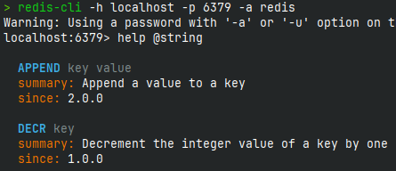
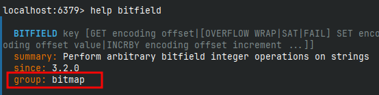

# Redis 数据类型

详情参见官网 [Understand Redis data types](https://redis.io/docs/latest/develop/data-types/)

在 Redis 中，命令是不区分大小的，但是 key 是区分大小写的。我们可以通过 [官网-Commands](https://redis.io/docs/latest/commands/) 来查看命令的使用，也可以在 `redis-cli` 中使用命令 `help @数据类型` 获得帮助：



## string

### 常用命令

#### set key value

```shell
localhost:6379> set key value [NX|XX] [GET] [EX seconds|PX milliseconds|EXAT unix-time-seconds|PXAT unix-time-milliseconds|KEEPTTL]
```

set 命令有 nx、xx、ex、px 和 keepttl 五个可选参数：

- ex seconds：以秒为单位设置过期时间
- px milliseconds：以毫秒为单位设置过期时间
- exat unix-time-seconds：设置以秒为单位 Unix 时间戳所对应的时间为过期时间
- pxat unix-time-milliseconds：设置以毫秒为单位 Unix 时间戳所对应的时间为过期时间
- nx：键不存在的时候设置的键值
- xx：键存在的时候设置的键值
- keepttl：保留设置前指定键的生存时间
- get：返回指定键原本的值，不存在返回 nil

#### get key

获取 key 对应的值

#### mset/mget/msetnx

批量操作

#### getrange/setrange

获取/设置指定区间的值

#### incr/decr

递增递减数字

#### incr by/decr by

增加/减少指定整数

#### strlen/append

获取字符串长度和内容追加

#### getset

先 get 再 set

### 应用场景

1. 缓存对象
2. 分布式锁（setnx）
3. 常规计数（incr/decr）

## list

底层实际是个双端链表，对两端操作性能很高，但通过索引下标的操作中间的节点性能会较差。主要功能有 push/pop 等，一般用在栈、队列、消息队列等场景，比如微信公众号订阅的消息：

```shell
lpush likearticle:userid articleid1 articleid2
lrange likearticle:userid 0 9 # 显示 list 中的十条消息
```

## hash

KV 键值对，JD 购物车早期设计，目前不再采用，当前小中厂可用：

```shell
新增商品 hset shopcar: uid 商品 id 1
# 增加数量 hincrby shopcar: uid 商品 id 1
# 商品总数 hlen shopcar: uid
# 全部选择 hgetall shopcar: uid
```

## set

单值多 value, 且无重复，应用场景：

- 微信抽奖小程序
- 微信朋友圈点赞查看同赞好友
- QQ 内推可能认识的人

## sorted-set

根据商品销售对商品进行排序显示：

```shell
商品编号 1001 销量 999, 商品编号 1002 销量 9999	zadd goods: sellsort 999 1001 9999 1002
# 有一个客户又买了两件商品 1001							zincrby goods: sellsort 2 1001
# 求商品销量前十名												 zrange goods: sellsort 0 9 withscores
```

## bitmap

由 0 和 1 状态表现的二进制位的 bit 数组，适合应用场景有签到

## hyperloglog

用于 UV(Unique Visitor)、PV(Page View)、DAU(Daily Active User)、MAU(Monthly Active User)统计

## geo

地图场景：

- geoadd 添加经纬度坐标
- geopos 返回经纬度
- geohash 返回坐标的 geohash 表示
- geodist 两个位置之间的距离
- georadius 以半径为中心，查找附近的 xxx
- georadiusbymember 找出位于指定范围内的元素，中心点是由给定的位置元素决定

## stream

实现消息队列，支持消息的持久化、自动生成全局唯一 id、ack 确认消息的模式、消费组模式等，让消息队列更加稳定和可靠

## 	bitfields




