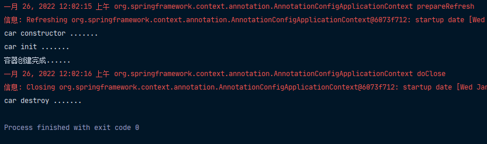
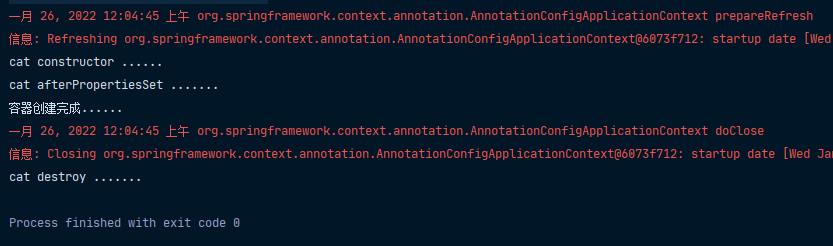
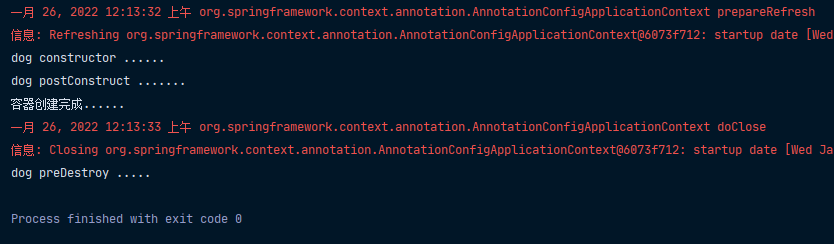
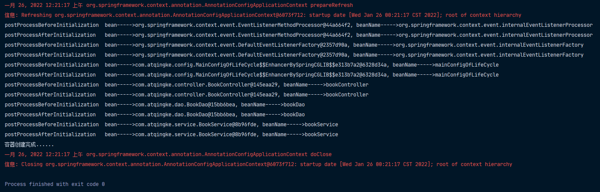
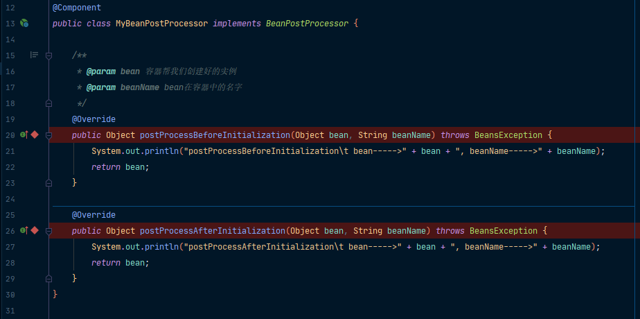
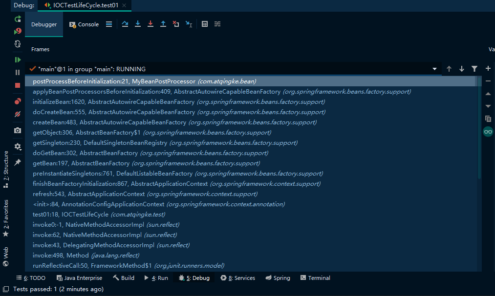
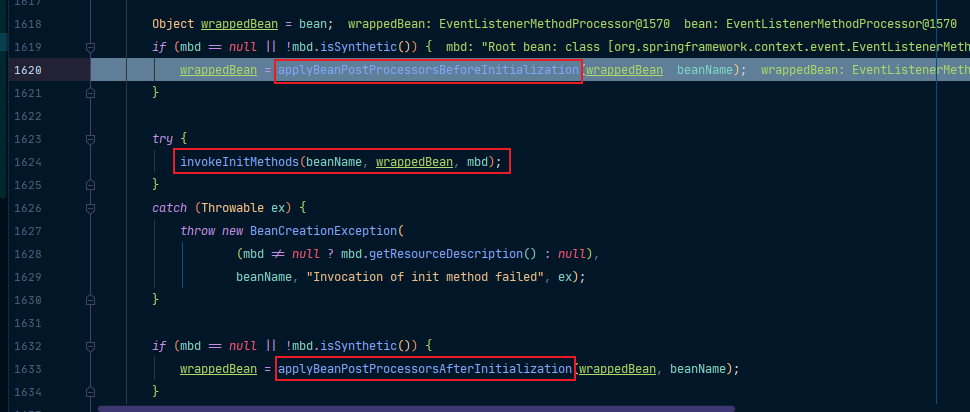
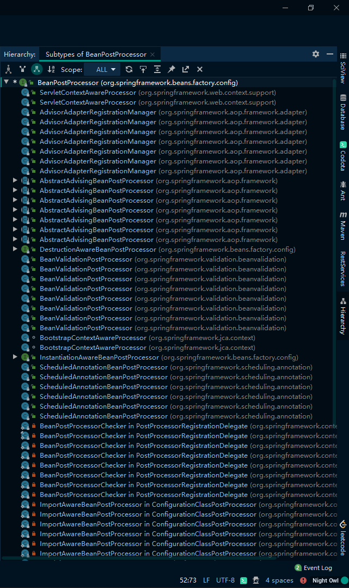
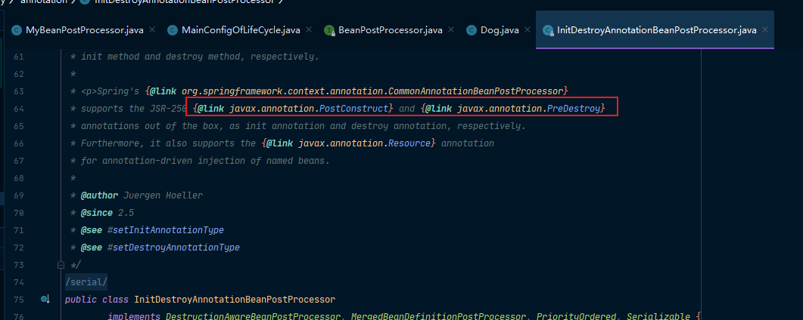

所谓bean的生命周期，指的是bean的创建、初始化和销毁的过程。容器会帮我们管理bean的生命周期，但是我们也可以自定义初始化和销毁方法，容器在进行到当前生命周期的时候调用我们自定义的方法进行初始化和销毁。

> - 构建（对象创建）
>   - 单实例，在容器启动的时候创建对象
>   - 多实例，在每次获取的时候创建对象
> - 初始化
>   - 对象创建完成，并赋值好，调用初始化方法
> - 销毁
>   - 单实例，容器关闭的时候
>   - 多实例，容器不会管理这个bean，不会调用销毁方法

## @Bean注解上指定初始化和销毁方法

首先，我们在bean中准备好我们的初始化和销毁方法

```java
public class Car {

    public Car() {
        System.out.println("car constructor .......");
    }

    public void init() {
        System.out.println("car init .......");
    }

    public void destroy() {
        System.out.println("car destroy .......");
    }
}
```

然后，我们在@Bean注解上分别指定它们

```java
@Configuration
@ComponentScan("com.atqingke")
public class MainConfigOfLifeCycle {

    @Bean(initMethod = "init", destroyMethod = "destroy")
    public Car car() {
        return new Car();
    }
 }
```

这样，就OK了！



## InitializingBean和DisposableBean

第二种方法是让我们的Bean去实现两个接口InitializingBean和DisposableBean

```java
@Component
public class Cat implements InitializingBean, DisposableBean {

    public Cat() {
        System.out.println("cat constructor ......");
    }

    @Override
    public void destroy() throws Exception {
        System.out.println("cat destroy .......");
    }

    @Override
    public void afterPropertiesSet() throws Exception {
        System.out.println("cat afterPropertiesSet .......");
    }
}
```

我们在InitializingBean中定义我们的初始化逻辑，在DisposableBean中定义我们的销毁逻辑。



## @PostConstruct和@PreDestroy

第三种方法是使用JSR250提供的两个注解，也是在实体bean上进行操作

```java
@Component
public class Dog {

    public Dog() {
        System.out.println("dog constructor ......");
    }

    @PostConstruct
    public void init() {
        System.out.println("dog postConstruct .......");
    }

    @PreDestroy
    public void destroy() {
        System.out.println("dog preDestroy .....");
    }
}
```

标注了@PostConstruct的方法会在bean创建完成并且属性赋值好后，来执行；标注了@PreDestroy的方法会在容器销毁bean之前执行。



## BeanPostProcessor

第四种方法是自定义一个BeanPostProcessor，BeanPostProcessor也就是我们所说的后置处理器。首先它是一个interface，它会在bean初始化前后进行一些工作。postProcessBeforeInitialization是在初始化之前工作；postProcessAfterInitialization在初始化之后工作。

```java
@Component
public class MyBeanPostProcessor implements BeanPostProcessor {

    /**
     * @param bean 容器帮我们创建好的实例
     * @param beanName bean在容器中的名字
     */
    @Override
    public Object postProcessBeforeInitialization(Object bean, String beanName) throws BeansException {
        System.out.println("postProcessBeforeInitialization\t bean----->" + bean + ", beanName----->" + beanName);
        return bean;
    }

    @Override
    public Object postProcessAfterInitialization(Object bean, String beanName) throws BeansException {
        System.out.println("postProcessAfterInitialization\t bean----->" + bean + ", beanName----->" + beanName);
        return bean;
    }
}
```



## BeanPostProcessor原理

首先，我们直接给我们的后置处理器中的方法打上断点：



接着我们直接Resume Program跳到我们的postProcessBeforeInitialization断点里面，我们观察我们的调试窗口：



从我们的test01方法开始，先来到AnnotationConfigApplicationContext，在经过一系列方法。可以看到，它首先尝试获取bean，然后再createBean，创建bean完了之后来到initializeBean。



可以看到，在初始化bean里面，真正执行初始化之前会先执行applyBeanPostProcessorsBeforeInitialization，初始化之后再执行applyBeanPostProcessorsAfterInitialization。我们进到applyBeanPostProcessorsBeforeInitialization：

```java
@Override
public Object applyBeanPostProcessorsBeforeInitialization(Object existingBean, String beanName)
    throws BeansException {

    Object result = existingBean;
    for (BeanPostProcessor beanProcessor : getBeanPostProcessors()) {
        result = beanProcessor.postProcessBeforeInitialization(result, beanName);
        if (result == null) {
            return result;
        }
    }
    return result;
}
```

可以看到，它会遍历得到容器中所有的BeanPostProcessor，然后挨个执行postProcessBeforeInitialization。而如果一旦执行结果为null，就跳出循环，不会再往下执行了。

我们再回到我们的initializeBean，你会发现，在执行初始化之前，还会执行一行代码：

```java
populateBean(beanName, mbd, instanceWrapper);
```

点进这个方法你会发现，它其实就是在初始化之前通过bean的定义为我们的属性赋值。

总结就是：

> ```java
> populateBean(beanName, mbd, instanceWrapper); // 执行初始化之前先为属性赋值
> ......;
> exposedObject = initializeBean(beanName, exposedObject, mbd);	 {
> 	......;	// 在初始化里面，先执行BeanPostProcessor的BeforeInitialization
> 	wrappedBean = applyBeanPostProcessorsBeforeInitialization(wrappedBean, beanName);
>  ......;	// 执行完了再执行初始化
> 	invokeInitMethods(beanName, wrappedBean, mbd);
> 	......; // 初始化之后，执行BeanPostProcessor的AfterInitialization
> 	wrappedBean = applyBeanPostProcessorsAfterInitialization(wrappedBean, beanName);
> 	......;
> }
> ......;
> ```
>
> 

## Spring底层对BeanPostProcessor的使用



### ApplicationContextAwareProcessor

Spring实现了BeanPostProcessor的接口和类有非常多，我们看一个ApplicationContextAwareProcessor，它是Spring提供的供我们的组件获取IOC容器的。要让我们的组件获取IOC容器只要让它实现ApplicationContextAware接口中的setApplicationContext方法即可。

```java
@Component
public class Dog implements ApplicationContextAware {
    
    private ApplicationContext applicationContext;

    public Dog() {
        System.out.println("dog constructor ......");
    }

    @PostConstruct
    public void init() {
        System.out.println("dog postConstruct .......");
    }

    @PreDestroy
    public void destroy() {
        System.out.println("dog preDestroy .....");
    }

    @Override
    public void setApplicationContext(ApplicationContext applicationContext) throws BeansException {
        this.applicationContext = applicationContext;
    }
}
```

进去ApplicationContextAwareProcessor查看它的实现原理：

1、首先判断我们的组件它是否实现了ApplicationContextAware等接口

```java
@Override
public Object postProcessBeforeInitialization(final Object bean, String beanName) throws BeansException {
    AccessControlContext acc = null;

    // 首先判断我们的组件它是否实现了ApplicationContextAware等接口
    if (System.getSecurityManager() != null &&
        (bean instanceof EnvironmentAware || bean instanceof EmbeddedValueResolverAware ||
         bean instanceof ResourceLoaderAware || bean instanceof ApplicationEventPublisherAware ||
         bean instanceof MessageSourceAware || bean instanceof ApplicationContextAware)) {
        acc = this.applicationContext.getBeanFactory().getAccessControlContext();
    }

    if (acc != null) {
        AccessController.doPrivileged(new PrivilegedAction<Object>() {
            @Override
            public Object run() {
                invokeAwareInterfaces(bean);
                return null;
            }
        }, acc);
    }
    else {
        invokeAwareInterfaces(bean);
    }

    return bean;
}
```

2、如果是实现了，调用invokeAwareInterfaces给里面注入值

```java
private void invokeAwareInterfaces(Object bean) {
    // 判断属于哪个Aware，再将其转成对应的Aware，最后调用set方法，把IOC容器注入进去，然后我们的组件中就可以收到这个IOC容器了
    if (bean instanceof Aware) {
        if (bean instanceof EnvironmentAware) {
            ((EnvironmentAware) bean).setEnvironment(this.applicationContext.getEnvironment());
        }
        if (bean instanceof EmbeddedValueResolverAware) {
            ((EmbeddedValueResolverAware) bean).setEmbeddedValueResolver(this.embeddedValueResolver);
        }
        if (bean instanceof ResourceLoaderAware) {
            ((ResourceLoaderAware) bean).setResourceLoader(this.applicationContext);
        }
        if (bean instanceof ApplicationEventPublisherAware) {
            ((ApplicationEventPublisherAware) bean).setApplicationEventPublisher(this.applicationContext);
        }
        if (bean instanceof MessageSourceAware) {
            ((MessageSourceAware) bean).setMessageSource(this.applicationContext);
        }
        if (bean instanceof ApplicationContextAware) {
            ((ApplicationContextAware) bean).setApplicationContext(this.applicationContext);
        }
    }
}
```

### BeanValidationPostProcessor

可以看到，BeanValidationPostProcessor也是利用BeanPostProcessor来实现在初始化前后调用doValidate进行校验。

### InitDestroyAnnotationBeanPostProcessor

用来处理@PostConstruct和@PreDestroy的。



总结，我们的bean赋值、注入其它组件、@Autowired、生命周期注解功能、@Async、xxx很多都是考BeanPostProcessor来完成的。