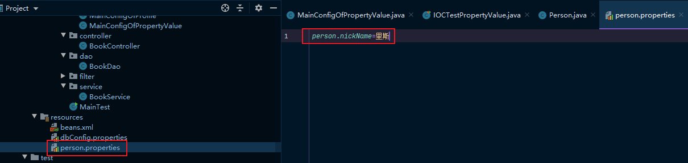
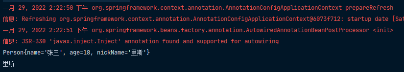
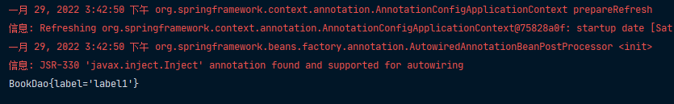

在Spring的XML配置文件中，我们可以通过property标签来实现对属性的赋值，那么，我们要如何通过注解给属性赋值呢？

## @Value属性赋值

在我们的实体类的属性上，标注@Value即可为属性赋值，在@Value里面可以写以下三种类型的值：

1. 基本数值
2. SpEL表达式
3. ${}

```java
@Value("张三")
private String name;

@Value("#{20-2}")
private Integer age;

@Value("${person.nickName}")
private String nickName;
```

使用${}可以读取我们配置文件中的值，我们在资源目录下新建一个person.properties文件：



然后在我们的配置类中结合@PropertySource注解指明我们要读取的配置文件位置：

```java
@Configuration
// 使用@PropertySource读取外部配置文件中的k/v保存到运行的环境变量中;加载完外部的配置文件以后使用${}取出配置文件中的值
@PropertySource("classpath:/person.properties")
public class MainConfigOfPropertyValue {

    @Bean
    public Person person() {
        return new Person();
    }
}
```

在测试类中取出我们的person对象和person.nickName：

```java
@Test
public void test01() {
    Person person = this.bean.getBean(Person.class);
    System.out.println(person);

    Environment environment = bean.getEnvironment();
    String property = environment.getProperty("person.nickName");
    System.out.println(property);
}
```



## 自动装配

我们知道，Spring利用依赖注入（DI），来完成对IOC容器中各个组件的依赖关系赋值，这就是Spring的自动装配。

### @Autowired

我们要在controller里面调用service里的方法，又在service里面调用dao的逻辑，固然可以使用@Bean注解在配置类中配置，但不够简洁；也可以直接在controller里面声明一个service，但这获取的并不是容器中的组件。我们可以使用@Autowire注解在一个组件里获取另外的组件：

```java
@Controller
public class BookController {

    @Autowired
    private BookService bookService;
}
```

```java
@Service
public class BookService {

    @Autowired()
    private BookDao bookDao;

    @Override
    public String toString() {
        return "BookService{" +
                "bookDao=" + bookDao +
                '}';
    }
}
```

使用@Autowire注解可以让Spring通过DI实现对容器中的各个组件的依赖关系赋值，它默认会优先按照类型去容器中找对应的组件，如果找到了就直接赋值；如果容器中有多个这个类型的组件，就再将属性的名称作为组件的id去容器中查找。

### @Qualifier

我们可以通过在自动注入的属性上添加一个@Qualifier注解来指定需要装配的组件的id，而不是使用默认的属性名自动装配。

```java
@Service
public class BookService {

    @Qualifier("bookDao")
    @Autowired()
    private BookDao bookDao2;
}
```

```java
// 我们在配置类中也注入注入一个bookDao，并且给它的name属性赋值为bookDao2
@Bean("bookDao2")
public BookDao bookDao() {
    return new BookDao("label2");
}
```

之后，我们在测试类中通过BooDao这个类型去获取它的bean实例



可以看到，虽然我们在service里面BookDao的属性名是bookDao2，但我们使用了@Qualifier注解指定要获取的组件id是bookDao，因此我们获取到的是bookDao，而不是属性名中的bookDao2。

> ps：自动装配默认一定要将属性赋值好，如果没有赋值好，就会报错，但是我们可以通过使用@Autowired(required = false)来告诉Spring，这个组件可以不赋值。这样，如果自动装配能装上就装，如果装不上就赋为null，而不是报错。

### @Primary

除了使用@Qualifier来指定需要装配的组件id，也可以使用@Primary来指定Spring进行自动装配的时候，默认使用的首选的bean。

```java
@Primary
@Bean("bookDao2")
public BookDao bookDao() {
    return new BookDao("label2");
}
```

### @Resource & @Inject

除了@Autowired，Spring还支持Java规范的注解：@Resource(JSR250)、@Inject(JSR330)

```JAVA
@Resource
// @Inject
private BookDao bookDao;
```

这两者和Autowired的区别是：

- @Resource默认按照组件名称装配，而且不支持@Primary和@Autowired(required = false)的功能。
- @Inject需要导入javax.inject的包，它和@Autowired功能一样，但是没有@Autowired(required = false)的功能。

## @Autowired位置

目前为止，我们的@Autowired都是标在属性上的，其实除了属性上，还可以标在构造器、方法、方法参数。

```java
//    @Autowired
    public Boss(/*@Autowired*/ Car car) {
        this.car = car;
        System.out.println("boss的有参构造器");
    }
```

构造器要用的组件，都是从容器中获取的（可以自行getBean获取对象进行比对测试）。

> ps：如果只有一个有参构造器，那么这个@Autowired可以省略不写，参数位置的组件还是可以自动从容器中获取的。

```java
@Autowired
public void setCar(Car car) {
    this.car = car;
    System.out.println("boss的setter");
}
```

我们在Boss的setter上标注了@Autowired，那么，当Spring容器要创建一个boss对象时，就会调用这个setter，完成赋值。并且，我们在方法的参数位置传入了另外一个组件，这个组件它也会从IOC容器中获取。

```java
@Bean
public Color color(Car car) {
    return new Color(car);
}
```

也可以结合@Bean使用，在这里，即使我们没有给Car参数标注@Autowired(当然，也可以标上)，但是@Bean标注的方法创建对象的时候，方法的参数默认也是从IOC容器中获取的。

## 自定义组件想要使用Spring容器底层的一些组件

当我们自定义的bean想要获取Spring底层的一些组件的时候，我们可以通过让它实现xxxAware接口的setXxx方法。

```java
@Component
public class Dog implements ApplicationContextAware {

    private ApplicationContext applicationContext;

    public Dog() {
        System.out.println("dog constructor ......");
    }

    @PostConstruct
    public void init() {
        System.out.println("dog postConstruct .......");
    }

    @PreDestroy
    public void destroy() {
        System.out.println("dog preDestroy .....");
    }

    @Override
    public void setApplicationContext(ApplicationContext applicationContext) throws BeansException {
        this.applicationContext = applicationContext;
    }
}
```

自定义组件实现xxxAware，在创建对象的时候，会调用接口规定的方法相关注入组件，而xxxAware的功能都是通过xxxAwareProcessor处理的。

> ps：关于xxxAwareProcessor原理参见[Spring注解驱动开发——生命周期](https://atqingke.com/index.php/archives/382/)


