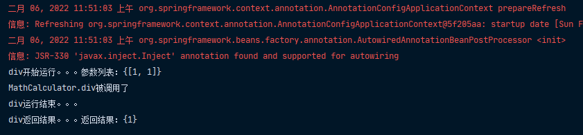

AOP【动态代理】：指在程序运行期间动态将某段代码切入到指定方法指定位置进行运行的变成方式。

## 导入AOP模块

```xml
<dependency>
    <groupId>org.springframework</groupId>
    <artifactId>spring-aspects</artifactId>
    <version>4.3.12.RELEASE</version>
</dependency>
```

## 定义一个业务逻辑类

```java
package com.atqingke.aop;

/**
 * @Author pengbin007
 * @Date 2022/1/29 20:20
 */
public class MathCalculator {

    public int div(int i, int j) {
        System.out.println("MathCalculator.div被调用了");
        return i / j;
    }
}
```

## 定义一个日志切面类

## 给切面类的目标方法标注何时何地运行

```java
package com.atqingke.aop;

import org.aspectj.lang.JoinPoint;
import org.aspectj.lang.annotation.*;

import java.util.Arrays;

/**
 * @Author pengbin007
 * @Date 2022/1/29 20:23
 */
@Aspect
public class LogAspects {

    @Pointcut("execution(public int com.atqingke.aop.MathCalculator.*(..))")
    public void pointCut(){}

    @Before("pointCut()")
    public void logStart(JoinPoint joinPoint) {
        System.out.println("" + joinPoint.getSignature().getName() + "开始运行。。。参数列表：{" + Arrays.toString(joinPoint.getArgs()) + "}");
    }

    @After("pointCut()")
    public void logEnd(JoinPoint joinPoint) {
        System.out.println("" + joinPoint.getSignature().getName() + "运行结束。。。");
    }

    @AfterReturning(value = "pointCut()", returning = "result")
    public void logReturn(JoinPoint joinPoint, Object result) {
        System.out.println("" + joinPoint.getSignature().getName() + "返回结果。。。返回结果：{" + result + "}");
    }

    @AfterThrowing(value = "pointCut()", throwing = "exception")
    public void logException(JoinPoint joinPoint, Exception exception) {
        System.out.println("" + joinPoint.getSignature().getName() + "抛出异常。。。异常信息：{" + exception + "}");
    }
}
```

## 将切面类和业务逻辑类加入到容器中

```java
package com.atqingke.config;

import com.atqingke.aop.LogAspects;
import com.atqingke.aop.MathCalculator;
import org.springframework.context.annotation.Bean;
import org.springframework.context.annotation.Configuration;
import org.springframework.context.annotation.EnableAspectJAutoProxy;

/**
 * @Author pengbin007
 * @Date 2022/1/29 20:21
 */
@Configuration
@EnableAspectJAutoProxy
public class MainConfigOfAOP {

    @Bean
    public MathCalculator mathCalculator() {
        return new MathCalculator();
    }

    @Bean
    public LogAspects logAspects() {
        return new LogAspects();
    }
}
```

## 告诉Spring哪个是切面类@Aspect

LogAspects上标注@Aspect注解

## 开启基于注解的aop模式

MainConfigOfAOP上标注@EnableAspectJAutoProxy注解

## 测试

```java
package com.atqingke.test;

import com.atqingke.aop.MathCalculator;
import com.atqingke.config.MainConfigOfAOP;
import org.junit.Test;
import org.springframework.context.ApplicationContext;
import org.springframework.context.annotation.AnnotationConfigApplicationContext;

/**
 * @Author pengbin007
 * @Date 2022/1/26 20:45
 */
public class IOCTestAOP {

    AnnotationConfigApplicationContext bean = new AnnotationConfigApplicationContext(MainConfigOfAOP.class);

    @Test
    public void test01() {
        MathCalculator calculator = this.bean.getBean(MathCalculator.class);
        calculator.div(1,1);
    }

    private void printBeans(ApplicationContext context) {
        String[] beanDefinitionNames = context.getBeanDefinitionNames();
        for (String beanDefinitionName : beanDefinitionNames) {
            System.out.println(beanDefinitionName);
        }
    }
}
```



