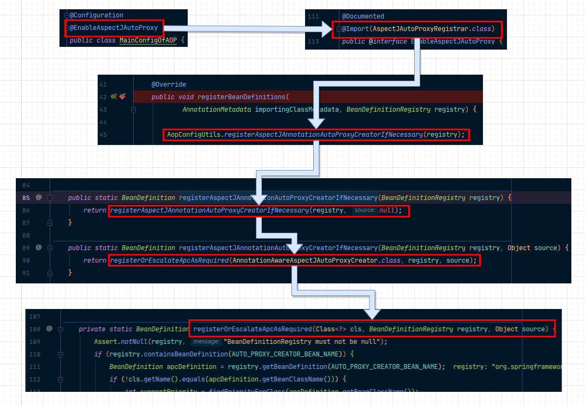
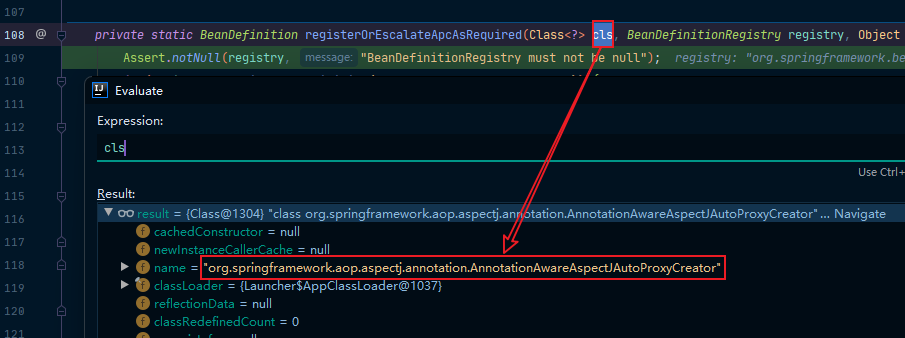
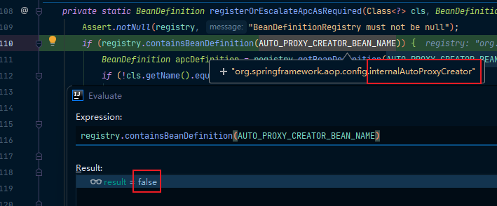

要实现注解版的AOP功能，最核心的注解就是@EnableAspectJAutoProxy了，有了它，AOP模式才生效。

#### 流程分析图



可以看到，使用@EnableAspectJAutoProxy注解实际上就是使用@Import导入一个实现了ImportBeanDefinitionRegistrar的组件，也就是利用AspectJAutoProxyRegistrar实现registerBeanDefinitions方法及那个bean手动注册到容器中。

```java
/**
 * Register, escalate, and configure the AspectJ auto proxy creator based on the value
 * of the @{@link EnableAspectJAutoProxy#proxyTargetClass()} attribute on the importing
 * {@code @Configuration} class.
*/
@Override
public void registerBeanDefinitions(
      AnnotationMetadata importingClassMetadata, BeanDefinitionRegistry registry) {

    // 将AspectJAnnotationAutoProxyCreator注册到容器中如果需要的话
    AopConfigUtils.registerAspectJAnnotationAutoProxyCreatorIfNecessary(registry);

    // 得到EnableAspectJAutoProxy注解的信息
    AnnotationAttributes enableAspectJAutoProxy =
        AnnotationConfigUtils.attributesFor(importingClassMetadata, EnableAspectJAutoProxy.class);
    // 判断是否包含proxyTargetClass属性
    if (enableAspectJAutoProxy.getBoolean("proxyTargetClass")) {
        AopConfigUtils.forceAutoProxyCreatorToUseClassProxying(registry);
    }
    // 判断是否包含exposeProxy属性
    if (enableAspectJAutoProxy.getBoolean("exposeProxy")) {
        AopConfigUtils.forceAutoProxyCreatorToExposeProxy(registry);
    }
}
```

在registerBeanDefinitions方法中，通过AopConfigUtils中的方法将AspectJAnnotationAutoProxyCreator注册到容器中，如果需要的话。之后拿到EnableAspectJAutoProxy注解的信息，再对其进行判断“proxyTargetClass”和“exposeProxy”是否为true，如果为true，对其进行相应操作。

最终，registerAspectJAnnotationAutoProxyCreatorIfNecessary方法经过两层封装来到了registerOrEscalateApcAsRequired：

```java
private static BeanDefinition registerOrEscalateApcAsRequired(Class<?> cls, BeanDefinitionRegistry registry, Object source) {
    Assert.notNull(registry, "BeanDefinitionRegistry must not be null");
    // 判断容器中是否已经有internalAutoProxyCreator，有则让internalAutoProxyCreator = AnnotationAwareAspectJAutoProxyCreator将AnnotationAwareAspectJAutoProxyCreator注册到容器中去
    if (registry.containsBeanDefinition(AUTO_PROXY_CREATOR_BEAN_NAME)) {
        BeanDefinition apcDefinition = registry.getBeanDefinition(AUTO_PROXY_CREATOR_BEAN_NAME);
        if (!cls.getName().equals(apcDefinition.getBeanClassName())) {
            int currentPriority = findPriorityForClass(apcDefinition.getBeanClassName());
            int requiredPriority = findPriorityForClass(cls);
            if (currentPriority < requiredPriority) {
                apcDefinition.setBeanClassName(cls.getName());
            }
        }
        return null;
    }
    // 没有，新建一个关于AnnotationAwareAspectJAutoProxyCreator的bean的定义信息
    RootBeanDefinition beanDefinition = new RootBeanDefinition(cls);
    beanDefinition.setSource(source);
    beanDefinition.getPropertyValues().add("order", Ordered.HIGHEST_PRECEDENCE);
    beanDefinition.setRole(BeanDefinition.ROLE_INFRASTRUCTURE);
    // internalAutoProxyCreator = AnnotationAwareAspectJAutoProxyCreator注册到容器中
    registry.registerBeanDefinition(AUTO_PROXY_CREATOR_BEAN_NAME, beanDefinition);
    return beanDefinition;
}
```

这个方法传了一个参数：AnnotationAwareAspectJAutoProxyCreator



然后，它判断容器中是否有internalAutoProxyCreator。



如果容器中有internalAutoProxyCreator，则会让传入的cls也就是AnnotationAwareAspectJAutoProxyCreator赋给internalAutoProxyCreator。

而我们这里并没有这个组件，因此它会创建一个AnnotationAwareAspectJAutoProxyCreator的RootBeanDefinition(new RootBeanDefinition()也就是创建一个bean的定义信息)。

最后，依然是通过internalAutoProxyCreator = AnnotationAwareAspectJAutoProxyCreator将AnnotationAwareAspectJAutoProxyCreator注册到容器中。

---

**因此，@EnableAspectJAutoProxy注解的作用就是将我们的AnnotationAwareAspectJAutoProxyCreator注册到容器中。**

---

