## 分析

通过前面我们知道：@EnableAspectJAutoProxy注解就是为了给容器中注册一个AnnotationAwareAspectJAutoProxyCreator，我们先来看一下它的继承树：

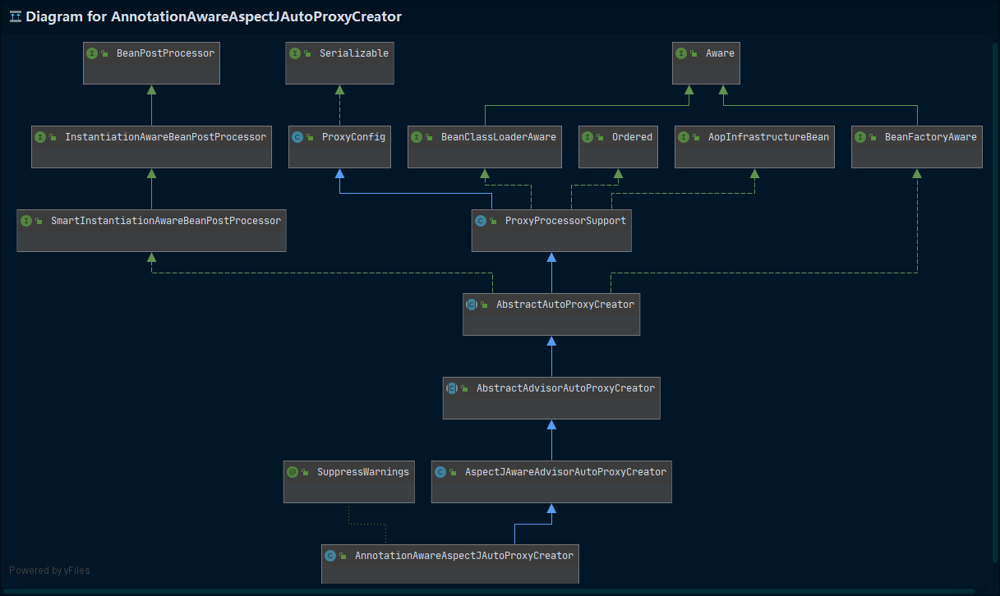

通过这个继承树以及源码中我们可以看到，在AbstractAutoProxyCreator中，实现了SmartInstantiationAwareBeanPostProcessor和BeanFactoryAware两个接口。而我们知道：xxxAwareBeanPostProcessor是后置处理器（也就是bean初始化前后做的事），BeanFactoryAware用于自动装配。

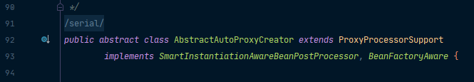

我们一层一层去看都有哪些需要我们去关注的方法。在AbstractAutoProxyCreator中，我们重点是这些postProcess方法，可以为这些有实现的方法打上断点：

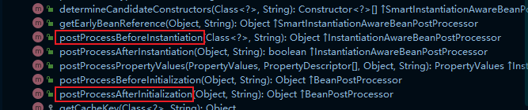

在AbstractAdvisorAutoProxyCreator中，有一个setBeanFactory方法毫无疑问是用来自动装配的，我们可以打上断点：

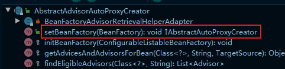

AspectJAwareAdvisorAutoProxyCreator中并没有跟后置处理器和自动装配有关的方法，可以跳过。

在AnnotationAwareAspectJAutoProxyCreator中有一个initBeanFactory是用来初始化BeanFactory的，我们也可以给它打上断点：

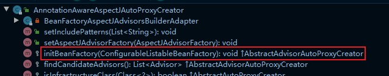

最后，我们给配置类中注册两个bean打上断点：

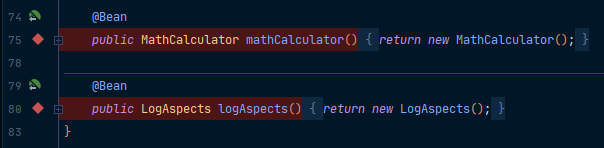

## 注册 AnnotationAwareAspectJAutoProxyCreator

Debug运行，来到第一个断点处，是我们的AbstractAdvisorAutoProxyCreator中的setBeanFactory方法：

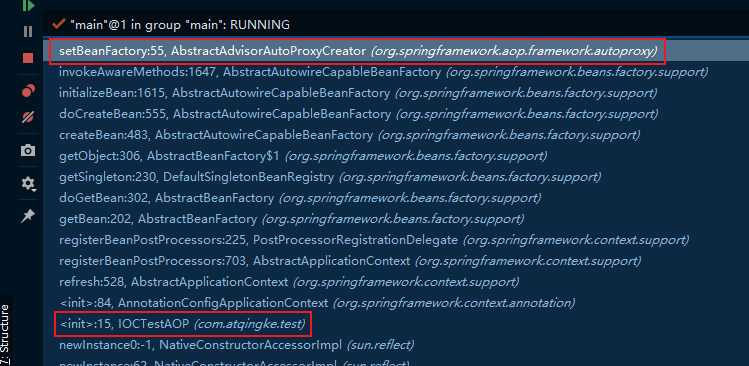

我们从我们的test方法开始，看看经历了哪些流程！

首先是传入配置类，创建IOC容器：

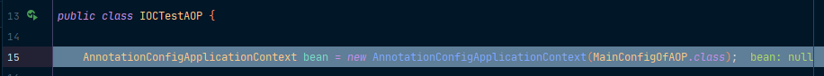

然后是注册配置类，调用refresh()方法刷新容器：

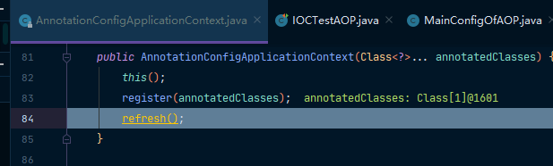

在refresh中，来到第528行的registerBeanPostProcessors(beanFactory); 在这里面注册bean的后置处理器以方便拦截bean的创建：

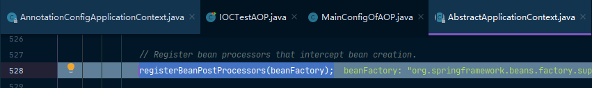

我们进入registerBeanPostProcessors方法看看：

```java
public static void registerBeanPostProcessors(
    	ConfigurableListableBeanFactory beanFactory, AbstractApplicationContext applicationContext) {
		// ① 先获取IOC容器中已经定义了的需要创建对象的所有BeanPostProcessor
    String[] postProcessorNames = beanFactory.getBeanNamesForType(BeanPostProcessor.class, true, false);

    // ② 给容器中加别的BeanPostProcessor
    // Register BeanPostProcessorChecker that logs an info message when
    // a bean is created during BeanPostProcessor instantiation, i.e. when
    // a bean is not eligible for getting processed by all BeanPostProcessors.
    int beanProcessorTargetCount = beanFactory.getBeanPostProcessorCount() + 1 + postProcessorNames.length;
    beanFactory.addBeanPostProcessor(new BeanPostProcessorChecker(beanFactory, beanProcessorTargetCount));

    // Separate between BeanPostProcessors that implement PriorityOrdered,
    // Ordered, and the rest.
    List<BeanPostProcessor> priorityOrderedPostProcessors = new ArrayList<BeanPostProcessor>();
    List<BeanPostProcessor> internalPostProcessors = new ArrayList<BeanPostProcessor>();
    List<String> orderedPostProcessorNames = new ArrayList<String>();
    List<String> nonOrderedPostProcessorNames = new ArrayList<String>();
    for (String ppName : postProcessorNames) {
        if (beanFactory.isTypeMatch(ppName, PriorityOrdered.class)) {
            BeanPostProcessor pp = beanFactory.getBean(ppName, BeanPostProcessor.class);
            priorityOrderedPostProcessors.add(pp);
            if (pp instanceof MergedBeanDefinitionPostProcessor) {
                internalPostProcessors.add(pp);
            }
        }
        else if (beanFactory.isTypeMatch(ppName, Ordered.class)) {
            orderedPostProcessorNames.add(ppName);
        }
        // ⑤ 注册没实现优先级接口的BeanPostProcessor
        else {
            nonOrderedPostProcessorNames.add(ppName);
        }
    }

    // ③ 优先注册实现了PriorityOrdered接口的BeanPostProcessor
    // First, register the BeanPostProcessors that implement PriorityOrdered.
    sortPostProcessors(priorityOrderedPostProcessors, beanFactory);
    registerBeanPostProcessors(beanFactory, priorityOrderedPostProcessors);

    // ④ 再给容器中注册实现了Ordered接口的BeanPostProcessor
    // Next, register the BeanPostProcessors that implement Ordered.
    List<BeanPostProcessor> orderedPostProcessors = new ArrayList<BeanPostProcessor>();
    for (String ppName : orderedPostProcessorNames) {
        BeanPostProcessor pp = beanFactory.getBean(ppName, BeanPostProcessor.class);
        orderedPostProcessors.add(pp);
        if (pp instanceof MergedBeanDefinitionPostProcessor) {
            internalPostProcessors.add(pp);
        }
    }
    sortPostProcessors(orderedPostProcessors, beanFactory);
    registerBeanPostProcessors(beanFactory, orderedPostProcessors);

    // ⑤ 注册没实现优先级接口的BeanPostProcessor
    // Now, register all regular BeanPostProcessors.
    List<BeanPostProcessor> nonOrderedPostProcessors = new ArrayList<BeanPostProcessor>();
    for (String ppName : nonOrderedPostProcessorNames) {
        BeanPostProcessor pp = beanFactory.getBean(ppName, BeanPostProcessor.class);
        nonOrderedPostProcessors.add(pp);
        if (pp instanceof MergedBeanDefinitionPostProcessor) {
            internalPostProcessors.add(pp);
        }
    }
    registerBeanPostProcessors(beanFactory, nonOrderedPostProcessors);

    // Finally, re-register all internal BeanPostProcessors.
    sortPostProcessors(internalPostProcessors, beanFactory);
    registerBeanPostProcessors(beanFactory, internalPostProcessors);

    // Re-register post-processor for detecting inner beans as ApplicationListeners,
    // moving it to the end of the processor chain (for picking up proxies etc).
    beanFactory.addBeanPostProcessor(new ApplicationListenerDetector(applicationContext));
}
```

而我们的AnnotationAwareAspectJAutoProxyCreator通过前面的继承树可以看到，它是实现了Ordered接口的，因此它会走Next注册：

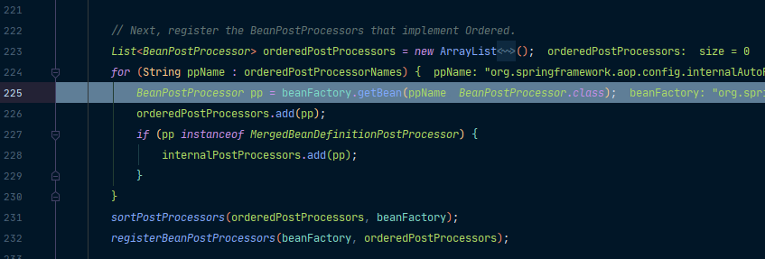

> ps：注册BeanPostProcessor，实际上就是创建BeanPostProcessor对象，保存在容器中。也就是创建internalAutoProxyCreator的BeanPostProcessor【AnnotationAwareAspectJAutoProxyCreator】。之前是将AnnotationAwareAspectJAutoProxyCreator的定义信息赋给了internalAutoProxyCreator，现在就通过internalAutoProxyCreator中的BeanDefinition来创建AnnotationAwareAspectJAutoProxyCreator。

现在我们来到了红色框中的部分准备获取bean，而我们的bean还没有创建好，因此要先去创建bean，因此来到白色框部分：

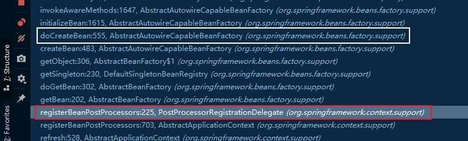

在doCreateBean中，首先会创建bean的实例：

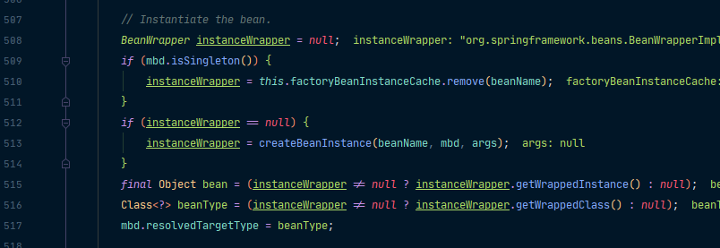

在给bean初始化之前，还有一步populateBean()来给bean的各种属性赋值：

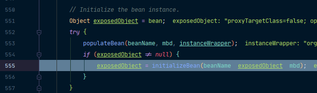

赋好值后再通过initializeBean()初始化bean。

现在来到initializeBean中：

```java
protected Object initializeBean(final String beanName, final Object bean, RootBeanDefinition mbd) {
    if (System.getSecurityManager() != null) {
        AccessController.doPrivileged(new PrivilegedAction<Object>() {
            @Override
            public Object run() {
                invokeAwareMethods(beanName, bean);
                return null;
            }
        }, getAccessControlContext());
    }
    else {
        // ①处理Aware接口的方法回调
        invokeAwareMethods(beanName, bean);
    }

    Object wrappedBean = bean;
    if (mbd == null || !mbd.isSynthetic()) {
        // ②应用后置处理器的postProcessorBeforeInitialization
        wrappedBean = applyBeanPostProcessorsBeforeInitialization(wrappedBean, beanName);
    }

    try {
        // ③执行自定义的初始化方法
        invokeInitMethods(beanName, wrappedBean, mbd);
    }
    catch (Throwable ex) {
        throw new BeanCreationException(
            (mbd != null ? mbd.getResourceDescription() : null),
            beanName, "Invocation of init method failed", ex);
    }

    if (mbd == null || !mbd.isSynthetic()) {
        // ④执行后置处理器的postProcessorsAfterInitialization
        wrappedBean = applyBeanPostProcessorsAfterInitialization(wrappedBean, beanName);
    }
    return wrappedBean;
}
```

经过这一系列操作之后，我们的BeanPostProcessor【AnnotationAwareAspectJAutoProxyCreator】就创建成功了！

创建好之后，会将BeanPostProcessor注册到BeanFactory中：

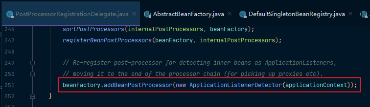

最后来到了我们分析的AbstractAdvisorAutoProxyCreator中setBeanFactory方法。

> 创建和注册AnnotationAwareAspectJAutoProxyCreator的过程总结：
>
>  *      1、 传入配置类，创建IOC容器
>  *      2、 注册配置类，调用refresh()刷新容器
>  *      3、 registerBeanPostProcessors(beanFactory); 注册bean的后置处理器来方便拦截bean的创建
>          *          ① 先获取IOC容器中已经定义了的需要创建对象的所有BeanPostProcessor
>          *          ② 给容器中加别的BeanPostProcessor
>          *          ③ 优先注册实现了PriorityOrdered接口的BeanPostProcessor
>          *          ④ 再给容器中注册实现了Ordered接口的BeanPostProcessor
>          *          ⑤ 注册没实现优先级接口的BeanPostProcessor
>          *      ⑥ 注册BeanPostProcessor，实际上就是创建BeanPostProcessor对象，保存在容器中
>                  *              创建internalAutoProxyCreator的BeanPostProcessor【AnnotationAwareAspectJAutoProxyCreator】
>                  *              1、创建bean的实例
>                  *              2、populateBean 给bean的各种属性赋值
>                  *      3、initializeBean 初始化bean
>                          *                  ① invokeAwareMethods() 处理Aware接口的方法回调
>                          *                  ② applyBeanPostProcessorsBeforeInitialization() 应用后置处理器的postProcessorBeforeInitialization
>                          *                  ③ invokeInitMethods 执行自定义的初始化方法
>                          *                  ④ applyBeanPostProcessorsAfterInitialization 执行后置处理器的postProcessorsAfterInitialization
>  *      4、BeanPostProcessor【AnnotationAwareAspectJAutoProxyCreator】创建成功
>          *          ⑦ 把BeanPostProcessor注册到BeanFactory中
>          *              beanFactory.addBeanPostProcessor(postProcessor);

## AnnotationAwareAspectJAutoProxyCreator 执行时机

通过前面的介绍，我们知道了创建和注册AnnotationAwareAspectJAutoProxyCreator的过程。下面来看一下AnnotationAwareAspectJAutoProxyCreator作为后置处理器做了什么。

我们一路放行到下一个断点，来到postProcessBeforeInstantiation断点处：

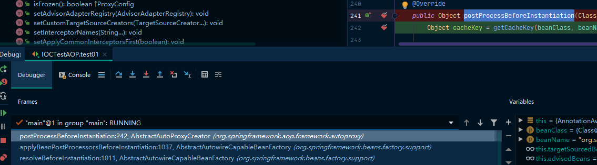

> ps：需要注意的是，这里是Instantiation，并不是BeanPostProcessor中的postProcessBeforeInitialization。通过继承树也可以看到，SmartInstantiationAwareBeanPostProcessor实现的是InstantiationAwareBeanPostProcessor。

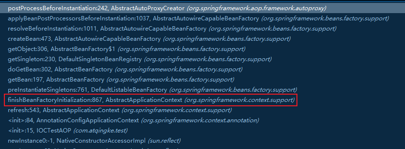

在finishBeanFactoryInitialization中，会完成BeanFactory初始化工作，并创建剩下的单实例bean。

首先，会遍历获取容器中所有的bean，依次创建对象getBean(beanName)：

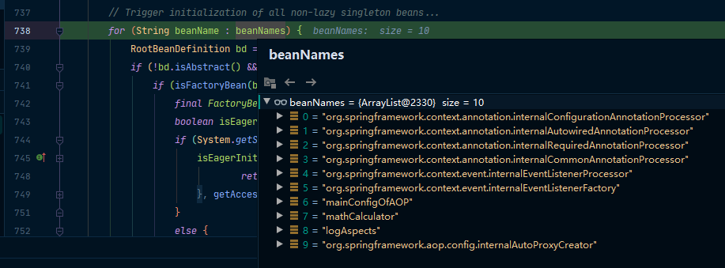

在getBean中，按照“getBean->doGetBean->getSingleton”先尝试获取单实例bean，获取失败，就会去创建bean。

> ps：要注意的是，我们之前创建好的AnnotationAwareAspectJAutoProxyCreator会在所有bean创建之前有一个拦截，InstantiationAwareBeanPostProcessor，会调用postProcessBeforeInstantiation：
>
> 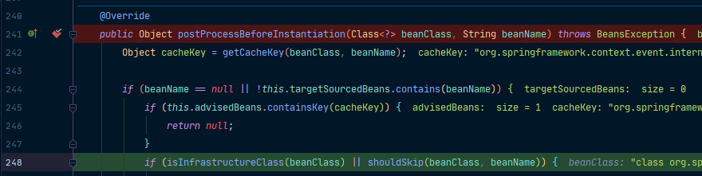

在创建bean的时候，会先从缓存中获取当前bean，如果能获取到，说明bean是之前被创建过的，直接使用；否则再创建（只要创建好的bean都会被缓存起来）。

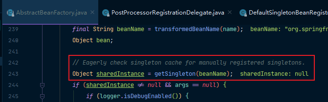

然后才会来到我们的createBean方法创建bean：

```java
@Override
protected Object createBean(String beanName, RootBeanDefinition mbd, Object[] args) throws BeanCreationException {
   if (logger.isDebugEnabled()) {
      logger.debug("Creating instance of bean '" + beanName + "'");
   }
   RootBeanDefinition mbdToUse = mbd;

   // Make sure bean class is actually resolved at this point, and
   // clone the bean definition in case of a dynamically resolved Class
   // which cannot be stored in the shared merged bean definition.
   Class<?> resolvedClass = resolveBeanClass(mbd, beanName);
   if (resolvedClass != null && !mbd.hasBeanClass() && mbd.getBeanClassName() != null) {
      mbdToUse = new RootBeanDefinition(mbd);
      mbdToUse.setBeanClass(resolvedClass);
   }

   // Prepare method overrides.
   try {
      mbdToUse.prepareMethodOverrides();
   }
   catch (BeanDefinitionValidationException ex) {
      throw new BeanDefinitionStoreException(mbdToUse.getResourceDescription(),
            beanName, "Validation of method overrides failed", ex);
   }

   try {
      // Give BeanPostProcessors a chance to return a proxy instead of the target bean instance.
      Object bean = resolveBeforeInstantiation(beanName, mbdToUse);
      if (bean != null) {
         return bean;
      }
   }
   catch (Throwable ex) {
      throw new BeanCreationException(mbdToUse.getResourceDescription(), beanName,
            "BeanPostProcessor before instantiation of bean failed", ex);
   }

   Object beanInstance = doCreateBean(beanName, mbdToUse, args);
   if (logger.isDebugEnabled()) {
      logger.debug("Finished creating instance of bean '" + beanName + "'");
   }
   return beanInstance;
}
```

在createBean中，我们重点关注两个地方：

- resolveBeforeInstantiation(beanName, mbdToUse);
- doCreateBean(beanName, mbdToUse, args);

resolveBeforeInstantiation就是解析BeforeInstantiation的，通过它上面的注释可以知道“它希望后置处理器在此能返回一个代理对象”，如果能返回一个代理对象就用；如果不能就继续。

```java
protected Object resolveBeforeInstantiation(String beanName, RootBeanDefinition mbd) {
    Object bean = null;
    // 后置处理器先尝试返回对象
    if (!Boolean.FALSE.equals(mbd.beforeInstantiationResolved)) {
        // Make sure bean class is actually resolved at this point.
        if (!mbd.isSynthetic() && hasInstantiationAwareBeanPostProcessors()) {
            Class<?> targetType = determineTargetType(beanName, mbd);
            if (targetType != null) {
                // 拿到所有后置处理器，如果是InstantiationAwareBeanPostProcessor，就执行postProcessBeforeInstantiation
                bean = applyBeanPostProcessorsBeforeInstantiation(targetType, beanName);
                if (bean != null) {
                    bean = applyBeanPostProcessorsAfterInitialization(bean, beanName);
                }
            }
        }
        mbd.beforeInstantiationResolved = (bean != null);
    }
    return bean;
}
```

而doCreateBean我们在上面已经进入过了，流程就和上面总结的“注册BeanPostProcessor，实际上就是创建BeanPostProcessor对象，保存在容器中”这一步一样了。

> 这一段流程总结下来就是：
>
>  - 4、finishBeanFactoryInitialization(beanFactory); 完成BeanFactory初始化工作，创建剩下的单实例bean
>
>     - Ⅰ 遍历获取容器中所有的Bean，依次创建对象getBean(beanName)
>
>        - getBean->doGetBean->getSingleton
>
>     - Ⅱ 创建bean
>
>       【AnnotationAwareAspectJAutoProxyCreator再所有bean创建之前会有一个拦截，InstantiationAwareBeanPostProcessor，会调用postProcessBeforeInstantiation】
>
>     - ① 先从缓存中获取当前bean，如果能获取到，说明bean是之前被创建过的，直接使用；否则再创建。
>
>        - 只要创建好的bean都会被缓存起来
>
>     - ② createBean(); 创建bean AnnotationAwareAspectJAutoProxyCreator会在任何bean创建之前先尝试返回bean实例
>
>        - 【BeanPostProcessor是在Bean对象创建完成初始化前后调用的】
>        - 【InstantiationAwareBeanPostProcessor是在创建Bean实例之前先尝试用后置处理器返回对象的】
>        - 1、resolveBeforeInstantiation(beanName, mbdToUse); 解析BeforeInstantiation
>           - 希望后置处理器在此能返回一个代理对象，如果能返回代理对象就是用；如果不能就继续
>           - Ⅰ后置处理器先尝试返回对象
>           - bean = applyBeanPostProcessorsBeforeInstantiation(targetType, beanName);
>           - 拿到所有后置处理器，如果是InstantiationAwareBeanPostProcessor
>           - 就执行postProcessBeforeInstantiation
>           - if (bean != null) {
>           - bean = applyBeanPostProcessorsAfterInitialization(bean, beanName);
>           - }
>        - 2、doCreateBean(beanName, mbdToUse, args); 真正的去创建一个bean实例，和3.6流程一样
