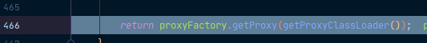

通过前面的流程分析已经知道:

- registerBeanPostProcessors(beanFactory); 注册bean的后置处理器来方便拦截bean的创建。
- finishBeanFactoryInitialization(beanFactory); 完成BeanFactory初始化工作，创建剩下的单实例bean。

下面就来看一下AnnotationAwareAspectJAutoProxyCreator【InstantiationAwareBeanPostProcessor】的作用，也就是它如何创建AOP代理的。

每一个bean创建之前，调用postProcessBeforeInstantiation()：

```java
@Override
public Object postProcessAfterInitialization(Object bean, String beanName) throws BeansException {
	if (bean != null) {
		Object cacheKey = getCacheKey(bean.getClass(), beanName);
		if (!this.earlyProxyReferences.contains(cacheKey)) {
			return wrapIfNecessary(bean, beanName, cacheKey);
		}
	}
	return bean;
}
```

在这里，我们只关心MathCalculator和LogAspects的创建。

我们一路放行到下一个断点，来到了MathCalculator经过我们的后置处理器：


```java
@Override
public Object postProcessBeforeInstantiation(Class<?> beanClass, String beanName) throws BeansException {
    Object cacheKey = getCacheKey(beanClass, beanName);
    
    if (beanName == null || !this.targetSourcedBeans.contains(beanName)) {
        
    	//判断当前bean是否在advisedBeans中（保存了所有需要增强的bean）
        if (this.advisedBeans.containsKey(cacheKey)) {
            return null;
        }
        // 判断当前bean是否是基础类型的Advice、Pointcut、Advisor、AopInfrastructureBean、或者是否切面（@Aspect）
    	// 是否需要跳过
        if (isInfrastructureClass(beanClass) || shouldSkip(beanClass, beanName)) {
            this.advisedBeans.put(cacheKey, Boolean.FALSE);
            return null;
        }
    }

    // Create proxy here if we have a custom TargetSource.
    // Suppresses unnecessary default instantiation of the target bean:
    // The TargetSource will handle target instances in a custom fashion.
    if (beanName != null) {
        TargetSource targetSource = getCustomTargetSource(beanClass, beanName);
        if (targetSource != null) {
            this.targetSourcedBeans.add(beanName);
            Object[] specificInterceptors = getAdvicesAndAdvisorsForBean(beanClass, beanName, targetSource);
            Object proxy = createProxy(beanClass, beanName, specificInterceptors, targetSource);
            this.proxyTypes.put(cacheKey, proxy.getClass());
            return proxy;
        }
    }

    return null;
}
```

在isInfrastructureClass(bean.getClass())中，我们进入可以看到它的判断：


而在shouldSkip(bean.getClass(), beanName)中：

```java
@Override
protected boolean shouldSkip(Class<?> beanClass, String beanName) {
    // 获取候选的增强器（切面里面的通知方法）
    // TODO: Consider optimization by caching the list of the aspect names
    List<Advisor> candidateAdvisors = findCandidateAdvisors();
    for (Advisor advisor : candidateAdvisors) {
        // 判断每一个增强器是否是AspectJPointcutAdvisor类型的
        if (advisor instanceof AspectJPointcutAdvisor) {
            if (((AbstractAspectJAdvice) advisor.getAdvice()).getAspectName().equals(beanName)) {
                return true;
            }
        }
    }
    return super.shouldSkip(beanClass, beanName);
}
```


可以看到，每一个封装的通知方法的增强器是InstantiationModelAwarePointcutAdvisor。接着，它会判断每一个增强器是否是AspectJPointcutAdvisor类型的，是就会返回true。而我们这里显然不是，因此它会走到最后的return super.shouldSkip(beanClass, beanName);我们进入里面可以看到，它永远返回false：


## 创建对象

然后它会来到我们的postProcessAfterInitialization：


在postProcessAfterInitialization我们关注这个return wrapIfNecessary(bean, beanName, cacheKey); 包装如果需要的情况下。

```java
protected Object wrapIfNecessary(Object bean, String beanName, Object cacheKey) {
    if (beanName != null && this.targetSourcedBeans.contains(beanName)) {
        return bean;
    }
    if (Boolean.FALSE.equals(this.advisedBeans.get(cacheKey))) {
        return bean;
    }
    if (isInfrastructureClass(bean.getClass()) || shouldSkip(bean.getClass(), beanName)) {
        this.advisedBeans.put(cacheKey, Boolean.FALSE);
        return bean;
    }

    // 获取当前bean所有增强器（通知方法）Object[] specificInterceptors
    // Create proxy if we have advice.
    Object[] specificInterceptors = getAdvicesAndAdvisorsForBean(bean.getClass(), beanName, null);
    if (specificInterceptors != DO_NOT_PROXY) {
        // 保存当前bean在advisedBeans中
        this.advisedBeans.put(cacheKey, Boolean.TRUE);
        // 如果当前bean需要增强，创建当前bean的代理对象
        Object proxy = createProxy(
            bean.getClass(), beanName, specificInterceptors, new SingletonTargetSource(bean));
        this.proxyTypes.put(cacheKey, proxy.getClass());
        return proxy;
    }

    this.advisedBeans.put(cacheKey, Boolean.FALSE);
    return bean;
}
```

我们在getAdvicesAndAdvisorsForBean(bean.getClass(), beanName, null);进入查看它是如何获取当前bean的所有增强器的：


可以看到，大致是下面几个步骤：

1. 找到候选的所有的增强器（找哪些通知方法是需要切入当前bean方法的）。
2. 获取到能在当前bean使用的增强器。
3. 给增强器排序。

获取到之后，会保存当前bean在advisedBeans中，并且如果当前bean需要增强，创建当前bean的代理对象，也就是createProxy方法，我们进去看一下，它是如何创建的？

```java
protected Object createProxy(
    Class<?> beanClass, String beanName, Object[] specificInterceptors, TargetSource targetSource) {

    if (this.beanFactory instanceof ConfigurableListableBeanFactory) {
        AutoProxyUtils.exposeTargetClass((ConfigurableListableBeanFactory) this.beanFactory, beanName, beanClass);
    }
    // 获取所有增强器（通知方法）
    ProxyFactory proxyFactory = new ProxyFactory();
    // 保存到proxyFactory中
    proxyFactory.copyFrom(this);

    if (!proxyFactory.isProxyTargetClass()) {
        if (shouldProxyTargetClass(beanClass, beanName)) {
            proxyFactory.setProxyTargetClass(true);
        }
        else {
            evaluateProxyInterfaces(beanClass, proxyFactory);
        }
    }

    Advisor[] advisors = buildAdvisors(beanName, specificInterceptors);
    proxyFactory.addAdvisors(advisors);
    proxyFactory.setTargetSource(targetSource);
    customizeProxyFactory(proxyFactory);

    proxyFactory.setFrozen(this.freezeProxy);
    if (advisorsPreFiltered()) {
        proxyFactory.setPreFiltered(true);
    }

    // 创建代理对象，Spring自动决定
    return proxyFactory.getProxy(getProxyClassLoader());
}
```

来到最后的return语句，我们进入：



最终来到有实现的createAopProxy：


```java
@Override
public AopProxy createAopProxy(AdvisedSupport config) throws AopConfigException {
    if (config.isOptimize() || config.isProxyTargetClass() || hasNoUserSuppliedProxyInterfaces(config)) {
        Class<?> targetClass = config.getTargetClass();
        if (targetClass == null) {
            throw new AopConfigException("TargetSource cannot determine target class: " +
                                         "Either an interface or a target is required for proxy creation.");
        }
        if (targetClass.isInterface() || Proxy.isProxyClass(targetClass)) {
            return new JdkDynamicAopProxy(config);
        }
        return new ObjenesisCglibAopProxy(config);
    }
    else {
        return new JdkDynamicAopProxy(config);
    }
}
```

可以看到，在这里会创建代理对象，并且这个代理对象是由Spring决定的。是创建JdkDynamicAopProxy(config); JDK的动态代理，还是ObjenesisCglibAopProxy(config); cglib的动态代理。我们这里的MathCalculator并没有实现接口，因此显然会创建cglib的动态代理：


最后，可以看到，给容器中返回当前组件使用cglib增强了的代理对象：


那么，以后容器中获取到的就是这个组件的代理对象，执行目标方法的时候，代理对象就会执行通知方法的流程。

