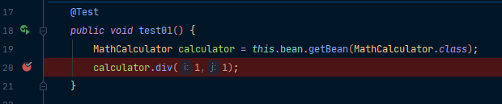
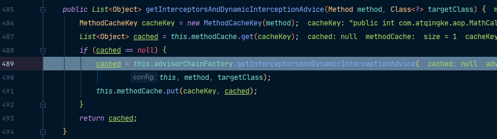
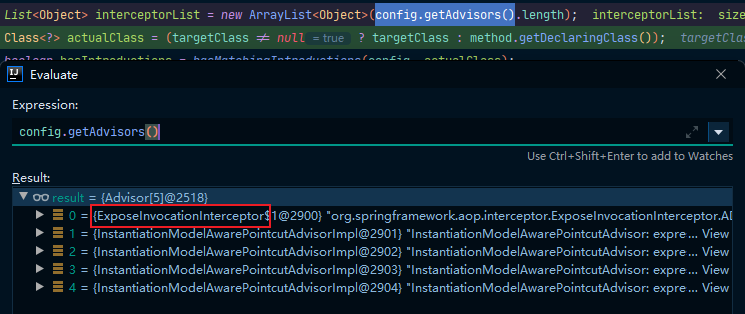
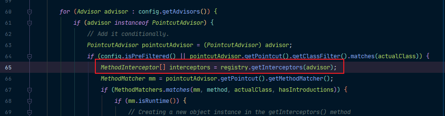
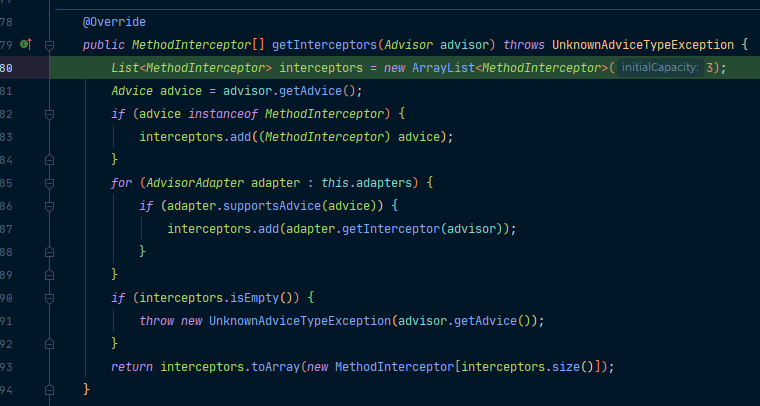
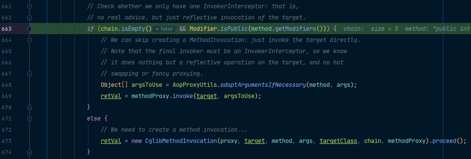

前面我们已经知道了：

- registerBeanPostProcessors(beanFactory); 注册bean的后置处理器来方便拦截bean的创建。
- finishBeanFactoryInitialization(beanFactory); 完成BeanFactory初始化工作，创建剩下的单实例bean。
- 后置处理器会创建cglib的动态代理。

我们为我们的方法调用打上一个断点，看它是如何执行的。



当它运行到这里的时候，我们Step Into进入里面，可以看到，它来到了CglibAopProxy.DynamicAdvisedInterceptor#intercept();也就是说，这个intercept会拦截我们的目标方法的执行：

```java
@Override
public Object intercept(Object proxy, Method method, Object[] args, MethodProxy methodProxy) throws Throwable {
    Object oldProxy = null;
    boolean setProxyContext = false;
    Class<?> targetClass = null;
    Object target = null;
    try {
        if (this.advised.exposeProxy) {
            // Make invocation available if necessary.
            oldProxy = AopContext.setCurrentProxy(proxy);
            setProxyContext = true;
        }
        // May be null. Get as late as possible to minimize the time we
        // "own" the target, in case it comes from a pool...
        target = getTarget();
        if (target != null) {
            targetClass = target.getClass();
        }
        List<Object> chain = this.advised.getInterceptorsAndDynamicInterceptionAdvice(method, targetClass);
        Object retVal;
        // Check whether we only have one InvokerInterceptor: that is,
        // no real advice, but just reflective invocation of the target.
        if (chain.isEmpty() && Modifier.isPublic(method.getModifiers())) {
            // We can skip creating a MethodInvocation: just invoke the target directly.
            // Note that the final invoker must be an InvokerInterceptor, so we know
            // it does nothing but a reflective operation on the target, and no hot
            // swapping or fancy proxying.
            Object[] argsToUse = AopProxyUtils.adaptArgumentsIfNecessary(method, args);
            retVal = methodProxy.invoke(target, argsToUse);
        }
        else {
            // We need to create a method invocation...
            retVal = new CglibMethodInvocation(proxy, target, method, args, targetClass, chain, methodProxy).proceed();
        }
        retVal = processReturnType(proxy, target, method, retVal);
        return retVal;
    } finally {
        if (target != null) {
            releaseTarget(target);
        }
        if (setProxyContext) {
            // Restore old proxy.
            AopContext.setCurrentProxy(oldProxy);
        }
    }
}
```

前面一些初始化的东西不用看，来到我们的List\<Object> chain = this.advised.getInterceptorsAndDynamicInterceptionAdvice(method, targetClass);它会根据ProxyFactory对象获取将要执行的目标方法的拦截器链。我们进入里面一探究竟！



我们进入getInterceptorsAndDynamicInterceptionAdvice方法：

```java
@Override
public List<Object> getInterceptorsAndDynamicInterceptionAdvice(
    Advised config, Method method, Class<?> targetClass) {

    // 保存所有拦截器
    // This is somewhat tricky... We have to process introductions first,
    // but we need to preserve order in the ultimate list.
    List<Object> interceptorList = new ArrayList<Object>(config.getAdvisors().length);
    Class<?> actualClass = (targetClass != null ? targetClass : method.getDeclaringClass());
    boolean hasIntroductions = hasMatchingIntroductions(config, actualClass);
    AdvisorAdapterRegistry registry = GlobalAdvisorAdapterRegistry.getInstance();

    // 遍历所有增强器，将其转为Interceptor  registry.getInterceptors(advisor);
    // 将增强器转为List<MethodInterceptor> interceptorList.addAll(Arrays.asList(interceptors));
    for (Advisor advisor : config.getAdvisors()) {
        if (advisor instanceof PointcutAdvisor) {
            // Add it conditionally.
            PointcutAdvisor pointcutAdvisor = (PointcutAdvisor) advisor;
            if (config.isPreFiltered() || pointcutAdvisor.getPointcut().getClassFilter().matches(actualClass)) {
                MethodInterceptor[] interceptors = registry.getInterceptors(advisor);
                MethodMatcher mm = pointcutAdvisor.getPointcut().getMethodMatcher();
                if (MethodMatchers.matches(mm, method, actualClass, hasIntroductions)) {
                    if (mm.isRuntime()) {
                        // Creating a new object instance in the getInterceptors() method
                        // isn't a problem as we normally cache created chains.
                        for (MethodInterceptor interceptor : interceptors) {
                            interceptorList.add(new InterceptorAndDynamicMethodMatcher(interceptor, mm));
                        }
                    }
                    else {
                        interceptorList.addAll(Arrays.asList(interceptors));
                    }
                }
            }
        }
        else if (advisor instanceof IntroductionAdvisor) {
            IntroductionAdvisor ia = (IntroductionAdvisor) advisor;
            if (config.isPreFiltered() || ia.getClassFilter().matches(actualClass)) {
                Interceptor[] interceptors = registry.getInterceptors(advisor);
                interceptorList.addAll(Arrays.asList(interceptors));
            }
        }
        else {
            Interceptor[] interceptors = registry.getInterceptors(advisor);
            interceptorList.addAll(Arrays.asList(interceptors));
        }
    }

    return interceptorList;
}
```

可以看到，它能获取到我们在LogAspects中写的四个通知的方法，另外还有一个默认的ExposeInvocationInterceptor，所以一共获取到五个增强器。



接着可以看到，它会来到一个增强for循环，遍历所有增强器，并通过registry.getInterceptors(advisor)将其转为了Interceptor。

我们可以看到，在for循环里面，会将所有的增强器转为MethodInterceptor：



我们可以Step Into看它是如何工作的：



分两种情况：

- 如果是MethodInterceptor，直接加入到集合中。
- 如果不是，使用AdvisorAdapter将增强器转为MethodInterceptor。

最后，再通过interceptorList.addAll(Arrays.asList(interceptors))将其转为了List\<MethodInterceptor>，转化完成返回MethodInterceptor数组。

这样，就将我们的拦截器链获取到了！

拦截器链获取到之后，就会判断是否有拦截器链了。



如果没有拦截器链，直接执行目标方法。

> ps：拦截器链：每一个通知方法又被包装为方法拦截器，利用MethodInterceptor机制。

如果有拦截器链，把需要执行的目标对象，目标方法，拦截器链等所有信息传入创建一个CglibMethodInvocation对象，并调用proceed()返回一个retVal。

