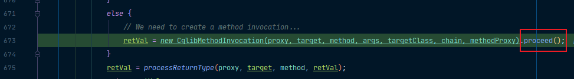
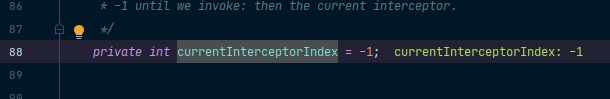
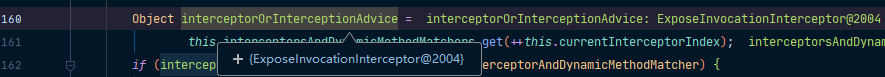
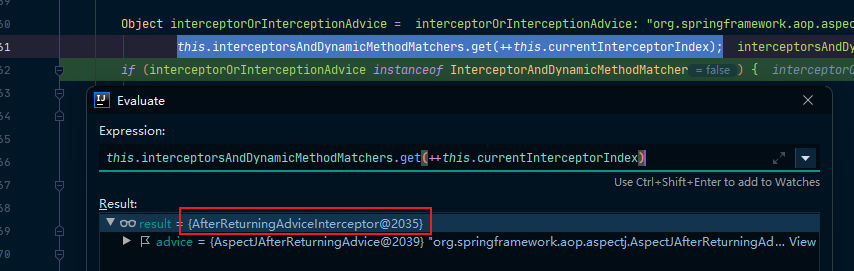
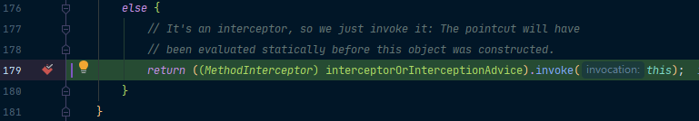
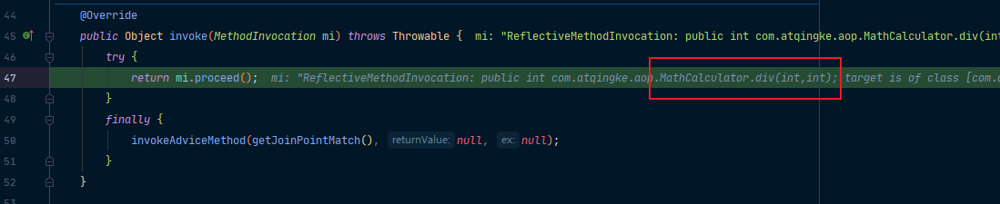
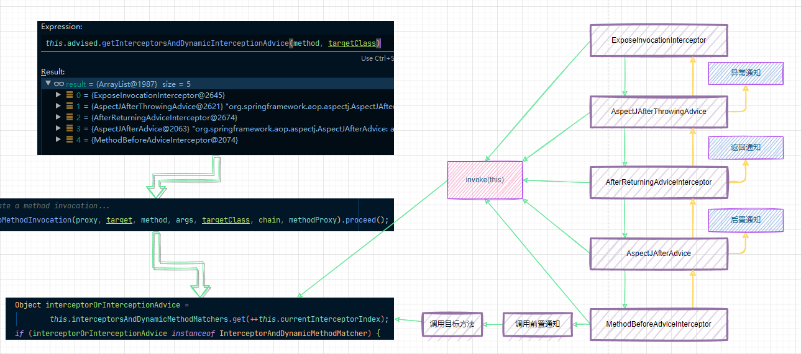

前面已经知道了：

- registerBeanPostProcessors(beanFactory); 注册bean的后置处理器来方便拦截bean的创建。
- finishBeanFactoryInitialization(beanFactory); 完成BeanFactory初始化工作，创建剩下的单实例bean。
- 后置处理器会创建cglib的动态代理。
- this.advised.getInterceptorsAndDynamicInterceptionAdvice(method, targetClass); 获取拦截器链。

下面来看一下，这个拦截器链是如何执行的！我们进入我们的proceed方法：



```java
@Override
public Object proceed() throws Throwable {
   // We start with an index of -1 and increment early.
   if (this.currentInterceptorIndex == this.interceptorsAndDynamicMethodMatchers.size() - 1) {
      return invokeJoinpoint();
   }

   Object interceptorOrInterceptionAdvice =
         this.interceptorsAndDynamicMethodMatchers.get(++this.currentInterceptorIndex);
   if (interceptorOrInterceptionAdvice instanceof InterceptorAndDynamicMethodMatcher) {
      // Evaluate dynamic method matcher here: static part will already have
      // been evaluated and found to match.
      InterceptorAndDynamicMethodMatcher dm =
            (InterceptorAndDynamicMethodMatcher) interceptorOrInterceptionAdvice;
      if (dm.methodMatcher.matches(this.method, this.targetClass, this.arguments)) {
         return dm.interceptor.invoke(this);
      }
      else {
         // Dynamic matching failed.
         // Skip this interceptor and invoke the next in the chain.
         return proceed();
      }
   }
   else {
      // It's an interceptor, so we just invoke it: The pointcut will have
      // been evaluated statically before this object was constructed.
      return ((MethodInterceptor) interceptorOrInterceptionAdvice).invoke(this);
   }
}
```

在这里面，首先会判断：当前的索引是不是跟拦截器链的大小减一是一样的。而这个索引我们跳转到它的定义处可以看到，默认是-1的。所以在这里，需要用拦截器链的大小减一。那么，如果没有拦截器或者指定到来最后一个拦截器，就会直接执行目标方法。



接着，它会获取到当前的拦截器，第一个是默认的拦截器，不执行操作：



需要注意的是，这里使用了前加加，来让索引自增，是拦截器链能往下走。

接着来到我们的返回通知：



然后执行invoke方法：



接着是我们的后置通知，然后执行invoke方法；

然后是前置通知，然后执行invoke方法；

然后会执行目标方法：



目标方法执行完后，又会按照拦截器链相反的顺序一层层进行回调。



总的来说，就是**链式获取每一个拦截器，拦截器执行invoke方法，每一个拦截器等待下一个拦截器执行完成返回以后再来执行。拦截器链的机制，保证通知方法于目标方法的执行顺序**.

- 正常执行：前置通知-》目标方法-》后置通知-》返回通知
- 出现异常：前置通知-》目标方法-》后置通知-》异常通知

