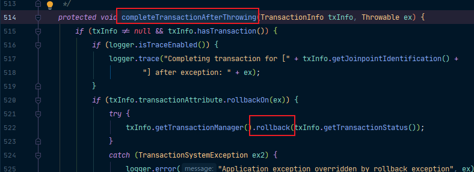
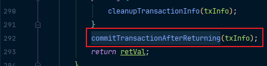

## 环境搭建

### 导入相关依赖（数据源、数据库驱动、Spring-jdbc）

```xml
<dependency>
    <groupId>org.springframework</groupId>
    <artifactId>spring-jdbc</artifactId>
    <version>4.3.12.RELEASE</version>
</dependency>
<!-- https://mvnrepository.com/artifact/c3p0/c3p0 -->
<dependency>
    <groupId>c3p0</groupId>
    <artifactId>c3p0</artifactId>
    <version>0.9.1.2</version>
</dependency>
<!-- https://mvnrepository.com/artifact/mysql/mysql-connector-java -->
<dependency>
    <groupId>mysql</groupId>
    <artifactId>mysql-connector-java</artifactId>
    <version>5.1.44</version>
</dependency>
```

### 数据库创建

```sql
CREATE DATABASE tx;
USE tx;
CREATE TABLE `tx`.`tbl_user`( `username` VARCHAR(255), `age` INT ); 
```

### 配置数据源、JdbcTemplate（Spring提供的简化数据库操作的工具）操作数据

```java
@EnableTransactionManagement
@ComponentScan("com.atqingke.tx")
@Configuration
public class TxConfig {

    @Bean
    public DataSource dataSource() throws Exception {
        ComboPooledDataSource dataSource = new ComboPooledDataSource();
        dataSource.setUser("root");
        dataSource.setPassword("123456");
        dataSource.setDriverClass("com.mysql.jdbc.Driver");
        dataSource.setJdbcUrl("jdbc:mysql://localhost:3306/tx");
        return dataSource;
    }

    @Bean
    public JdbcTemplate jdbcTemplate() throws Exception {
        // Spring对@Configuration类会特殊处理，给容器中加组件的方法，多次调用都只是从容器中找组件
        JdbcTemplate jdbcTemplate = new JdbcTemplate(dataSource());
        return jdbcTemplate;
    }

    @Bean
    public PlatformTransactionManager platformTransactionManager() throws Exception {
        return new DataSourceTransactionManager(dataSource());
    }
}
```

### 给方法上标注@Transactional 表示当前方法是一个事务方法

```java
package com.atqingke.tx;

import org.springframework.beans.factory.annotation.Autowired;
import org.springframework.stereotype.Service;
import org.springframework.transaction.annotation.Transactional;

/**
 * @Author pengbin007
 * @Date 2022/2/8 16:55
 */
@Service
public class UserService {

    @Autowired
    private UserDao userDao;

    @Transactional
    public void insertUser() {
        userDao.insert();
        int i = 10 / 0;
        System.out.println("插入完成...");
    }
}
```

### @EnableTransactionManagement开启基于注解的事务管理功能

见配置类上。

### 配置事务管理器来控制事务

见配置类中PlatformTransactionManager组件。

### UserDao

```java
package com.atqingke.tx;

import org.springframework.beans.factory.annotation.Autowired;
import org.springframework.jdbc.core.JdbcTemplate;
import org.springframework.stereotype.Repository;

import java.util.UUID;

/**
 * @Author pengbin007
 * @Date 2022/2/8 16:55
 */
@Repository
public class UserDao {

    @Autowired
    private JdbcTemplate jdbcTemplate;

    public void insert() {
        String sql = "INSERT INTO `tbl_user` (username, age) VALUES (?, ?)";

        String username = UUID.randomUUID().toString().substring(0, 5);
        jdbcTemplate.update(sql, username, 23);
    }
}
```

### 测试类

```java
package com.atqingke.test;

import com.atqingke.tx.TxConfig;
import com.atqingke.tx.UserService;
import org.junit.Test;
import org.springframework.context.annotation.AnnotationConfigApplicationContext;

/**
 * @Author pengbin007
 * @Date 2022/2/8 17:02
 */
public class TxTest {

    @Test
    public void test01() {
        AnnotationConfigApplicationContext applicationContext = new AnnotationConfigApplicationContext(TxConfig.class);

        UserService userService = applicationContext.getBean(UserService.class);
        userService.insertUser();

        applicationContext.close();
    }
}
```

> ps：
>
> - 事务方法没有标注@Transactional，没有事务。
>
> - 配置类没有开启基于注解的事务管理功能@EnableTransactionManagement，事务不起效果。
> - 配置类中没有注册PlatformTransactionManager组件控制事务，事务不起效果。

## 源码分析

在AOP原理中，我们已经研究了@EnableAspectJAutoProxy注解的原理，而这里的@EnableTransactionManagement其实跟它差不多。


可以看到，它也是利用@Import给容器中导入了一个组件，只不过方式不一样，在这里是导入的是实现了ImportSelector接口的组件。

```java
public class TransactionManagementConfigurationSelector extends AdviceModeImportSelector<EnableTransactionManagement> {

   /**
    * {@inheritDoc}
    * @return {@link ProxyTransactionManagementConfiguration} or
    * {@code AspectJTransactionManagementConfiguration} for {@code PROXY} and
    * {@code ASPECTJ} values of {@link EnableTransactionManagement#mode()}, respectively
    */
   @Override
   protected String[] selectImports(AdviceMode adviceMode) {
      switch (adviceMode) {
         case PROXY:
            return new String[] {AutoProxyRegistrar.class.getName(), ProxyTransactionManagementConfiguration.class.getName()};
         case ASPECTJ:
            return new String[] {TransactionManagementConfigUtils.TRANSACTION_ASPECT_CONFIGURATION_CLASS_NAME};
         default:
            return null;
      }
   }

}
```

在这里面就一个判断：如果AdviceMode是proxy就注册AutoProxyRegistrar和ProxyTransactionManagementConfiguration；而如果是aspectj就注册TransactionManagementConfigUtils。而我们可以看到，在@EnableTransactionManagement里面，就已经给AdviceMode默认赋了一个值proxy：


因此这里显然走第一个case注册两个组件。

### 先看AutoProxyRegistrar

AutoProxyRegistrar里就一个方法，方法运行来到72行会注册自动代理创建器如果需要，我们进去：


再进去：


就来到了我们熟悉的地方了，我们已经在AOP原理中进过这里，方法传了一个参数InfrastructureAdvisorAutoProxyCreator。也就是说：导入AutoProxyRegistrar组件是为了给容器中注册InfrastructureAdvisorAutoProxyCreator组件。

我们查看InfrastructureAdvisorAutoProxyCreator继承树可以发现，跟我们在AOP原理中看到的AnnotationAwareAspectJAutoProxyCreator是一样的。


> ps：在AOP原理中，我们知道，注册AnnotationAwareAspectJAutoProxyCreator是为了利用后置处理器机制在对象创建以后，包装对象，返回一个代理对象（增强器），代理对象执行方法利用拦截器链进行调用。这里的InfrastructureAdvisorAutoProxyCreator跟它类似，不作深入探讨。
>

### 再看ProxyTransactionManagementConfiguration

首先它是一个配置类，给容器中利用@Bean给容器中注册了transactionAdvisor事务增强器。在给容器中注册事务增强器的时候又设置了一个事务属性，这个事务属性又是一个Bean。可以看到，它返回了一个AnnotationTransactionAttributeSource注解的事务属性。


```java
/**
 * Create a default AnnotationTransactionAttributeSource, supporting
 * public methods that carry the {@code Transactional} annotation
 * or the EJB3 {@link javax.ejb.TransactionAttribute} annotation.
 */
public AnnotationTransactionAttributeSource() {
   this(true);
}
```

点进来，从注释中可以看到，它就是为我们的@Transactional注解服务的。我们再从this进去：


可以看到，它利用annotationParsers注解的解析器来添加Spring和Jta或Ejb的注解解析器。进入Spring的事务注解解析器可以看到，它对@Transactional的各种属性做了解析：


看完advisor.setTransactionAttributeSource(transactionAttributeSource());再看advisor.setAdvice(transactionInterceptor());它给容器中注入了一个TransactionInterceptor


而这个TransactionInterceptor我们点开来看可以发现，它实现了MethodInterceptor接口，这就回到了我们熟悉的AOP原理中：在获取拦截器链的时候，会将所有的增强器转换成这个MethodInterceptor。


在TransactionInterceptor中就重写了invoke方法，最终是调用invokeWithinTransaction支持事务。在invokeWithinTransaction中，首先获取事务相关的属性：


然后再获取PlatformTransactionManager：


怎么获取，我们可以进入determineTransactionManager方法看一眼。首先它会看我们有没有用@Qualifier指定事务的名称，如果有，则使用。


而tx.getQualifier()就是获取@Transactional注解里的transactionManager属性：


接下来，它会判断是否配置了transactionManagerBeanName：


而以上两个我们都没有指定，因此它会走最后一个判断：


先获取默认注入的TransactionManager，但是我们没有给它配置，因此会获取PlatformTransactionManager。

接下来，回到我们的invokeWithinTransaction方法。如果在执行过程中，出现了异常，会获取到事务管理器，利用事务管理回滚操作：




那如果正常执行，会利用事务管理器，提交事务：




至此，关于声明式事务原理的简单分析就结束了，如果前面的AOP原理掌握了，在这里其实是非常清晰的。

> - @EnableTransactionManagement
>
>   - 利用TransactionManagementConfigurationSelector给容器中导入两个组件
>     - AutoProxyRegistrar
>     - ProxyTransactionManagementConfiguration
>
> - AutoProxyRegistrar
>
>   - 给容器中注册一个InfrastructureAdvisorAutoProxyCreator组件
>   - 利用后置处理器机制在对象创建以后，包装对象，返回一个代理对象（增强器），代理对象执行方法利用拦截器链进行调用
>
> - ProxyTransactionManagementConfiguration
>
>   - 给容器中注册事务增强器
>
>     - 事务增强器要用事务注解的信息，AnnotationTransactionAttributeSource解析事务
>
>     - 事务拦截器，TransactionInterceptor保存了事务属性信息，事务管理器，是一个MethodInterceptor，在执行目标方法的时候
>
>       - 执行拦截器链
>
>       - 事务拦截器
>         - 先获取事务相关属性
>         - 再获取PlatformTransactionManager，如果实现没有添加指定任何transactionManager，最终会从容器中按照类型获取一个PlatformTransactionManager
>         - 执行目标方法
>           - 如果异常，获取到事务管理器，利用事务管理回滚操作
>           - 如果正常，利用事务管理器，提交事务