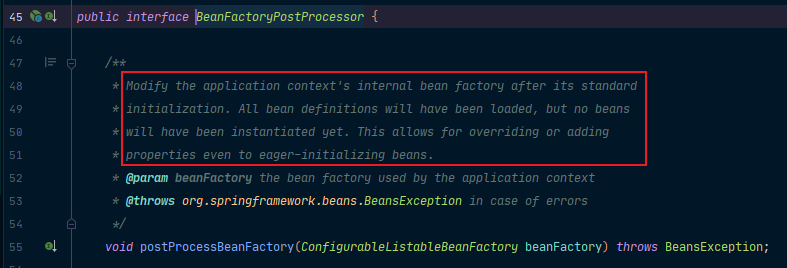
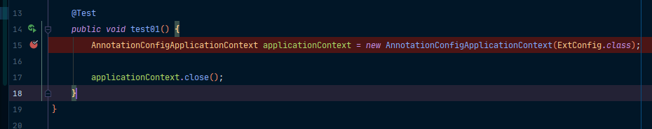
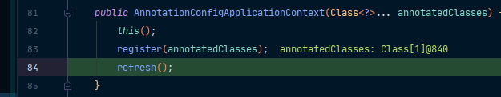
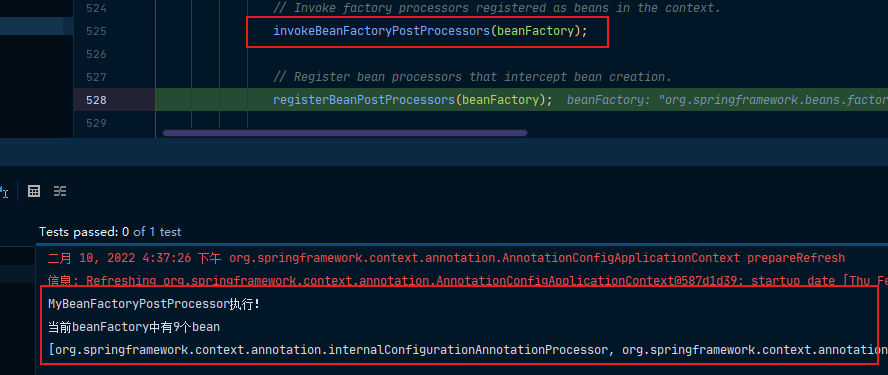
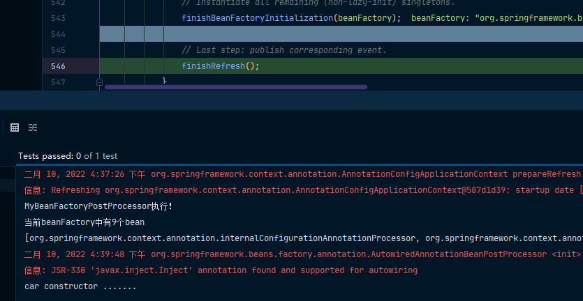
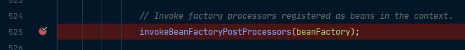
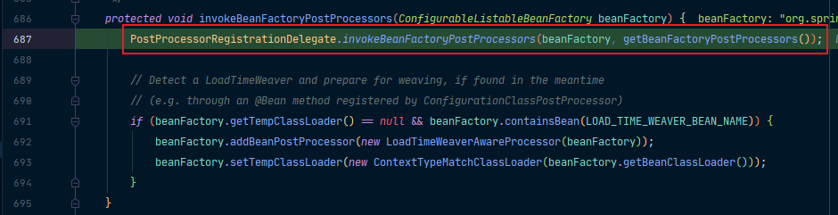
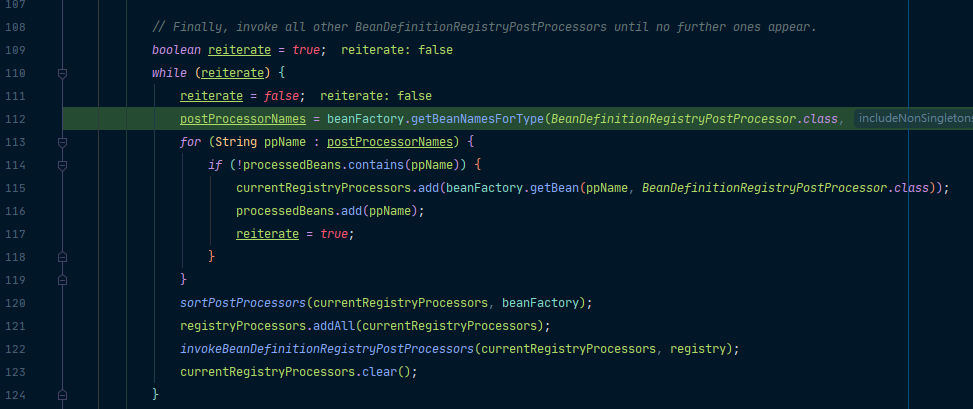
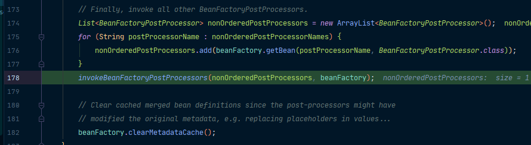
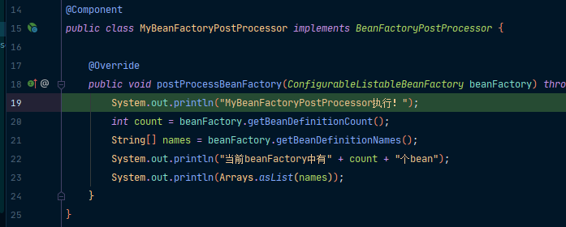

在介绍Spring的生命周期的时候，我们知道有一个BeanPostProcessor：它是bean的后置处理器，在bean创建对象初始化前后进行拦截工作的。而这里的BeanFactoryPostProcessor，它是BeanFactory的后置处理器，我们看看它是什么时候工作的：



从它的方法上的注释中可以看到，它是在BeanFactory标准初始化之后调用，这时所有的bean定义已经保存并加载到了BeanFactory中，只是还没有创建bean实例。

下面我们通过一个简单的例子来详细深入看一下它的原理！

## 环境准备

### 写一个自己的BeanFactory：

```java
package com.atqingke.ext;

import org.springframework.beans.BeansException;
import org.springframework.beans.factory.config.BeanFactoryPostProcessor;
import org.springframework.beans.factory.config.ConfigurableListableBeanFactory;
import org.springframework.stereotype.Component;

import java.util.Arrays;

/**
 * @Author pengbin007
 * @Date 2022/2/10 15:46
 */
@Component
public class MyBeanFactoryPostProcessor implements BeanFactoryPostProcessor {

    @Override
    public void postProcessBeanFactory(ConfigurableListableBeanFactory beanFactory) throws BeansException {
        System.out.println("MyBeanFactoryPostProcessor执行！");
        int count = beanFactory.getBeanDefinitionCount();
        String[] names = beanFactory.getBeanDefinitionNames();
        System.out.println("当前beanFactory中有" + count + "个bean");
        System.out.println(Arrays.asList(names));
    }
}
```

### 我们有一个Car组件：

```java
package com.atqingke.bean;

import org.springframework.stereotype.Component;

/**
 * @Author pengbin007
 * @Date 2022/1/21 21:00
 */
@Component
public class Car {

    public Car() {
        System.out.println("car constructor .......");
    }
}
```

### 在我们的配置类中将Car注册到容器中：

```java
package com.atqingke.ext;

import com.atqingke.bean.Car;
import org.springframework.context.annotation.Bean;
import org.springframework.context.annotation.ComponentScan;
import org.springframework.context.annotation.Configuration;

/**
 * @Author pengbin007
 * @Date 2022/2/10 15:40
 */
@ComponentScan("com.atqingke.ext")
@Configuration
public class ExtConfig {

    @Bean
    public Car car() {
        return new Car();
    }
}
```

### 在测试类中将配置文件加载到容器中：

```java
package com.atqingke.test;

import com.atqingke.ext.ExtConfig;
import org.junit.Test;
import org.springframework.context.annotation.AnnotationConfigApplicationContext;

/**
 * @Author pengbin007
 * @Date 2022/2/10 15:52
 */
public class ExtTest {

    @Test
    public void test01() {
        AnnotationConfigApplicationContext applicationContext = new AnnotationConfigApplicationContext(ExtConfig.class);

        applicationContext.close();
    }
}
```

### 打上断点：



首先是IOC容器的创建，一路来到我们熟悉的refresh方法：



在refresh方法中，可以看到，当我们的invokeBeanFactoryPostProcessors方法执行完后，我们自定义的BeanFactoryPostProcessor就执行完了



而当我们的finishBeanFactoryInitialization执行完了，bean的创建就完成了。



这也就解释了“它是在BeanFactory标准初始化之后调用，这时所有的bean定义已经保存并加载到了BeanFactory中，只是还没有创建bean实例”

下面我们来看一下，它是如何找到所有的BeanFactoryPostProcessor并执行它们的方法！我们给我们的invokeBeanFactoryPostProcessors打上断点：



Debug进去，主要是这个invokeBeanFactoryPostProcessors再Step Into进去



可以看到，在这里就跟我们在AOP原理中的AnnotationAwareAspectJAutoProxyCreator中的registerBeanPostProcessors方法一样，也是按照优先级来执行BeanDefinitionRegistryPostProcessors。

我们这里的BeanFactoryPostProcessor既没有实现PriorityOrdered也没有实现Ordered接口，因此直接来到我们的finally中执行剩下的BeanFactoryPostProcessor看看。



可以看到，它会直接在BeanFactory中找到所有类型是BeanFactoryPostProcessor的组件，然后在按照优先级来执行它们的方法：



Step Into进去就来到了我们自己写的BeanFactoryPostProcessor了！

