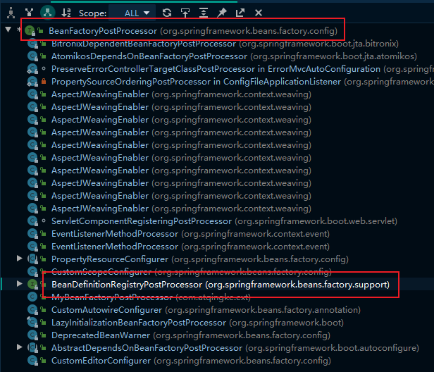
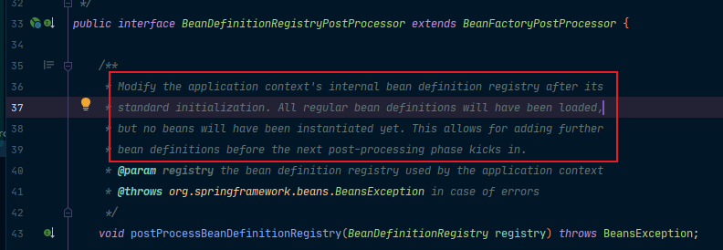
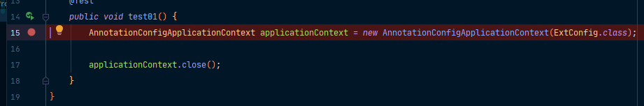
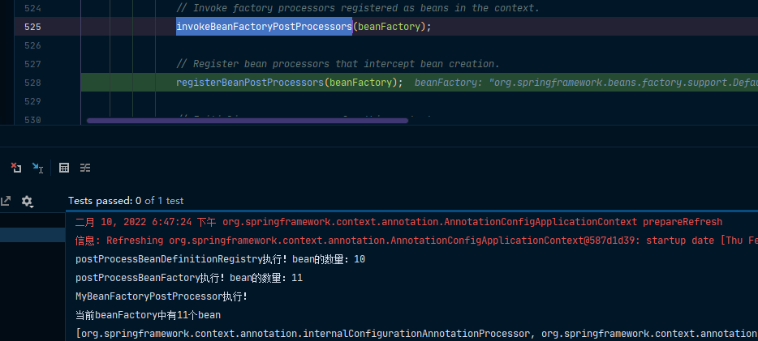
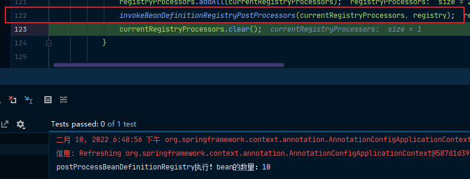
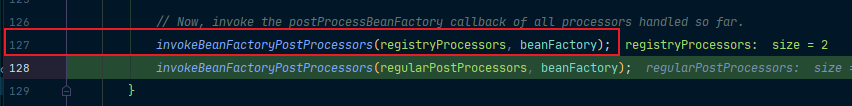
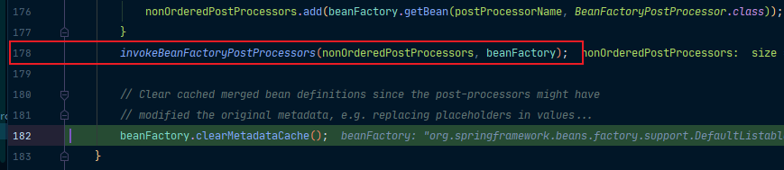

再来讲一下BeanFactoryPostProcessor下的一个子接口：BeanDefinitionRegistryPostProcessor



同样的，我们可以从它方法的注释上看到：它是在所有bean定义信息将要被加载，bean实例还未创建的时候执行！也就是说，它会优先于BeanFactoryPostProcessor执行。



我们自己写一个BeanDefinitionRegistryPostProcessor调试看一下：

```java
package com.atqingke.ext;

import com.atqingke.bean.Car;
import org.springframework.beans.BeansException;
import org.springframework.beans.factory.config.ConfigurableListableBeanFactory;
import org.springframework.beans.factory.support.*;
import org.springframework.stereotype.Component;

/**
 * @Author pengbin007
 * @Date 2022/2/10 17:02
 */
@Component
public class MyBeanDefinitionRegistryPostProcessor implements BeanDefinitionRegistryPostProcessor {

    /**
     *
     * @param registry bean信息的保存中心，以后BeanFactory就是按照BeanDefinitionRegistry里面保存的每一个bean定义信息创建bean实例
     */
    @Override
    public void postProcessBeanDefinitionRegistry(BeanDefinitionRegistry registry) throws BeansException {
        System.out.println("postProcessBeanDefinitionRegistry执行！bean的数量：" + registry.getBeanDefinitionCount());
//        RootBeanDefinition beanDefinition = new RootBeanDefinition(Car.class);
        AbstractBeanDefinition beanDefinition = BeanDefinitionBuilder.rootBeanDefinition(Car.class).getBeanDefinition();
        registry.registerBeanDefinition("hello", beanDefinition);
    }

    @Override
    public void postProcessBeanFactory(ConfigurableListableBeanFactory beanFactory) throws BeansException {
        System.out.println("postProcessBeanFactory执行！bean的数量：" + beanFactory.getBeanDefinitionCount());
    }
}
```

同样的，我们从它加载配置文件出发：



同样的，它也会来到我们的invokeBeanFactoryPostProcessors方法：



我们进去，来到我们熟悉的invokeBeanFactoryPostProcessors方法，可以看到，它会在122行执行关于我们的BeanDefinitionRegistryPostProcessor的逻辑：



然后，在127行执行我们在BeanDefinitionRegistryPostProcessor重写的关于BeanFactoryPostProcessor中的postProcessBeanFactory逻辑



最后，会在178行执行我们在BeanFactoryPostProcessor中的postProcessBeanFactory逻辑。



也就是说，BeanDefinitionRegistryPostProcessor优先于BeanFactoryPostProcessor执行，我们可以利用BeanDefinitionRegistryPostProcessor给容器中再额外添加一些组件。