下面来谈一下ApplicationListener：监听容器中发布的事件，事件驱动模型开发。

点进去可以看到，它是一个接口，并且接口有泛型。也就是说，它会监听ApplicationEvent及其子类下面的事件。

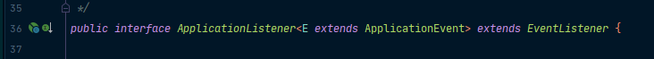

我们写一个简单的事件：

```java
package com.atqingke.ext;

import org.springframework.context.ApplicationEvent;
import org.springframework.context.ApplicationListener;
import org.springframework.stereotype.Component;

/**
 * @Author pengbin007
 * @Date 2022/2/10 18:57
 */
@Component
public class MyApplicationListener implements ApplicationListener<ApplicationEvent> {

    /**
     * 当容器中发布此事件后，方法触发
     */
    @Override
    public void onApplicationEvent(ApplicationEvent event) {
       System.out.println("收到事件：" + event);
    }
}
```

那么如何发布这个事件呢？在applicationContext里面就有发布事件的方法：

```java
package com.atqingke.test;

import com.atqingke.ext.ExtConfig;
import org.junit.Test;
import org.springframework.context.ApplicationEvent;
import org.springframework.context.annotation.AnnotationConfigApplicationContext;

/**
 * @Author pengbin007
 * @Date 2022/2/10 15:52
 */
public class ExtTest {

    @Test
    public void test01() {
        AnnotationConfigApplicationContext applicationContext = new AnnotationConfigApplicationContext(ExtConfig.class);

        // 发布事件
        applicationContext.publishEvent(new ApplicationEvent(new String("我发布的事件")) {

        });

        applicationContext.close();
    }
}
```

运行，可以看到，现在容器中有三个事件：一个我们自定义的、一个是容器刷新时候的事件、一个是容器关闭时候的事件：

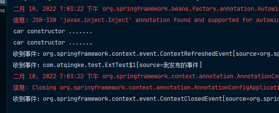

> 步骤：
>
> 1. 写一个监听器（ApplicationListener实现类）来监听某个事件（ApplicationEven及其子类）。
> 2. 把监听器加入到容器中。
> 3. 只要容器中有相应事件的发布，我们就能监听到这个事件。
> 4. 发布一个事件：applicationContext.publishEvent();

## ApplicationListener原理

通过上面的例子，我们让容器收到了三个事件：ContextRefreshedEvent、ExtTest$1、ContextClosedEvent，我们来看一下ApplicationListener是如何监听这些事件的。Debug运行，可以看到在refresh方法最后有一步finishRefresh();

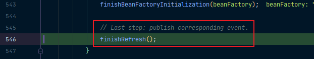

注释中也说了，在这里发布相对应的事件，也就是我们的ContextRefreshedEvent。进去就可以看到，它创建了一个ContextRefreshedEvent对象，然后将其发布出去：

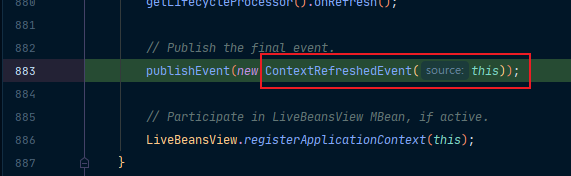

我们进去看一下它的事件发布流程是怎样的！首先是来到我们的日志输入部分，以及判断事件是否为ApplicationEvent，如果不是就将其转为ApplicationEvent：

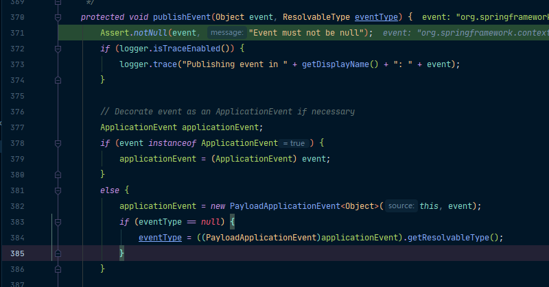

然后先获取事件的多播器（发布器）getApplicationEventMulticaster()，获取到多播器之后，再使用multicastEvent(applicationEvent, eventType)派发事件：

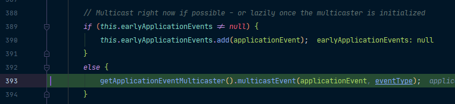

我们可以进去看它是如何派发事件的：

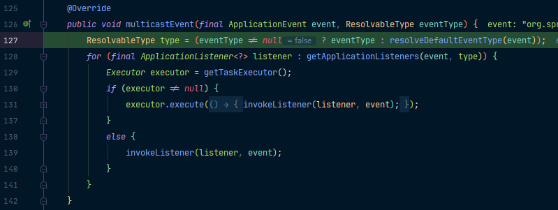

它会利用一个增强for循环获取到所有的ApplicationListener，然后判断如果有Executor，可以支持使用Executor进行异步派发；否则，直接使用同步的方式执行listener方法，拿到listener回调我们的onApplicationEvent方法。

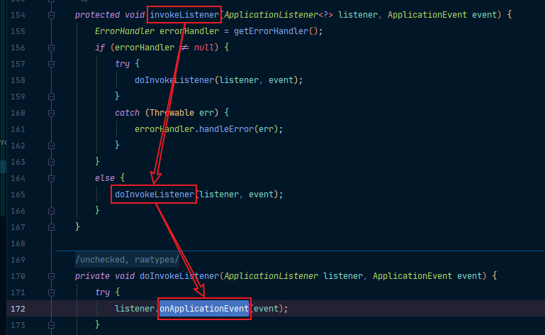

如此，也就将我们的ContextRefreshedEvent事件发布出去了，其它两个事件的发布流程也都是类似的。

## 事件多播器(派发器)

从上面的事件发布流程我们知道，在事件发布之前需要先获取到我们的事件多播器getApplicationEventMulticaster()，那么这个事件多播器是从哪里来的呢？我们回到我们的refresh方法里面，可以看到里面有一个initApplicationEventMulticaster()初始化应用程序的事件多播器：

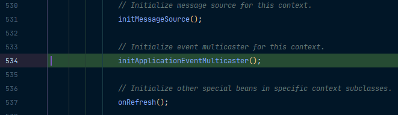

进去可以看到，它会先去容器中找看有没有id等于applicationEventMulticaster的组件：

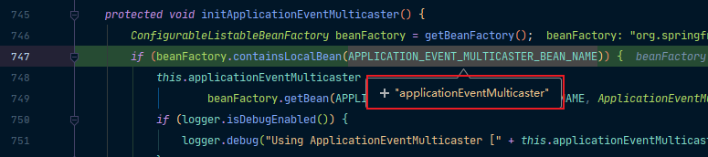

如果有，那么就会拿到这个组件；而没有，则会new SimpleApplicationEventMulticaster(beanFactory)再注册到容器中去，这样我们就可以在其它组件要派发事件时，自动注入这个applicationEventMulticaster。

## getApplicationListeners(event, type)

看完事件多播器，我们再看一下容器中有哪些监听器？通过上面的事件发布流程我们知道，在派发事件时，会先获取到所有的监听器，那这些监听器是从哪里获取的？还是回到我们的refresh方法，在结束BeanFactory的初始化之前有一步registerListeners()注册监听器，我们的监听器就是在这个时候注册到容器中去的：

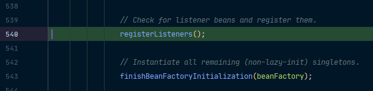

首先注册指定的静态监听器，我们这里没有。然后来到我们的String[] listenerBeanNames = getBeanNamesForType(ApplicationListener.class, true, false)从容器中拿到所有的监听器。然后再通过一个增强for将所有的监听器注册到applicationEventMulticaster中：

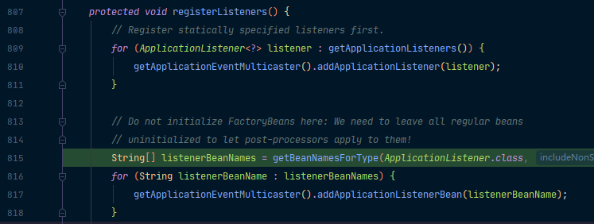