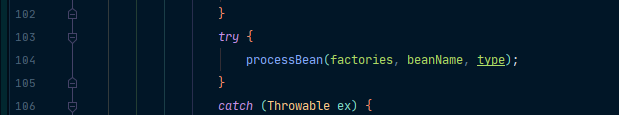
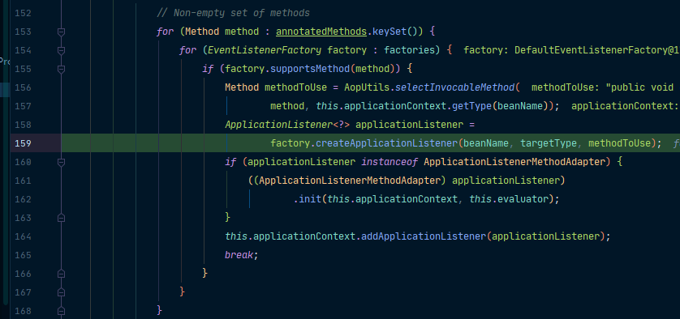

我们除了可以使用实现ApplicationListener接口来监听容器中发布的事件，我们也可以通过@EventListener注解来实现。

比如我们有一个组件UserService，我们希望它能够监听到事件，我们就可以写一个方法，在方法上标注@EventListener，给注解添加classes属性来指定要监听哪些事件，方法位置传入ApplicationEvent让它获取到事件：

```java
package com.atqingke.ext;

import org.springframework.context.ApplicationEvent;
import org.springframework.context.event.EventListener;
import org.springframework.stereotype.Service;

/**
 * @Author pengbin007
 * @Date 2022/2/10 19:39
 */
@Service
public class UserService {

    @EventListener(classes = {ApplicationEvent.class})
    public void listen(ApplicationEvent event) {
        System.out.println("UserService监听到的事件" + event);
    }
}
```

这个注解的工作原理我们通过它上面的注释可以知道：它是使用EventListenerMethodProcessor处理器来解析方法上的@EventListener：


那么我们就来看一下EventListenerMethodProcessor，可以看到它实现了SmartInitializingSingleton：


这里主要是讲这个接口，我们进去可以看到，它是在单实例bean全部创建完之后再来执行：


就类似于之前的ContextRefreshedEvent事件触发时机：


我们可以给afterSingletonsInstantiated打上一个断点运行看一下。


通过它走的流程分析可知，它是在IOC容器创建对象并refresh是，执行finishBeanFactoryInitialization(beanFactory)会初始化剩下的单实例bean，而我们的afterSingletonsInstantiated就是在这个时候执行的。

```java
@Override
public void preInstantiateSingletons() throws BeansException {
   if (this.logger.isDebugEnabled()) {
      this.logger.debug("Pre-instantiating singletons in " + this);
   }

   // Iterate over a copy to allow for init methods which in turn register new bean definitions.
   // While this may not be part of the regular factory bootstrap, it does otherwise work fine.
   List<String> beanNames = new ArrayList<String>(this.beanDefinitionNames);

   // Trigger initialization of all non-lazy singleton beans...
   for (String beanName : beanNames) {
      RootBeanDefinition bd = getMergedLocalBeanDefinition(beanName);
      if (!bd.isAbstract() && bd.isSingleton() && !bd.isLazyInit()) {
         if (isFactoryBean(beanName)) {
            final FactoryBean<?> factory = (FactoryBean<?>) getBean(FACTORY_BEAN_PREFIX + beanName);
            boolean isEagerInit;
            if (System.getSecurityManager() != null && factory instanceof SmartFactoryBean) {
               isEagerInit = AccessController.doPrivileged(new PrivilegedAction<Boolean>() {
                  @Override
                  public Boolean run() {
                     return ((SmartFactoryBean<?>) factory).isEagerInit();
                  }
               }, getAccessControlContext());
            }
            else {
               isEagerInit = (factory instanceof SmartFactoryBean &&
                     ((SmartFactoryBean<?>) factory).isEagerInit());
            }
            if (isEagerInit) {
               getBean(beanName);
            }
         }
         else {
            getBean(beanName);
         }
      }
   }

   // Trigger post-initialization callback for all applicable beans...
   for (String beanName : beanNames) {
      Object singletonInstance = getSingleton(beanName);
      if (singletonInstance instanceof SmartInitializingSingleton) {
         final SmartInitializingSingleton smartSingleton = (SmartInitializingSingleton) singletonInstance;
         if (System.getSecurityManager() != null) {
            AccessController.doPrivileged(new PrivilegedAction<Object>() {
               @Override
               public Object run() {
                  smartSingleton.afterSingletonsInstantiated();
                  return null;
               }
            }, getAccessControlContext());
         }
         else {
            smartSingleton.afterSingletonsInstantiated();
         }
      }
   }
}
```

执行方法前，先通过一个增强for，将所有的单实例bean创建完：


创建完成后，再通过一个增强for看是否有SmartInitializingSingleton，如果有，就执行afterSingletonsInstantiated方法。


在afterSingletonsInstantiated里面，通过增强for找出带有@EventListener注解的组件，执行processBean方法：



在processBean里面找到带有@EventListener注解的方法：


再根据beanName、targetType和methodToUse创建监听器：


